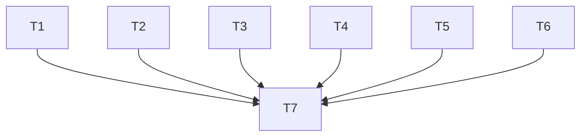

# Implementation Plan: Skill Chaining & AskUserQuestion Integration

**Date:** 2026-04-13
**Spec:** `docs/specs/2026-04-13-skill-chaining-and-tool-integration-design.md`
**Complexity:** Medium (6 files, 22 edit-points)
**Quality Score:** Pending verification

---

## Requirements

| # | Requirement | Assertion | Tasks |
|---|-----------|-----------|-------|
| R1 | Brainstorming: Transition Section | `## Transition` exists, mentions `stn-skills:plan-writing` | T1 |
| R2 | Plan-Writing: Transition Section | `## Transition` exists, mentions `stn-skills:plan-execution` | T2 |
| R3 | Brainstorming: 4 Gates → AskUserQuestion | 4x `AskUserQuestion` in file | T1 |
| R4 | Brainstorming: Interview → AskUserQuestion | Phase 1 mentions `AskUserQuestion` | T1 |
| R5 | Plan-Writing: 4 Gates → AskUserQuestion | 4x `AskUserQuestion` in file | T2 |
| R6 | Plan-Execution: 6 interaction points → AskUserQuestion | 6x `AskUserQuestion` in file | T3 |
| R7 | Plan-Execution: Anti-Passivity Rule | "No passive asking" in Rules | T3 |
| R8 | Build-Feature: 2 Transitions → AskUserQuestion | 2x `AskUserQuestion` in file | T4 |
| R9 | Codebase-Audit: 3 Gates → AskUserQuestion | 3x `AskUserQuestion` in file | T5 |
| R10 | Bootstrap: 2 Gates → AskUserQuestion | 2x `AskUserQuestion` in file | T6 |

## File Structure

| File | Action | Tasks |
|------|--------|-------|
| `skills/brainstorming/SKILL.md` | MODIFY | T1 |
| `skills/plan-writing/SKILL.md` | MODIFY | T2 |
| `skills/plan-execution/SKILL.md` | MODIFY | T3 |
| `skills/build-feature/SKILL.md` | MODIFY | T4 |
| `skills/codebase-audit/SKILL.md` | MODIFY | T5 |
| `skills/codebase-quality-bootstrap/SKILL.md` | MODIFY | T6 |

## DAG



**Wave 1:** T1, T2, T3, T4, T5, T6 (parallel)
**Wave 2:** T7 (verification)

---

## Task T1: brainstorming/SKILL.md — Gates + Interview + Transition

**File:** `skills/brainstorming/SKILL.md`
**Requirements:** R1, R3, R4
**Depends on:** none
**Risk:** Low — additive changes, no logic altered

### Edit Pattern for Gates

For each gate, replace the `Ask: **"..."**` line with the AskUserQuestion protocol. The content BEFORE the Ask line stays unchanged (presentation requirements). The pattern:

**Before:**
```
Ask: **"[question text]"**
```

**After:**
```
**Present all content above to the user first.** Then use the AskUserQuestion tool:
- Question: "[question text]"
- Options: [contextually appropriate options from the gate's choice space]

**Do not proceed until the user responds.**
```

### Steps

1. **GATE 1 (line 160):** Replace `Ask: **"Confirm this problem statement, assumptions, and scope — or correct anything before I explore approaches."**` with AskUserQuestion protocol. Options: `["Confirmed", "Corrections needed"]`.

2. **GATE 2 (line 211):** Replace `Ask: **"Review these approaches..."**` with AskUserQuestion protocol. Options: `["Approaches confirmed", "Eliminate non-starters", "Explore specific direction deeper"]`.

3. **GATE 3 (line 281):** Replace `Ask: **"Select an approach, or adjust the criteria weights..."**` with AskUserQuestion protocol. Options: list the surviving approaches by name (max 4) — the agent populates these dynamically based on the approaches generated.

4. **GATE 4 (line 349):** Replace `Ask: **"Review this design spec..."**` with AskUserQuestion protocol. Options: `["Approve and save", "Request changes"]`.

5. **Interview (line 120):** After "Ask questions ONE AT A TIME. Maximum 6 questions total." add: `Use the AskUserQuestion tool for each question with category-appropriate options. The user can always select "Other" for free-text answers. Wait for the response before asking the next question.`

6. **Transition section:** Insert new `## Transition: Design Complete` section between Phase 6 (after line 359) and Red Flags section (line 363). Content:
   ```markdown
   ## Transition: Design Complete

   **Terminal state: The next pipeline step is `/stn-skills:plan-writing`.**

   Use AskUserQuestion:
   - Question: "Design spec saved to `{path}`. Continue to plan-writing, or stop here?"
   - Options: ["Continue to plan-writing", "Stop here"]

   **On "Continue to plan-writing":** Immediately invoke the Skill tool: `Skill(skill: "stn-skills:plan-writing", args: "{spec_file_path}")`
   **On "Stop here":** End. Inform user: resume later with `/stn-skills:plan-writing`.
   ```

**Verification:** `grep -c "AskUserQuestion" skills/brainstorming/SKILL.md` should return >= 6 (4 gates + 1 interview + 1 transition).

**Rollback:** `git checkout -- skills/brainstorming/SKILL.md`

---

## Task T2: plan-writing/SKILL.md — Gates + Transition

**File:** `skills/plan-writing/SKILL.md`
**Requirements:** R2, R5
**Depends on:** none
**Risk:** Low

### Steps

1. **GATE 1 (line 154):** Replace `Ask:` with AskUserQuestion. Options: `["Confirmed", "Adjust requirements or scope"]`.

2. **GATE 2 (line 230):** Replace `Ask:` with AskUserQuestion. Options: `["Confirmed", "Adjust tasks"]`.

3. **GATE 3 (line 381-383):** This gate is conditional. Replace both variants:
   - Score >= 90: AskUserQuestion with options `["Proceed to plan assembly", "Review defects first"]`
   - Score < 90: AskUserQuestion with options `["Proceed with known defects", "Adjust scope", "Another rework cycle"]`

4. **GATE 4 (line 415):** Replace `Ask:` with AskUserQuestion. Options: `["Approved", "Request changes"]`.

5. **Transition section:** Insert `## Transition: Plan Complete` between GATE 4 (after line 415) and Red Flags (line 419). Content:
   ```markdown
   ## Transition: Plan Complete

   **Terminal state: The next pipeline step is `/stn-skills:plan-execution`.**

   Use AskUserQuestion:
   - Question: "Plan saved to `{path}`. Continue to plan-execution, or stop here?"
   - Options: ["Continue to plan-execution", "Stop here"]

   **On "Continue to plan-execution":** Immediately invoke the Skill tool: `Skill(skill: "stn-skills:plan-execution", args: "{plan_file_path}")`
   **On "Stop here":** End. Inform user: resume later with `/stn-skills:plan-execution`.
   ```

**Verification:** `grep -c "AskUserQuestion" skills/plan-writing/SKILL.md` should return >= 5 (4 gates + 1 transition).

**Rollback:** `git checkout -- skills/plan-writing/SKILL.md`

---

## Task T3: plan-execution/SKILL.md — Gates + Inline Pauses + Anti-Passivity

**File:** `skills/plan-execution/SKILL.md`
**Requirements:** R6, R7
**Depends on:** none
**Risk:** Low

### Steps

1. **GATE 1 (line 126):** Replace `Ask:` with AskUserQuestion. Options: `["Confirmed — begin execution", "Adjust task order or scope"]`. Add after: `**After confirmation, proceed immediately to Phase 2. Do not ask "Should I start?" or similar.**`

2. **YELLOW circuit breaker (line 252):** Replace `**YELLOW**: pause, present to user, resume on approval.` with: `**YELLOW**: pause. Present metrics and current task context to the user, then use AskUserQuestion: Question: "Circuit breaker YELLOW — {metric} at threshold. Continue or abort?" Options: ["Continue execution", "Abort and checkpoint"]. **After confirmation, resume immediately.**`

3. **Adaptive Replanning (line 276):** Replace `2. Offer options: skip task, replan remaining tasks, abort execution.` with: `2. Use AskUserQuestion: Question: "Task {ID} blocked after all retries. How to proceed?" Options: ["Skip task", "Replan remaining tasks", "Abort execution"]. **After selection, execute immediately.**`

4. **GATE 2 (line 366):** Replace `Ask:` with AskUserQuestion. Options: `["Accept", "Identify gaps to address"]`. Add after: `**After acceptance, proceed immediately to GATE 3.**`

5. **GATE 3 (line 395):** Replace `Ask:` with AskUserQuestion. Options: `["Accept as complete", "Items need rework"]`.

6. **Anti-passivity rule:** In the Rules section (after rule 6, line 134 area of build-feature — actually in plan-execution's own rules section), add:
   ```markdown
   7. **No passive asking** — After a gate confirmation, execution continues immediately. Do not ask "Should I start?", "Which task first?", "Ready to proceed?", or similar. The plan defines the order. Execute it.
   ```

**Verification:** `grep -c "AskUserQuestion" skills/plan-execution/SKILL.md` should return >= 5.

**Rollback:** `git checkout -- skills/plan-execution/SKILL.md`

---

## Task T4: build-feature/SKILL.md — Transition Gates

**File:** `skills/build-feature/SKILL.md`
**Requirements:** R8
**Depends on:** none
**Risk:** Low

### Steps

1. **Post Macro-Phase 1 (line 79-83):** Replace the blockquote pattern:
   ```
   After GATE 4 (Final Spec Approval), ask the user:
   > "Design spec saved to `{path}`. Continue to plan-writing, or stop here?"
   ```
   With AskUserQuestion protocol:
   ```
   After GATE 4 (Final Spec Approval), use AskUserQuestion:
   - Question: "Design spec saved to `{path}`. Continue to plan-writing, or stop here?"
   - Options: ["Continue to plan-writing", "Stop here"]
   ```

2. **Post Macro-Phase 2 (line 102-106):** Same pattern replacement for the plan-writing → execution transition.

**Verification:** `grep -c "AskUserQuestion" skills/build-feature/SKILL.md` should return >= 2.

**Rollback:** `git checkout -- skills/build-feature/SKILL.md`

---

## Task T5: codebase-audit/SKILL.md — Gates

**File:** `skills/codebase-audit/SKILL.md`
**Requirements:** R9
**Depends on:** none
**Risk:** Low

### Steps

1. **GATE 1 (line 123):** Replace `Ask:` with AskUserQuestion. Options: `["Confirm all 13 domains", "Select specific domains"]`.

2. **GATE 2 (line 223):** Replace `Ask:` with AskUserQuestion. Options: `["Proceed to full report", "Investigate specific area deeper"]`.

3. **GATE 3 (line 366):** This is the complex gate. Replace the long `Ask:` with AskUserQuestion using simplified top-level options: `["Apply quick-fixes", "Generate pipeline remediation briefs", "Select specific findings", "Skip — keep report only"]`. The "Select specific findings" option leads to a follow-up AskUserQuestion or free-text input.

**Verification:** `grep -c "AskUserQuestion" skills/codebase-audit/SKILL.md` should return >= 3.

**Rollback:** `git checkout -- skills/codebase-audit/SKILL.md`

---

## Task T6: codebase-quality-bootstrap/SKILL.md — Gates

**File:** `skills/codebase-quality-bootstrap/SKILL.md`
**Requirements:** R10
**Depends on:** none
**Risk:** Low

### Steps

1. **GATE 1 (line 180):** Replace `Ask:` with AskUserQuestion. Options: `["Confirmed", "Correct misdetections"]`.

2. **GATE 2 (line 334):** Replace `Ask:` with AskUserQuestion. Options: `["Approve and write", "Request changes"]`.

3. **GATE 3** — No change (informational only, no question asked).

**Verification:** `grep -c "AskUserQuestion" skills/codebase-quality-bootstrap/SKILL.md` should return >= 2.

**Rollback:** `git checkout -- skills/codebase-quality-bootstrap/SKILL.md`

---

## Task T7: Verification

**Depends on:** T1, T2, T3, T4, T5, T6
**Risk:** None

### Steps

1. Run `grep -c "AskUserQuestion" skills/*/SKILL.md` and verify counts:
   - brainstorming: >= 6
   - plan-writing: >= 5
   - plan-execution: >= 5
   - build-feature: >= 2
   - codebase-audit: >= 3
   - codebase-quality-bootstrap: >= 2

2. Verify transition sections exist:
   - `grep "Terminal state" skills/brainstorming/SKILL.md` → match
   - `grep "Terminal state" skills/plan-writing/SKILL.md` → match

3. Verify anti-passivity rule:
   - `grep "No passive asking" skills/plan-execution/SKILL.md` → match

4. Run `bash evals/eval-consistency.sh` → 0 failures

5. Run `bash evals/eval-structure.sh` → no new failures (same 10 known line-limit findings)

---

## Traceability

| Req | Task | Verification |
|-----|------|-------------|
| R1 | T1.Step6 | T7.Step2 |
| R2 | T2.Step5 | T7.Step2 |
| R3 | T1.Steps1-4 | T7.Step1 |
| R4 | T1.Step5 | T7.Step1 |
| R5 | T2.Steps1-4 | T7.Step1 |
| R6 | T3.Steps1-5 | T7.Step1 |
| R7 | T3.Step6 | T7.Step3 |
| R8 | T4.Steps1-2 | T7.Step1 |
| R9 | T5.Steps1-3 | T7.Step1 |
| R10 | T6.Steps1-2 | T7.Step1 |
