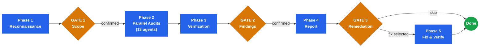

<div align="center">

# stn-skills: Codebase Audit

**Evidence-based repository audits for Claude Code**

13 domains. Parallel agents. Independently verified findings. Optional auto-fix.

<p>
  
  
  
  
  
</p>

</div>

Part of the **stn-skills** plugin suite by Sven Thiermann. A Claude Code skill that dispatches up to 13 specialized auditor agents in parallel, independently verifies every finding, and delivers a structured report with file:line evidence. Optionally, it fixes the findings directly in your code — surgically, with verification.

---

## Why This Exists

Code reviews catch issues in individual changes. But codebases accumulate problems across changes — security gaps nobody noticed, deprecated APIs that still work, dead code everyone steps around, documentation that drifted from reality, PII leaking into log files, N+1 queries hiding behind an ORM.

These systemic issues need a systematic audit, not a file-by-file review. This skill runs that audit. It works with any programming language and framework, adapts to your project's conventions, and enforces your team's quality mandates.

---

## Install

Run these two commands inside Claude Code (not in your terminal):

```
/plugin marketplace add sthiermann/stn-skills
/plugin install stn-skills
```

## Quick Start

Open Claude Code in any repository and say:

```
Audit this repository
```

That's it. The skill detects your tech stack, confirms scope with you, dispatches auditors, verifies findings, and generates the report.

Other phrases that work: `Review the codebase for production readiness` | `Run a code health check` | `Check this repo for security issues` | `Find dead code and deprecated patterns`

---

## How It Works



| Phase | What happens | Key detail |
|-------|-------------|------------|
| **Phase 1** | Detect tech stack, read project rules, map modules | Classifies repo size for optimal audit strategy |
| **Gate 1** | You confirm the scope | Adjust domains or modules before spending compute |
| **Phase 2** | 13 specialized auditors run in parallel | SEC, DOC, DEAD, DEPR, MAND, QUAL, ARCH, DEP, TEST, INFRA, PERF, CONC, PRIV |
| **Phase 3** | Independent verifier checks 30%+ of findings | False positives are removed; domains with >25% FP rate get re-audited |
| **Gate 2** | You review the verified findings | Challenge or investigate any finding before the report |
| **Phase 4** | Structured report with remediation roadmap | Every finding has a stable ID (F1, F2, ...) for selection |
| **Gate 3** | You choose what to fix — or skip entirely | Select by ID, severity, domain, or module. No code changes without your say. |
| **Phase 5** | Fixes applied surgically, then verified | Bottom-up edits, test suite run, regression detection |

---

## Audit Domains

| Domain | Code | What It Examines |
|--------|------|-----------------|
| **Security** | `SEC` | OWASP Top 10, hardcoded secrets, injection, auth, CORS, security headers, cryptographic weaknesses |
| **Documentation** | `DOC` | README accuracy, API docs vs. actual endpoints, architecture docs vs. structure, stale references |
| **Dead Code** | `DEAD` | Unused imports, functions, variables, files, unreachable branches, commented-out code, dead tests |
| **Deprecated Patterns** | `DEPR` | Outdated language features, deprecated framework APIs, legacy patterns — verified against actual versions |
| **Enterprise Mandates** | `MAND` | Non-negotiable project rules from CLAUDE.md (configurable per project) |
| **Code Quality** | `QUAL` | SOLID principles, DRY, naming, complexity, error handling, nesting depth, consistent idioms |
| **Architecture** | `ARCH` | Layer violations, circular dependencies, coupling, cohesion, testability, module boundaries |
| **Dependencies** | `DEP` | Outdated versions, CVEs, unused deps, duplicates, unpinned versions, license conflicts |
| **Test Coverage** | `TEST` | Untested interfaces, mock abuse, shallow assertions, missing edge cases, flaky indicators |
| **Infrastructure** | `INFRA` | Container best practices, CI/CD completeness, env var hygiene, secret management, IaC quality |
| **Performance** | `PERF` | N+1 queries, blocking I/O, unbounded data structures, resource leaks, missing caching, inefficient algorithms |
| **Concurrency** | `CONC` | Race conditions, deadlocks, TOCTOU, shared mutable state, async pitfalls (dispatched only when concurrency is detected) |
| **Data Privacy** | `PRIV` | PII in logs and error responses, data retention gaps, missing consent tracking, uncontrolled third-party data transmission |

---

## Language Support

The skill is fully technology-agnostic. All audit checks are expressed as universal principles — Claude adapts them to whatever tech stack it detects.

| Ecosystem | Languages and Frameworks |
|-----------|------------------------|
| **JVM** | Java, Kotlin, Scala, Groovy — Spring Boot, Quarkus, Micronaut, Gradle, Maven |
| **JavaScript / TypeScript** | Node.js, Deno, Bun — React, Angular, Vue, Next.js, NestJS, Express, Fastify |
| **Python** | Django, Flask, FastAPI, SQLAlchemy, Poetry, pip |
| **Go** | Standard library, Gin, Echo, Fiber, Chi |
| **Rust** | Actix, Axum, Rocket, Cargo |
| **C# / .NET** | ASP.NET Core, Blazor, Entity Framework, NuGet |
| **PHP** | Laravel, Symfony, Composer |
| **Ruby** | Rails, Sinatra, Bundler |
| **Swift** | iOS, macOS, Swift Package Manager |
| **C / C++** | CMake, Make, Bazel, Conan, vcpkg |
| **Others** | Elixir/Phoenix, Haskell/Stack, Clojure/Leiningen, Dart/Flutter, Zig, Nim |

---

## Example Output

Every finding includes severity, confidence, file:line evidence, impact, remediation, effort estimate, and risk level. Each carries a stable ID (F1, F2, ...) for remediation selection at Gate 3.

Severity levels: **Critical** (fix immediately) > **High** (fix this sprint) > **Medium** (fix this cycle) > **Low** (track)

**F1 [Critical] SEC: SQL injection in user search endpoint**
- **File:** `src/api/users.py:47`
- **Confidence:** Confirmed
- **Evidence:** `cursor.execute(f"SELECT * FROM users WHERE name = '{query}'")`
- **Impact:** User-supplied input is interpolated directly into SQL, enabling full database extraction via UNION-based injection
- **Remediation:** Use parameterized query: `cursor.execute("SELECT * FROM users WHERE name = %s", (query,))`
- **Effort:** Trivial (< 30min) | **Risk:** Safe

**F4 [High] PERF: N+1 query in order listing endpoint**
- **File:** `src/api/orders.js:82`
- **Confidence:** Confirmed
- **Evidence:** `orders.forEach(async (o) => { o.items = await db.query("SELECT * FROM items WHERE order_id = ?", o.id) })`
- **Impact:** For N orders, executes N+1 database queries. At 500 orders per page, this produces 501 queries per request.
- **Remediation:** Use a single JOIN or IN-clause: `SELECT * FROM items WHERE order_id IN (?)` with all order IDs batched
- **Effort:** Small (< 2h) | **Risk:** Moderate

**F9 [Medium] DEAD: Unused exported function**
- **File:** `src/utils/format.ts:124`
- **Confidence:** High
- **Evidence:** `export function formatLegacyDate(d: Date): string` — zero references found across 847 files searched
- **Impact:** Dead code increases bundle size and confuses maintainers scanning the utils module
- **Remediation:** Remove `formatLegacyDate` and its associated tests in `tests/utils/format.test.ts:89`
- **Effort:** Trivial (< 30min) | **Risk:** Safe

**F15 [Low] DOC: README setup instructions reference removed env variable**
- **File:** `README.md:34`
- **Confidence:** Confirmed
- **Evidence:** `Set LEGACY_DB_URL in your .env` — but `LEGACY_DB_URL` is not referenced anywhere in source code
- **Impact:** Users following setup instructions will configure an unused variable, wasting time and causing confusion
- **Remediation:** Remove the outdated setup step or replace with the current `DATABASE_URL` variable
- **Effort:** Trivial (< 30min) | **Risk:** Safe

---

## Enterprise Mandates

When your project defines quality mandates in `CLAUDE.md`, the audit enforces them. The default mandates:

| # | Mandate | Target State |
|---|---------|-------------|
| 1 | **Current APIs** | All code uses current, officially recommended APIs and language idioms |
| 2 | **Clean-slate system** | No migration scripts, compatibility layers, or transition logic |
| 3 | **State-of-the-art** | Current best practices applied consistently to every component |
| 4 | **Forward-only** | No backward compatibility shims, version checks, or legacy adapters |
| 5 | **Unified codebase** | No "old/new/legacy" labeling — everything is the current state |
| 6 | **Full rewrite** | No partial patches preserving outdated structures |
| 7 | **Zero legacy assumptions** | No assumptions about pre-existing users, data, or state |

The audit produces a PASS/FAIL compliance matrix for each mandate with cited evidence.

---

## Report Structure

The final audit report contains:

- **Executive Summary** — finding counts, top 3 priorities, verification statistics
- **Enterprise Mandate Compliance Matrix** — PASS/FAIL per mandate with evidence
- **Findings by Severity** — Critical, High, Medium, Low — each with file:line evidence
- **Remediation Roadmap** — prioritized by severity and estimated effort
- **Evidence Index** — all file:line references organized by domain

---

## Plugin Structure

```
codebase-audit/
|
|-- .claude-plugin/
|   |-- plugin.json                          # Plugin metadata
|   +-- marketplace.json                     # Marketplace registration
|
|-- skills/
|   +-- codebase-audit/
|       |-- SKILL.md                         # Orchestration (5 phases, 3 gates)
|       |
|       |-- agents/
|       |   |-- security-auditor.md          # OWASP Top 10, secrets, injection
|       |   |-- documentation-auditor.md     # Doc accuracy, completeness
|       |   |-- dead-code-auditor.md         # Unused code, unreachable branches
|       |   |-- deprecated-patterns-auditor.md
|       |   |-- enterprise-mandates-auditor.md
|       |   |-- code-quality-auditor.md      # SOLID, DRY, naming, complexity
|       |   |-- architecture-auditor.md      # Coupling, cohesion, layering
|       |   |-- dependency-auditor.md        # CVEs, outdated, licenses
|       |   |-- test-coverage-auditor.md     # Gaps, mock abuse, edge cases
|       |   |-- infrastructure-auditor.md    # Containers, CI/CD, secrets
|       |   |-- performance-auditor.md       # N+1, blocking I/O, leaks
|       |   |-- concurrency-auditor.md       # Race conditions, deadlocks
|       |   |-- data-privacy-auditor.md      # PII handling, retention
|       |   |-- findings-verifier.md         # Independent evidence check
|       |   |-- report-synthesizer.md        # Dedup, ID assignment, report
|       |   |-- remediation-executor.md      # Applies fixes to code files
|       |   +-- remediation-verifier.md      # Verifies fixes, runs tests
|       |
|       +-- references/
|           |-- severity-classification.md   # Severity levels and evidence rules
|           +-- report-template.md           # Output report structure
|
|-- README.md
+-- LICENSE
```

---

## Suppressing Findings

Teams can suppress known false positives or intentional patterns by adding comments directly in source code:

```python
# audit-suppress: DEAD: intentionally unused — reserved for plugin API
def on_plugin_load(ctx):
    pass
```

```java
// audit-suppress: SEC: CSRF not applicable — internal microservice, no browser clients
@PostMapping("/internal/sync")
public void syncData(@RequestBody SyncRequest req) { ... }
```

Suppression syntax: `audit-suppress: DOMAIN` or `audit-suppress: DOMAIN: reason`. Applies to the next line only. Critical findings with Confirmed confidence are never suppressed.

---

## CI/CD Integration

The audit runs interactively by default (3 user gates for scope, findings, and remediation). For CI/CD pipelines, use Claude Code's headless mode with pre-confirmed scope:

```yaml
# GitHub Actions example
- name: Run codebase audit
  run: |
    claude --print "Run a codebase audit on this repository. \
      Scope: all 13 domains. \
      At Gate 1: confirm full scope. \
      At Gate 2: proceed to report. \
      At Gate 3: skip remediation. \
      Output the full report."
```

**Using the deploy recommendation:**
The audit report includes a deploy recommendation at Gate 2 based on findings:
- **Block deploy**: Critical findings with Confirmed or High confidence detected
- **Deploy with caution**: High findings in non-critical paths
- **Ship it**: No Critical or High findings

Teams can parse the deploy recommendation from the report output and use it as a gate in their pipeline.

---

## Contributing

Contributions are welcome. If you want to improve an auditor's checklist, add support for a new domain, or fix an issue:

1. Fork the repository
2. Make your changes
3. Ensure all auditor prompts follow the canonical format (see `SKILL.md` for the finding format specification)
4. Submit a pull request with a clear description of what changed and why

**Guidelines:**
- Audit checks use universal principles, not language-specific rules
- Every checklist item uses positive formulations ("verify that X works correctly" not "check for X failure")
- All agents use the same context variable format and output field names
- New domains need a corresponding entry in the dispatch table in `SKILL.md`

---

## Acknowledgments

- Security audit categories reference the [OWASP Top 10 2021](https://owasp.org/Top10/), published by the OWASP Foundation under [CC BY-SA 4.0](https://creativecommons.org/licenses/by-sa/4.0/). OWASP is a registered trademark of the OWASP Foundation, Inc. This project is not affiliated with or endorsed by the OWASP Foundation.

---

## License

MIT
