<div align="center">

# stn-skills

**The only Claude Code skill suite that plans, builds, and proves it worked.**

<p>
  
  
  
  
</p>

[What's new in v3.1.0](CHANGELOG.md)

</div>

Requires [Claude Code](https://claude.ai/code) installed.

Professional skill suite for the complete software engineering lifecycle. From brainstorming through planning to verified execution — every step produces evidence, every claim is backed by verification, every decision is traceable.

---

## The Problem

AI-assisted coding without structure produces predictable failures: plans abandoned halfway through, implementations that drift from specifications, deprecated APIs that persist because nobody verified they were replaced, and completion claims backed by nothing but the agent's word. Research confirms this is not hypothetical — multi-turn AI code generation degrades 20-27% in quality without per-step verification, and planning before coding yields 12-18% higher correctness rates. The larger the task, the wider the gap between what was requested and what gets delivered.

stn-skills closes that gap. Every design decision is explored through multiple lenses before commitment. Every implementation step is independently verified by separate reviewer agents. Every completion claim is backed by fresh evidence. The result: features that are fully implemented, fully verified, and fully modern — with zero deprecated code, zero placeholders, and zero unverified claims.

---

## Available Skills

| Skill | Invoke | Description | Typical Duration |
|-------|--------|-------------|-----------------|
| **Brainstorming** | `stn-skills:brainstorming` | Multi-lens design exploration with adversarial review. Transforms vague requests into validated design specs. | 5-25 min |
| **Plan Writing** | `stn-skills:plan-writing` | DAG-based task decomposition with zero placeholders. Every step has complete code, verification, and rollback. | 5-35 min |
| **Plan Execution** | `stn-skills:plan-execution` | Checkpoint-verified execution with drift detection, 3-stage review, circuit breakers, and fidelity scoring. | ~3 min/task |
| **Build Feature** | `stn-skills:build-feature` | End-to-end pipeline: brainstorming → plan-writing → plan-execution in one workflow. | 30-90 min |
| **Codebase Audit** | `stn-skills:codebase-audit` | 13-domain evidence-based repository audit with confidence scoring, optional auto-fix, and pipeline escalation for complex findings. | 15-45 min |
| **Quality Bootstrap** | `stn-skills:codebase-quality-bootstrap` | Generates production-grade CLAUDE.md and hooks aligned with all 13 audit domains. | 5-15 min |

| Skill | Invoke | Description |
|-------|--------|-------------|
| **Brainstorming** | `stn-skills:brainstorming` | Multi-lens design exploration with adversarial review. Transforms vague requests into validated design specs. |
| **Plan Writing** | `stn-skills:plan-writing` | DAG-based task decomposition with zero placeholders. Every step has complete code, verification, and rollback. |
| **Plan Execution** | `stn-skills:plan-execution` | Checkpoint-verified execution with drift detection, 3-stage review, circuit breakers, and fidelity scoring. |
| **Build Feature** | `stn-skills:build-feature` | End-to-end pipeline: brainstorming → plan-writing → plan-execution in one workflow. |
| **Codebase Audit** | `stn-skills:codebase-audit` | 13-domain evidence-based repository audit with confidence scoring and optional auto-fix. |
| **Quality Bootstrap** | `stn-skills:codebase-quality-bootstrap` | Generates production-grade CLAUDE.md and hooks aligned with all 13 audit domains. |

---

## The Pipeline

```mermaid
graph LR
    A["Brainstorming<br/><i>6 phases, 4 gates</i>"] -->|design spec| B["Plan Writing<br/><i>6 phases, 4 gates</i>"]
    B -->|implementation plan| C["Plan Execution<br/><i>7 phases, 3 gates</i>"]
    C -->|completion report| D(("Verified<br/>Feature"))
    E["Codebase Audit<br/><i>13 domains, 3 gates</i>"] -->|"complex findings<br/>[PIPELINE]"| A

    style A fill:#2563eb,stroke:#1d4ed8,color:#fff
    style B fill:#7c3aed,stroke:#6d28d9,color:#fff
    style C fill:#059669,stroke:#047857,color:#fff
    style D fill:#16a34a,stroke:#15803d,color:#fff
    style E fill:#dc2626,stroke:#b91c1c,color:#fff
```



Each skill works independently or as part of the pipeline. Use `/stn-skills:build-feature` for the full pipeline, or invoke each skill separately. Complex audit findings can be escalated to the brainstorming → planning → execution pipeline for structured remediation.

---

## Install

Run inside Claude Code (not your terminal):

```
/install stn-skills
```

---

## Quick Start

### Full pipeline (idea to verified code)

```
/stn-skills:build-feature
```

Or: `Build this feature` | `Implement end-to-end` | `Full pipeline`

### Individual skills

```
/stn-skills:brainstorming          # Explore and design
/stn-skills:plan-writing           # Create implementation plan
/stn-skills:plan-execution         # Execute plan with verification
/stn-skills:codebase-audit         # Audit existing code
/stn-skills:codebase-quality-bootstrap  # Set up quality standards
```

---

## What Makes This Different

### Brainstorming — tree-structured exploration, not linear Q&A

- Explores problems through 5 cognitive lenses: Inversion, Stakeholder, Constraint Removal, Temporal, and Simplification
- Weighted decision matrix with 7 criteria (including Modernity) — reduces anchoring bias
- Adversarial review with 11-type reasoning flaw taxonomy attacks the selected approach before commitment
- Adapts depth to complexity: Focused (1 lens) / Standard (3 lenses) / Deep (5 lenses)
- Output: validated design specification with acceptance criteria, ready for plan-writing

### Plan Writing — DAG-based decomposition, zero placeholders

- Tasks form a Directed Acyclic Graph with explicit dependencies and parallel groups
- Every step contains complete code or exact commands — 40+ placeholder patterns detected and rejected
- Plan Quality Score (0-100) must reach 90+ before delivery
- 7-check adversarial verification: requirements coverage, placeholders, signatures, DAG integrity, conventions, rollback, traceability
- Output: machine-parseable plan with traceability matrix

### Plan Execution — verified completion, not trust

- Fresh subagent per task with structured handoff and mandatory context refresh
- 3-stage sequential review: spec compliance → code quality → integration (each reads the actual diff, not the implementer's summary)
- Drift detection after every task (scope, content, overreach checks)
- Circuit breakers (GREEN/YELLOW/RED) prevent infinite retry loops
- Reflect-Retry-Escalate protocol with self-reflection and model escalation
- Post-execution cleanup: zero debug artifacts, zero deprecated code, zero legacy patterns
- Execution Fidelity Score (0-100) with evidence for every claim
- Output: formal completion report with end-to-end traceability

### Codebase Audit — pipeline-integrated remediation

- 13 specialized auditor agents dispatched in parallel, each with domain expertise
- Independent verification removes false positives (30%+ sampling, all criticals mandatory)
- Two-tier remediation: surgical quick fixes for simple findings, pipeline escalation for complex ones
- Complex findings generate a structured remediation brief that feeds directly into brainstorming or plan-writing

<details>
<summary><b>Token Efficiency</b> — progressive disclosure architecture</summary>

- SKILL.md bodies: max 400 lines, split into reference files loaded on-demand
- Agent prompts: max 200 lines, dense and filler-free
- Subagent output stays in subagent context — only structured summaries return
- KV-cache optimized: stable prefixes, deterministic ordering, no timestamps in system content

</details>

---

## Research-Backed Methodology

Every design choice in stn-skills is grounded in established principles of AI-assisted software engineering:

| Principle | Evidence | How stn-skills Implements It |
|-----------|----------|------------------------------|
| **Plan before code** | Structured decomposition before generation yields 12-18% higher correctness | Brainstorming produces validated specs; plan-writing produces complete plans — before any code is written |
| **Verify at every step** | Multi-turn AI generation degrades 20-27% without per-step feedback | Plan-execution runs 3-stage review + drift detection after every single task |
| **Separate generator from reviewer** | Distinct personas for generation vs. review catch errors self-review misses | Task-implementer (generator) is independent from spec-compliance, code-quality, and integration reviewers |
| **Test-driven development** | TDD compensates for model limitations — lower-performing models benefit more | Plan-writing enforces test-first task decomposition; task-implementer prioritizes test steps |
| **Dual-threshold circuit breakers** | Prevents runaway failures and infinite retry loops | GREEN/YELLOW/RED thresholds on review failures, BLOCKED counts, and drift events |
| **Context refresh over caching** | Re-reading files before each step prevents plan staleness | Orchestrator re-reads all scope files before every task dispatch; fresh subagent per task |
| **Tree-structured search** | Generating multiple approaches and pruning outperforms single-path generation | Brainstorming generates distinct approaches via parallel cognitive lenses, then prunes via adversarial review |

---

## Plugin Structure

```
stn-skills/
  .claude-plugin/
    plugin.json                          # Plugin metadata (v3.1.0)
    marketplace.json                     # Marketplace registration (6 skills)
  commands/
    brainstorming.md                     # /stn-skills:brainstorming
    plan-writing.md                      # /stn-skills:plan-writing
    plan-execution.md                    # /stn-skills:plan-execution
    build-feature.md                     # /stn-skills:build-feature
    codebase-audit.md                    # /stn-skills:codebase-audit
    codebase-quality-bootstrap.md        # /stn-skills:codebase-quality-bootstrap
  skills/
    brainstorming/                       # 6 phases, 4 gates
      SKILL.md, README.md
      agents/ (5)    references/ (4)
    plan-writing/                        # 6 phases, 4 gates
      SKILL.md, README.md
      agents/ (4)    references/ (3)
    plan-execution/                      # 7 phases, 3 gates
      SKILL.md, README.md
      agents/ (5)    references/ (7)
    build-feature/                       # 3 macro-phases
      SKILL.md, README.md
    codebase-audit/                      # 5 phases, 3 gates
      SKILL.md, README.md
      agents/ (17)   references/ (2)
    codebase-quality-bootstrap/          # 4 phases, 3 gates
      SKILL.md, README.md
      agents/ (6)    references/ (3)
```

---

## Contributing

See [CONTRIBUTING.md](CONTRIBUTING.md) for guidelines.

---

## License

MIT
