<div align="center">


# stn-skills

**Structured AI development — from first idea to verified code.**

A professional skill suite for Claude Code, Cursor, and Copilot CLI.<br>
Brainstorm. Plan. Execute. Verify. Every step produces evidence.

<p>
  
  
  
  
  
</p>

[What's new in v7.0.0](CHANGELOG.md)

</div>

Supports [Claude Code](https://claude.ai/code), [Cursor](https://cursor.com), and [Copilot CLI](https://docs.github.com/en/copilot).

---

## Why stn-skills

AI-assisted coding without structure produces predictable failures:

- **Plans abandoned halfway** — without task decomposition and checkpoints, multi-step implementations drift from the original intent
- **No verification** — completion claims backed by nothing but the agent's word. Research measures 20–27% quality degradation without per-step feedback
- **Deprecated code persists** — nobody verified the old APIs were actually replaced
- **Planning skipped entirely** — yet structured decomposition yields 12–18% higher correctness

stn-skills closes these gaps with evidence-backed structure at every stage. Every design decision is explored through multiple lenses before commitment. Every implementation step is independently verified by separate reviewer agents. Every completion claim is backed by fresh evidence.

---

## The Pipeline

```mermaid
graph LR
    A["Brainstorming<br/><i>6 phases, 4 gates</i>"] -->|design spec| V1{"Handoff<br/>Validator"}
    V1 -->|validated| B["Plan Writing<br/><i>6 phases, 4 gates</i>"]
    B -->|implementation plan| V2{"Handoff<br/>Validator"}
    V2 -->|validated| C["Plan Execution<br/><i>7 phases, 3 gates</i>"]
    C -->|completion report| D(("Verified<br/>Feature"))
    E["Codebase Audit<br/><i>13 domains, 3 gates</i>"] -->|"complex findings<br/>[PIPELINE]"| A

    style A fill:#2563eb,stroke:#1d4ed8,color:#fff
    style V1 fill:#d97706,stroke:#b45309,color:#fff
    style B fill:#7c3aed,stroke:#6d28d9,color:#fff
    style V2 fill:#d97706,stroke:#b45309,color:#fff
    style C fill:#059669,stroke:#047857,color:#fff
    style D fill:#16a34a,stroke:#15803d,color:#fff
    style E fill:#dc2626,stroke:#b91c1c,color:#fff
```



Each skill works independently or as part of the pipeline. The `session-init` skill auto-loads at session start and routes to the correct skill based on pipeline state. Use `/stn-skills:build-feature` for the full pipeline, or invoke each skill separately. Complex audit findings can be escalated to the brainstorming → planning → execution pipeline for structured remediation.

---

## Available Skills

| Skill | Invoke | Description | Typical Duration |
|-------|--------|-------------|-----------------|
| **[Build Feature](skills/build-feature/README.md)** | `stn-skills:build-feature` | End-to-end pipeline: brainstorming → plan-writing → plan-execution in one workflow. | 30–90 min |
| **[Brainstorming](skills/brainstorming/README.md)** | `stn-skills:brainstorming` | Multi-lens design exploration with adversarial review. Transforms vague requests into validated design specs. | 5–25 min |
| **[Plan Writing](skills/plan-writing/README.md)** | `stn-skills:plan-writing` | DAG-based task decomposition with zero placeholders. Every step has complete code, verification, and rollback. | 5–35 min |
| **[Handoff Validator](skills/pipeline-handoff-validator/README.md)** | `stn-skills:pipeline-handoff-validator` | Validates design specs and plans at pipeline boundaries before the next phase consumes them. | 1–3 min |
| **[Plan Execution](skills/plan-execution/README.md)** | `stn-skills:plan-execution` | Checkpoint-verified execution with drift detection, 3-stage review, circuit breakers, and fidelity scoring. | ~3 min/task |
| **[Codebase Audit](skills/codebase-audit/README.md)** | `stn-skills:codebase-audit` | 13-domain evidence-based repository audit with confidence scoring, optional auto-fix, and pipeline escalation for complex findings. | 15–45 min |
| **[Quality Bootstrap](skills/codebase-quality-bootstrap/README.md)** | `stn-skills:codebase-quality-bootstrap` | Generates production-grade CLAUDE.md and hooks aligned with all 13 audit domains. | 5–15 min |
| **[Auto-Discovery](skills/session-init/README.md)** | `stn-skills:session-init` | Session-start auto-loading with pipeline-state awareness. Routes to the correct skill. | auto |

---

## Install

Run inside your AI coding tool (not your terminal):

```
/install stn-skills
```

---

## Quick Start

### Full pipeline (idea to verified code)

```
/stn-skills:build-feature
```

Or: `Build this feature` | `Implement end-to-end` | `Full pipeline`

### Individual skills

```
/stn-skills:brainstorming                # Explore and design
/stn-skills:plan-writing                 # Create implementation plan
/stn-skills:pipeline-handoff-validator   # Validate artifacts between phases
/stn-skills:plan-execution              # Execute plan with verification
/stn-skills:codebase-audit              # Audit existing code
/stn-skills:codebase-quality-bootstrap  # Set up quality standards
```

---

## What Makes This Different

### Brainstorming — tree-structured exploration, not linear Q&A

- Explores problems through 5 cognitive lenses: Inversion, Stakeholder, Constraint Removal, Temporal, and Simplification
- Weighted decision matrix with 7 criteria (including Modernity) — reduces anchoring bias
- Adversarial review with 11-type reasoning flaw taxonomy attacks the selected approach before commitment
- Adapts depth to complexity: Focused (1 lens) / Standard (3 lenses) / Deep (5 lenses)
- Output: validated design specification with acceptance criteria, ready for plan-writing

---

### Plan Writing — DAG-based decomposition, zero placeholders

- Tasks form a Directed Acyclic Graph with explicit dependencies and parallel groups
- Every step contains complete code or exact commands — 40+ placeholder patterns detected and rejected
- Plan Quality Score (0-100) must reach 90+ before delivery
- 7-check adversarial verification: requirements coverage, placeholders, signatures, DAG integrity, conventions, rollback, traceability
- Output: machine-parseable plan with traceability matrix

---

### Plan Execution — verified completion, not trust

- Fresh subagent per task with structured handoff and mandatory context refresh
- 3-stage sequential review: spec compliance → code quality → integration (each reads the actual diff, not the implementer's summary)
- Drift detection after every task (scope, content, overreach checks)
- Circuit breakers (GREEN/YELLOW/RED) prevent infinite retry loops
- Reflect-Retry-Escalate protocol with self-reflection and model escalation
- Post-execution cleanup: zero debug artifacts, zero deprecated code, zero legacy patterns
- Execution Fidelity Score (0-100) with evidence for every claim
- Output: formal completion report with end-to-end traceability

---

### Codebase Audit — pipeline-integrated remediation

- 13 specialized auditor agents dispatched in parallel, each with domain expertise
- Independent verification removes false positives (30%+ sampling, all criticals mandatory)
- Two-tier remediation: surgical quick fixes for simple findings, pipeline escalation for complex ones
- Complex findings generate a structured remediation brief that feeds directly into brainstorming or plan-writing

---

<details>
<summary><b>Token Efficiency</b> — progressive disclosure architecture</summary>

- SKILL.md bodies: target 400 lines, complex skills up to 600 with reference files for on-demand loading
- Agent prompts: max 200 lines, dense and filler-free
- Subagent output stays in subagent context — only structured summaries return
- KV-cache optimized: stable prefixes, deterministic ordering, no timestamps in system content

</details>

---

## Research-Backed Methodology

Every design choice in stn-skills is grounded in established principles of AI-assisted software engineering:

| Principle | Evidence | How stn-skills Implements It |
|-----------|----------|------------------------------|
| **Plan before code** | Structured decomposition before generation yields 12–18% higher correctness | Brainstorming produces validated specs; plan-writing produces complete plans — before any code is written |
| **Verify at every step** | Multi-turn AI generation degrades 20–27% without per-step feedback | Plan-execution runs 3-stage review + drift detection after every single task |
| **Separate generator from reviewer** | Distinct personas for generation vs. review catch errors self-review misses | Task-implementer (generator) is independent from spec-compliance, code-quality, and integration reviewers |
| **Test-driven development** | TDD compensates for model limitations — lower-performing models benefit more | Plan-writing enforces test-first task decomposition; task-implementer prioritizes test steps |
| **Dual-threshold circuit breakers** | Prevents runaway failures and infinite retry loops | GREEN/YELLOW/RED thresholds on review failures, BLOCKED counts, and drift events |
| **Context refresh over caching** | Re-reading files before each step prevents plan staleness | Orchestrator re-reads all scope files before every task dispatch; fresh subagent per task |
| **Tree-structured search** | Generating multiple approaches and pruning outperforms single-path generation | Brainstorming generates distinct approaches via parallel cognitive lenses, then prunes via adversarial review |

---

## Plugin Structure

| Directory | Contents |
|-----------|----------|
| `.claude-plugin/` | `plugin.json` (metadata) · `marketplace.json` (marketplace registration) |
| `.cursor-plugin/` | `plugin.json` (Cursor metadata) · `hooks-cursor.json` (Cursor hooks) |
| `hooks/` | `hooks.json` (hook definitions) · 7 enforcement hooks (see below) |
| `commands/` | 8 slash command entry points (one `.md` per skill) |
| `skills/` | 8 skill implementations (see below) |
| `evals/` | Eval framework: 59 behavioral tests, 88 consistency checks, activation tests |

### Enforcement Hooks

7 hooks execute at the Claude Code harness level — outside the LLM's reasoning chain. Claude cannot rationalize past them.

| Hook | Event | What It Enforces |
|------|-------|-----------------|
| `stn-init` | SessionStart | Loads pipeline state + session-init routing into context |
| `stn-session-lock` | SessionStart | Prevents concurrent sessions via atomic mkdir lock |
| `stn-skill-gate` | PreToolUse | Blocks invalid skill chain transitions (handoff not validated) |
| `stn-state-validator` | PreToolUse | Validates JSON integrity on pipeline state file writes |
| `stn-routing-guard` | PreToolUse | Blocks multi-file edits (3+ files) outside pipelines with actionable deny |
| `stn-scope-guard` | PreToolUse | Blocks writes outside current task scope during execution |
| `stn-circuit-breaker` | PreToolUse | Blocks all modifications when circuit breaker is RED |

See [Hook Documentation](docs/recommended-hooks.md) for details and override options.

### Skill Structure

Pipeline skills contain: `SKILL.md` (orchestrator prompt) · `README.md` (documentation) · `banner.svg` · `agents/` (subagent prompts) · `references/` (loaded on-demand). `session-init` is a lightweight routing skill auto-injected at session start — it has no agents or references.

| Skill | Phases | Agents | References |
|-------|--------|--------|------------|
| `build-feature` | 3 macro-phases | — | — |
| `brainstorming` | 6 phases, 4 gates | 5 | 4 |
| `plan-writing` | 6 phases, 4 gates | 4 | 3 |
| `pipeline-handoff-validator` | 2 validation modes | — | 1 |
| `plan-execution` | 7 phases, 3 gates | 5 | 7 |
| `codebase-audit` | 5 phases, 3 gates | 17 | 4 |
| `codebase-quality-bootstrap` | 4 phases, 3 gates | 6 | 3 |
| `session-init` | auto-discovery | — | — |

---

## Troubleshooting

**A hook blocked my edit. How do I proceed?**
Read the block reason — it tells you what to do. Usually: invoke the correct skill first. For urgent hotfixes: `export STN_ROUTING_GUARD_SKIP=1` bypasses the routing guard without disabling other hooks.

**My pipeline was interrupted. Can I resume?**
Yes. Pipeline state persists in `.claude/stn-skills-pipeline-state.json`. Start a new session in the same directory — `session-init` detects the active pipeline and offers to resume.

**How do I disable all hooks temporarily?**
`export STN_SKILLS_HOOKS_DISABLE=1` disables all stn-skills hooks. See [Hook Documentation](docs/recommended-hooks.md) for granular overrides.

**Can I use individual skills without the full pipeline?**
Yes. Every skill works independently. Use `/stn-skills:brainstorming` for design only, `/stn-skills:codebase-audit` for audit only, etc.

---

## Contributing

See [CONTRIBUTING.md](CONTRIBUTING.md) for guidelines. All changes must pass the eval suite (`./evals/eval-runner.sh`).

---

## License

MIT
