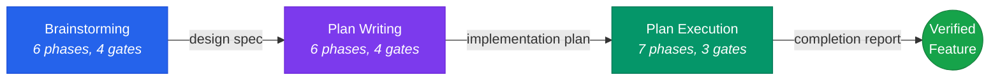

<div align="center">

# stn-skills

**The only Claude Code skill suite that plans, builds, and proves it worked.**

<p>
  
  
  
  
</p>

[What's new in v3.0.0](CHANGELOG.md)

</div>

Requires [Claude Code](https://claude.ai/code) installed.

Professional skill suite for the complete software engineering lifecycle. From brainstorming through planning to verified execution — every step produces evidence, every claim is backed by verification, every decision is traceable.

---

## Available Skills

| Skill | Invoke | Description |
|-------|--------|-------------|
| **Brainstorming** | `stn-skills:brainstorming` | Multi-lens design exploration with adversarial review. Transforms vague requests into validated design specs. |
| **Plan Writing** | `stn-skills:plan-writing` | DAG-based task decomposition with zero placeholders. Every step has complete code, verification, and rollback. |
| **Plan Execution** | `stn-skills:plan-execution` | Checkpoint-verified execution with drift detection, 3-stage review, circuit breakers, and fidelity scoring. |
| **Build Feature** | `stn-skills:build-feature` | End-to-end pipeline: brainstorming → plan-writing → plan-execution in one workflow. |
| **Codebase Audit** | `stn-skills:codebase-audit` | 13-domain evidence-based repository audit with confidence scoring and optional auto-fix. |
| **Quality Bootstrap** | `stn-skills:codebase-quality-bootstrap` | Generates production-grade CLAUDE.md and hooks aligned with all 13 audit domains. |

---

## The Pipeline



Each skill works independently or as part of the pipeline. Use `/stn-skills:build-feature` for the full pipeline, or invoke each skill separately.

---

## Install

Run inside Claude Code (not your terminal):

```
/install stn-skills
```

---

## Quick Start

### Full pipeline (idea to verified code)

```
/stn-skills:build-feature
```

Or: `Build this feature` | `Implement end-to-end` | `Full pipeline`

### Individual skills

```
/stn-skills:brainstorming          # Explore and design
/stn-skills:plan-writing           # Create implementation plan
/stn-skills:plan-execution         # Execute plan with verification
/stn-skills:codebase-audit         # Audit existing code
/stn-skills:codebase-quality-bootstrap  # Set up quality standards
```

---

## What Makes This Different

<details>
<summary><b>Brainstorming</b> — 5 cognitive lenses, not linear Q&A</summary>

- Explores problems through Inversion, Stakeholder, Constraint Removal, Temporal, and Simplification lenses
- Weighted decision matrix with 7 criteria (including Modernity)
- Adversarial review with 11-type reasoning flaw taxonomy
- Adapts depth to complexity: Focused (1 lens) / Standard (3 lenses) / Deep (5 lenses)
- Output: validated design specification with acceptance criteria

</details>

<details>
<summary><b>Plan Writing</b> — DAG-based decomposition, zero placeholders</summary>

- Tasks form a Directed Acyclic Graph with explicit dependencies and parallel groups
- Every step contains complete code or exact commands — 40+ placeholder patterns detected and rejected
- Plan Quality Score (0-100) must reach 90+ before delivery
- 7-check adversarial verification: requirements coverage, placeholders, signatures, DAG integrity, conventions, rollback, traceability
- Output: machine-parseable plan with traceability matrix

</details>

<details>
<summary><b>Plan Execution</b> — verified completion, not trust</summary>

- Fresh subagent per task with structured handoff (context isolation + knowledge transfer)
- 3-stage sequential review: spec compliance → code quality → integration
- Drift detection after every task (scope, content, overreach checks)
- Circuit breakers (GREEN/YELLOW/RED) prevent infinite retry loops
- Reflect-Retry-Escalate protocol for intelligent failure recovery
- Post-execution cleanup removes debug artifacts and legacy patterns
- Execution Fidelity Score (0-100) with evidence for every claim
- Output: formal completion report with end-to-end traceability

</details>

<details>
<summary><b>Token Efficiency</b> — progressive disclosure architecture</summary>

- SKILL.md bodies: max 400 lines, split into reference files loaded on-demand
- Agent prompts: max 200 lines, dense and filler-free
- Subagent output stays in subagent context — only structured summaries return
- KV-cache optimized: stable prefixes, deterministic ordering, no timestamps in system content

</details>

---

## Plugin Structure

```
stn-skills/
  .claude-plugin/
    plugin.json                          # Plugin metadata (v3.0.0)
    marketplace.json                     # Marketplace registration (6 skills)
  commands/
    brainstorming.md                     # /stn-skills:brainstorming
    plan-writing.md                      # /stn-skills:plan-writing
    plan-execution.md                    # /stn-skills:plan-execution
    build-feature.md                     # /stn-skills:build-feature
    codebase-audit.md                    # /stn-skills:codebase-audit
    codebase-quality-bootstrap.md        # /stn-skills:codebase-quality-bootstrap
  skills/
    brainstorming/                       # 6 phases, 4 gates
      SKILL.md, README.md
      agents/ (5)    references/ (4)
    plan-writing/                        # 6 phases, 4 gates
      SKILL.md, README.md
      agents/ (4)    references/ (3)
    plan-execution/                      # 7 phases, 3 gates
      SKILL.md, README.md
      agents/ (5)    references/ (7)
    build-feature/                       # 3 macro-phases
      SKILL.md, README.md
    codebase-audit/                      # 5 phases, 3 gates
      SKILL.md, README.md
      agents/ (17)   references/ (2)
    codebase-quality-bootstrap/          # 4 phases, 3 gates
      SKILL.md, README.md
      agents/ (6)    references/ (3)
```

---

## Contributing

See [CONTRIBUTING.md](CONTRIBUTING.md) for guidelines.

---

## License

MIT
