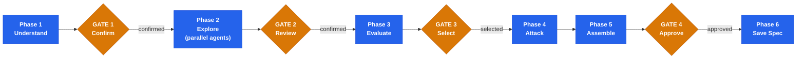

<div align="center">


# Brainstorming

**Structured design exploration for Claude Code**

Multi-lens analysis. Adversarial review. Validated design specs.

<p>
  
  
  
</p>

</div>

Part of the [stn-skills](https://github.com/sthiermann/stn-skills) pipeline. Produces design specs that feed directly into plan-writing. Use `/stn-skills:build-feature` for the full design-to-delivery pipeline.

A Claude Code skill for structured design exploration that transforms vague requests into validated design specifications. Instead of jumping straight to code, it surfaces hidden assumptions, explores genuinely distinct approaches through 5 cognitive lenses, scores them against a weighted decision matrix, and stress-tests the winner through adversarial review before producing a spec ready for plan-writing.

Research shows that exploring multiple approaches before implementation yields 12–18% higher correctness than single-path generation.

**Typical duration:** Focused: 5–8 min | Standard: 10–15 min | Deep: 15–25 min

---

## What It Does

- **Structured problem discovery** — one-at-a-time interview, assumption surfacing, scope boundaries
- **Multi-lens exploration** — parallel subagents apply inversion, stakeholder, constraint, temporal, and simplification lenses
- **Weighted evaluation** — 7-criteria decision matrix with mandatory justifications and risk pre-assessment
- **Adversarial review** — 11-type flaw taxonomy stress-tests the selected approach; blockers loop back
- **Spec output** — saves a complete design spec to `docs/specs/` ready for plan-writing

---

## Quick Start

```
/stn-skills:brainstorming
```

Or use natural language: `Brainstorm how to build this` | `Design this feature` | `Explore approaches for X` | `Think through the options` | `How should we build this?`

---

## How It Works



| Phase | What happens |
|-------|-------------|
| **Phase 1** | Codebase recon, structured interview (max 6 questions), classify complexity, surface assumptions |
| **Gate 1** | User confirms problem statement, assumptions, and scope |
| **Phase 2** | Parallel subagents: problem decomposer + multi-lens explorer + assumptions surfacer |
| **Gate 2** | User reviews approaches, confirms new assumptions, eliminates non-starters |
| **Phase 3** | Decision matrix (7 criteria) with risk pre-assessment per approach |
| **Gate 3** | User selects approach, may adjust weights |
| **Phase 4** | Adversarial reviewer attacks selected approach; blockers must resolve before proceeding |
| **Phase 5** | Orchestrator assembles design spec from validated outputs |
| **Gate 4** | User approves final spec |
| **Phase 6** | Spec saved to `docs/specs/YYYY-MM-DD-<topic>-design.md` |

---

## Key Outputs

- **Design spec document** — problem, approach, rationale, risks, acceptance criteria
- **Decision matrix** — weighted scores with justifications for every approach considered
- **Risk register** — likelihood, impact, and mitigation per identified risk
- **Adversarial findings** — blockers resolved, warnings and notes carried into spec

---

## Adaptive Depth

| Dimension | Focused | Standard | Deep |
|-----------|---------|----------|------|
| Interview | 2-3 questions | 4-5 questions | 6 questions |
| Lenses | 1 | 3 | 5 |
| Approaches | 2 | 3 | 5+ |
| Flaw types | 3 | 7 | 11 |
| Typical scope | Single component | Multi-module feature | System / architectural |
