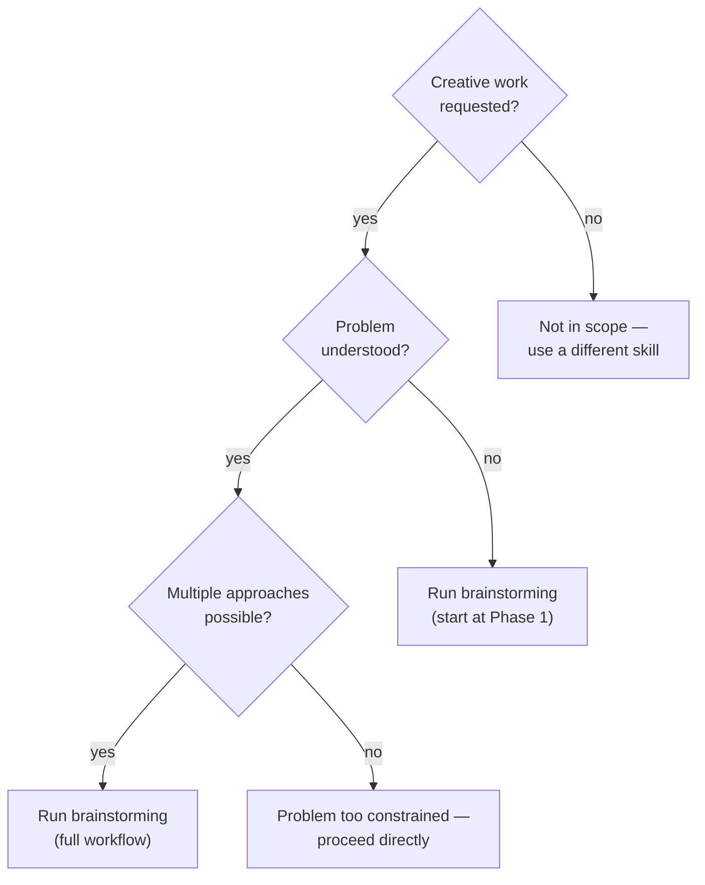
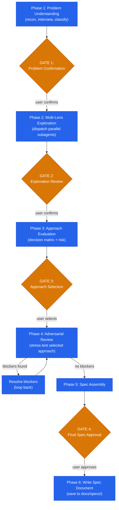

# Brainstorming

## Overview

Structured exploration that converts ambiguous requests into validated design specs. Surfaces assumptions, generates genuinely distinct approaches through multi-lens cognitive frameworks, scores them against weighted criteria, stress-tests the winner through adversarial review, and produces a spec document ready for plan-writing.

This skill implements tree-structured exploration — generating multiple distinct approaches in parallel (branching), evaluating each through weighted criteria (scoring), and pruning via adversarial review (selection). Research shows tree-structured search with execution feedback at each node consistently outperforms single-path linear generation for complex design problems.

**Core principle:** Every design decision requires explored alternatives. Assumptions without confirmation are landmines.

**Announce:** "I'm using the brainstorming skill to explore this problem systematically before implementation."

## Mandatory Skill Chain

When this skill completes (Phase 6 + user approval at Transition gate):
- **Next skill:** `stn-skills:plan-writing`
- **Invocation:** `Skill(skill: "stn-skills:plan-writing", args: "{spec_file_path}")`
- **Gate:** User chooses "Continue" or "Stop" via AskUserQuestion at the Transition section

Starting plan-writing work without invoking the Skill tool is a pipeline violation.
Never proceed to planning activities by "just doing it" — the Skill tool loads the full plan-writing workflow.

## The Iron Law

```
EVERY DESIGN DECISION REQUIRES EXPLORED ALTERNATIVES.
ASSUMPTIONS WITHOUT CONFIRMATION ARE LANDMINES.
```

If a design proceeds with only one approach considered — the design is underexplored. If an assumption is treated as fact without user confirmation — the design is built on sand.

## Modernization Mandate

```
USE ONLY CURRENT APIs, PATTERNS, AND BEST PRACTICES.
EVERY APPROACH MUST REFLECT THE STATE OF THE ART.
DEPRECATED PATTERNS ARE AUTOMATICALLY DISQUALIFIED.
```

This mandate applies to every phase:
- **Phase 2:** Approaches using deprecated APIs or legacy patterns are flagged by the multi-lens-explorer and assumptions-surfacer
- **Phase 3:** The "Modernity" criterion (12% weight) scores how future-proof each approach is. Approaches relying on deprecated patterns score 1/5.
- **Phase 4:** The adversarial reviewer checks for `Legacy_Pattern` flaws (flaw type #11). Any design decision relying on deprecated or outdated patterns is a Blocker.
- **Phase 6:** The design spec marks any approach that uses legacy code as rejected in the "Alternatives Considered" section with explicit reasoning.

## Session Resumption Protocol

At the start of EVERY turn — before any other action — read `references/pipeline-state-protocol.md` and follow its procedure:

1. **Read** `.claude/stn-skills-pipeline-state.json` (if it exists).
2. **State exists, `active_skill` is `brainstorming`:** Report "Resuming brainstorming at Phase {current_phase}/6. Gates passed: {gates_passed}." Continue from that phase. Do not restart completed phases.
3. **State exists, `active_skill` is a different skill:** Report the mismatch. Use AskUserQuestion: "Pipeline state shows {active_skill} is active at Phase {current_phase}. Resume that skill, or start fresh with brainstorming?"
4. **No state file:** Initialize the state file with `active_skill: "brainstorming"`, `current_phase: 1`, `total_phases: 6`, `gates_total: 4`.
5. **Update the state file** before starting each phase.

The state file determines what happens next — not the user's phrasing. Any continuation message ("continue", "next", "go", or anything else) means: read state, continue from current phase.

---

## When to Use



**Use this skill when:**
- Designing a new feature, component, or system
- Exploring how to modify existing behavior
- Evaluating multiple technical approaches
- Making architectural decisions with trade-offs
- User asks to think through, brainstorm, or explore options

**Not designed for:**
- Fixing a known bug with an obvious solution — fix it directly
- Applying a prescribed pattern with no design choice — execute it
- Refactoring where the target state is already defined — plan and execute

---

## Adaptive Depth

Complexity classification determines how much exploration each phase performs. Classify during Phase 1 based on scope, ambiguity, and impact.

| Dimension | Focused | Standard | Deep |
|-----------|---------|----------|------|
| Interview questions | 2-3 | 4-5 | 6 |
| Cognitive lenses | 1 | 3 | 5 |
| Approaches generated | 2 | 3 | 5+ |
| Sub-problem depth | Shallow (max 5) | Standard | Second-order + cross-cutting |
| Flaw types checked | 3 (highest-risk) | 7 (core + scope) | All 11 |
| Agent dispatches | 2 | 4 | 5 |
| Typical scope | Single function/component | Feature spanning modules | System-level or architectural |

---

## The Six Phases

Complete each phase before proceeding. Four user gates ensure alignment.



---

### Phase 1: Problem Understanding

Before generating any approach, understand the problem completely.

**1. Codebase reconnaissance.** Scan for relevant code, patterns, dependencies, and constraints. Identify tech stack, architectural patterns, and existing conventions that any solution must respect.

**2. Structured interview.** Ask questions ONE AT A TIME. Maximum 6 questions total. Each question targets a specific gap in understanding. Do not batch questions — wait for the answer before asking the next. Use the AskUserQuestion tool for each question with category-appropriate options. The user can always select "Other" for free-text answers.

Question categories:
- **Intent** — What outcome does the user want?
- **Constraints** — What cannot change?
- **Context** — Who/what is affected?
- **Scale** — How much data, how many users, how often?
- **Priority** — What matters most when trade-offs arise?
- **Integration** — What adjacent systems are involved?

**3. Classify complexity:**

| Signal | Focused | Standard | Deep |
|--------|---------|----------|------|
| Scope | Single component | Feature across modules | System/architectural |
| Ambiguity | Low — clear goal | Medium — some unknowns | High — multiple valid framings |
| Impact | Local | Cross-module | Cross-system or irreversible |
| Stakeholders | 1 | 2-3 | 4+ |

**4. Surface assumptions.** List every assumption about the problem, codebase, or solution space. Mark each: Confirmed (user stated), Inferred (derived from code), or Unverified (needs confirmation).

**5. Define scope boundaries:**

| Category | Content |
|----------|---------|
| **Always Do** | Actions within agreed scope, no approval needed |
| **Ask First** | Actions that could affect adjacent systems, require approval |
| **Never Do** | Hard constraints, explicitly excluded actions |

---

### GATE 1: Problem Confirmation

Present to the user:
- Problem statement (1-2 sentences)
- Complexity classification with justification
- All assumptions with their status (Confirmed / Inferred / Unverified)
- Scope boundaries (Always Do / Ask First / Never Do)
- Success criteria (testable outcomes)

**Present all content above to the user first.** Then use the AskUserQuestion tool:
- Question: "Confirm this problem statement, assumptions, and scope — or correct anything before I explore approaches."
- Options: ["Confirmed", "Corrections needed"]

**Do not proceed until the user responds.** The user must explicitly confirm or deny each unverified assumption. Proceeding with unaddressed assumptions violates the Iron Law.

**On confirmation:** Update state file: append `1` to `gates_passed`, set `current_phase: 2`.

---

### Phase 2: Multi-Lens Exploration

**Artifact Gate:** Before starting, verify Phase 1 produced:
- [ ] Problem statement, complexity classification, and assumptions list exist in conversation context
- [ ] GATE 1 passed (user confirmed problem statement)
- [ ] State file shows `current_phase >= 2` and `gates_passed` includes `1`

If any check fails: return to Phase 1. Do not proceed.

Dispatch parallel subagents to explore the problem from multiple angles simultaneously.

**Context package for every agent:**
```
PROBLEM_STATEMENT:      {{PROBLEM_STATEMENT}}
SUCCESS_CRITERIA:       {{SUCCESS_CRITERIA}}
CONFIRMED_ASSUMPTIONS:  {{CONFIRMED_ASSUMPTIONS}}
SCOPE_BOUNDARIES:       {{SCOPE_BOUNDARIES}}
COMPLEXITY_CLASS:       {{COMPLEXITY_CLASS}}
CODEBASE_CONTEXT:       {{CODEBASE_CONTEXT}}
```

**Dispatch table:**

| Agent | Prompt file | Focus | Dispatch |
|-------|------------|-------|----------|
| Problem Decomposer | `agents/problem-decomposer.md` | Break into sub-problems, map dependencies, generate distinct approaches | Always |
| Multi-Lens Explorer | `agents/multi-lens-explorer.md` | Apply cognitive lenses from `references/cognitive-lenses.md` | Always |
| Assumptions Surfacer | `agents/assumptions-surfacer.md` | Deep assumption mining beyond Phase 1 surface pass | Standard + Deep |

**Dispatch count by complexity:**
- **Focused:** 2 agents (Problem Decomposer + Multi-Lens Explorer)
- **Standard:** 3 agents (all three)
- **Deep:** 3 agents (all three, with expanded lens count and deeper decomposition)

Dispatch all agents in a single message to maximize parallelism. Each agent works independently.

**Synthesis.** After all agents complete, the orchestrator merges results:
1. Deduplicate approaches that are variations of the same strategy
2. Merge sub-problem maps with lens insights
3. Consolidate newly surfaced assumptions
4. Produce a unified list of genuinely distinct approaches

---

### GATE 2: Exploration Review

Present to the user:
- Sub-problem decomposition with dependency map
- All distinct approaches with summaries and differentiators
- Newly surfaced assumptions (if any) requiring confirmation
- Lens insights that challenged initial framing

**Present all content above to the user first.** Then use the AskUserQuestion tool:
- Question: "Review these approaches. Confirm new assumptions, eliminate any non-starters, or request deeper exploration of a specific direction."
- Options: ["Approaches confirmed", "Eliminate non-starters", "Explore specific direction deeper"]

**Do not proceed until the user responds.** The user may eliminate approaches, surface new constraints, or request additional exploration. Non-starters are removed before evaluation.

**On confirmation:** Update state file: append `2` to `gates_passed`, set `current_phase: 3`.

---

### Phase 3: Approach Evaluation

**Artifact Gate:** Before starting, verify Phase 2 produced:
- [ ] Subagent exploration reports returned (minimum 2 agents dispatched and completed)
- [ ] Deduplicated list of genuinely distinct approaches exists
- [ ] GATE 2 passed (user reviewed approaches)
- [ ] State file shows `current_phase >= 3` and `gates_passed` includes `2`

If any check fails: return to Phase 2. Do not proceed.

Dispatch the approach-evaluator subagent.

**Context package:**
```
PROBLEM_STATEMENT:      {{PROBLEM_STATEMENT}}
SUCCESS_CRITERIA:       {{SUCCESS_CRITERIA}}
CONFIRMED_ASSUMPTIONS:  {{CONFIRMED_ASSUMPTIONS}}
SCOPE_BOUNDARIES:       {{SCOPE_BOUNDARIES}}
COMPLEXITY_CLASS:       {{COMPLEXITY_CLASS}}
CODEBASE_CONTEXT:       {{CODEBASE_CONTEXT}}
SURVIVING_APPROACHES:   {{APPROACHES_AFTER_GATE_2}}
SUB_PROBLEMS:           {{SUB_PROBLEM_MAP}}
```

**Agent:** `agents/approach-evaluator.md`

The evaluator scores each surviving approach against 7 weighted criteria using the decision matrix from `references/decision-matrix-template.md`:

| Criterion | Default Weight | Definition |
|-----------|---------------|------------|
| Complexity | 18% | Implementation effort and cognitive load |
| Time-to-ship | 13% | Calendar time to production |
| Risk | 18% | What can go wrong and how badly |
| Extensibility | 13% | Adapts to future requirements |
| Alignment | 13% | Matches existing patterns and conventions |
| Maintainability | 13% | Long-term ownership cost |
| Modernity | 12% | Uses current best practices |

Every score requires a one-sentence justification. Scores without justification are invalid.

<details>
<summary>Example: Decision matrix for "Add user notification system"</summary>

| Criterion (Weight) | A: WebSocket Push | B: Polling + SSE | C: Third-party Service |
|---|---|---|---|
| Complexity (18%) | 7 — Requires connection lifecycle mgmt | 5 — Two simple mechanisms combined | 3 — External dependency but less code |
| Time-to-ship (13%) | 5 — Socket infra setup takes time | 7 — Both patterns well-known in team | 8 — SDK integration only |
| Risk (18%) | 6 — Scaling WebSockets at load is proven | 7 — Graceful degradation built in | 4 — Vendor lock-in, outage dependency |
| Extensibility (13%) | 8 — Bidirectional, supports future features | 5 — One-directional only | 6 — Limited to vendor capabilities |
| Alignment (13%) | 4 — No existing WebSocket usage in project | 8 — Matches current REST-based patterns | 3 — New vendor dependency pattern |
| Maintainability (13%) | 5 — Connection state adds complexity | 7 — Stateless, easy to debug | 6 — Vendor docs required |
| Modernity (12%) | 8 — Current best practice for real-time | 6 — Adequate but not optimal for RT | 7 — Managed service, auto-updated |

**Weighted totals:** A: 6.22 | B: 6.43 | C: 5.10
**Recommendation:** Approach B (Polling + SSE) — best alignment with existing patterns and lowest risk.

</details>

**Risk pre-assessment.** For each approach, identify top 3 risks: specific risk, likelihood (H/M/L), impact (H/M/L), and mitigation strategy. Answer: "What happens if this approach fails halfway through?"

**Tie-breaking:** If two approaches score within 5% weighted total, risk breaks the tie (lower risk wins). If risk is also tied, complexity breaks the tie (lower complexity wins).

---

### GATE 3: Approach Selection

Present to the user:
- Complete decision matrix with scores and justifications
- Risk pre-assessment per approach
- Recommended approach with reasoning
- Runner-up with specific trade-off comparison

**Present all content above to the user first.** Then use the AskUserQuestion tool:
- Question: "Select an approach, or adjust the criteria weights and I'll re-score."
- Options: list the surviving approaches by name as options (max 4), plus "Adjust weights"

**Do not proceed until the user responds.** The user may adjust weights (must still sum to 100%, minimum 5% per criterion), override the recommendation, or request a hybrid of approaches.

**On selection:** Update state file: append `3` to `gates_passed`, set `current_phase: 4`.

---

### Phase 4: Adversarial Review

**Artifact Gate:** Before starting, verify Phase 3 produced:
- [ ] Decision matrix with weighted scores and per-score justifications
- [ ] Risk pre-assessment for each approach
- [ ] GATE 3 passed (user selected an approach)
- [ ] State file shows `current_phase >= 4` and `gates_passed` includes `3`

If any check fails: return to Phase 3. Do not proceed.

Dispatch the adversarial-reviewer subagent to stress-test the selected approach.

**Context package:**
```
SELECTED_APPROACH:      {{SELECTED_APPROACH}}
PROBLEM_STATEMENT:      {{PROBLEM_STATEMENT}}
CONFIRMED_ASSUMPTIONS:  {{CONFIRMED_ASSUMPTIONS}}
SCOPE_BOUNDARIES:       {{SCOPE_BOUNDARIES}}
RISK_ASSESSMENT:        {{RISK_ASSESSMENT_FOR_SELECTED}}
CODEBASE_CONTEXT:       {{CODEBASE_CONTEXT}}
```

**Agent:** `agents/adversarial-reviewer.md`

The reviewer checks against the 11-type flaw taxonomy from `references/reasoning-flaw-catalog.md`. Depth scales with complexity:
- **Focused:** 3 flaw types (highest-risk)
- **Standard:** 7 flaw types (core reasoning + scope)
- **Deep:** All 11 flaw types

Each finding is classified:
- **Blocker** — must resolve before spec. Loop back, address the flaw, re-submit.
- **Warning** — must address during implementation.
- **Note** — awareness item.

**Visible output requirement:** The adversarial-reviewer presents a structured flaw assessment table:

| Flaw Type | Verdict | Classification | Detail |
|-----------|---------|---------------|--------|
| Legacy_Pattern | Clean/Finding | — / Blocker/Warning/Note | [evidence or "no legacy patterns detected"] |
| Assumptions_Unchecked | Clean/Finding | ... | ... |
| ... (all checked types per complexity class) |

This table is displayed to the user before proceeding. Findings without this table are incomplete.

**Blocker resolution loop:** If blockers are found, present them to the user, resolve each one (modify the approach, add constraints, or change scope), then re-dispatch the adversarial reviewer on the updated approach. Repeat until zero blockers remain.

---

### Phase 5: Spec Assembly

**Artifact Gate:** Before starting, verify Phase 4 produced:
- [ ] Adversarial review flaw assessment table exists
- [ ] Zero blockers remain (all blockers resolved through the resolution loop)
- [ ] State file shows `current_phase >= 5`

If any check fails: return to Phase 4. Do not proceed.

The orchestrator assembles the design spec from all prior phases. No new analysis — pure assembly from validated outputs.

Spec structure follows `references/design-spec-template.md`:
- Problem statement and success criteria
- Confirmed assumptions with evidence
- Scope boundaries
- Selected approach with rationale
- Decision matrix and alternative comparison
- Risk register
- Adversarial review findings (warnings + notes)
- Acceptance criteria with verification methods

Every acceptance criterion must include an exact verification method (command, test, or check). "Verify it works" is not a verification method.

---

### GATE 4: Final Spec Approval

Present the complete design spec to the user.

**Present all content above to the user first.** Then use the AskUserQuestion tool:
- Question: "Review this design spec. Approve to save, or request changes."
- Options: ["Approve and save", "Request changes"]

**Do not proceed until the user responds.** Changes loop back to the relevant phase. The spec is not saved until the user explicitly approves.

**On approval:** Update state file: append `4` to `gates_passed`, set `current_phase: 6`.

---

### Phase 6: Write Spec Document

**Artifact Gate:** Before starting, verify Phase 5 produced:
- [ ] Draft spec assembled with all required sections from `references/design-spec-template.md`
- [ ] GATE 4 passed (user approved the spec)
- [ ] State file shows `current_phase >= 6` and `gates_passed` includes `4`

If any check fails: return to Phase 5. Do not proceed.

Save the approved spec to `docs/specs/YYYY-MM-DD-<topic>-design.md` using the format from `references/design-spec-template.md`.

The file name uses the current date and a kebab-case topic derived from the problem statement. If `docs/specs/` does not exist, create it.

---

## Transition: Design Complete

### Pre-Transition Verification

Before offering the user a choice to advance, verify ALL of the following:

1. **All 6 phases completed** — check state file: `current_phase` reached 6
2. **All 4 gates passed** — check state file: `gates_passed` contains `[1, 2, 3, 4]`
3. **Spec artifact on disk** — verify the file exists at `docs/specs/YYYY-MM-DD-<topic>-design.md`
4. **Adversarial review completed** — Phase 4 flaw assessment table was produced (not skipped)

If ANY check fails: STOP. Return to the earliest incomplete phase. Do not present the AskUserQuestion.

### Mandatory Handoff Validation

Run the pipeline-handoff-validator BEFORE offering skill advancement:

1. Invoke: `Skill(skill: "stn-skills:pipeline-handoff-validator", args: "MODE_A {spec_file_path}")`
2. Wait for the Handoff Compliance Table result
3. **If READY:** update state file with `handoff_validated: true`. Proceed to Skill Advancement below.
4. **If GAPS_FOUND:** present gaps to user. Offer: "Fix gaps before proceeding, or proceed with acknowledged gaps?" If fixing: return to the relevant brainstorming phase. Do NOT offer skill advancement until gaps are resolved or explicitly acknowledged.

### Skill Advancement

MANDATORY: Invoke the next skill via the Skill tool. Do NOT start planning without it.

**Terminal state: The next pipeline step is `/stn-skills:plan-writing`.**

Use AskUserQuestion:
- Question: "Design spec saved to `{path}` and handoff validation passed. Continue to plan-writing, or stop here?"
- Options: ["Continue to plan-writing", "Stop here"]

**On "Continue to plan-writing":**
1. Update state file: `active_skill: "plan-writing"`, `current_phase: 1`, `total_phases: 6`, `gates_passed: []`, `gates_total: 4`, `handoff_validated: false`
2. Immediately invoke: `Skill(skill: "stn-skills:plan-writing", args: "{spec_file_path}")`

**On "Stop here":** End. Inform user: resume later with `/stn-skills:plan-writing`.

If you find yourself about to decompose tasks or write a plan without having invoked the Skill tool — STOP. That is the pipeline violation described in the Mandatory Skill Chain section above.

---

## Red Flags — STOP and Correct

If you catch yourself:
- Asking multiple questions in a single message during the interview
- Generating approaches without completing the structured interview
- Scoring the decision matrix without one-sentence justifications per score
- Proceeding past any gate without explicit user confirmation
- Proceeding with unverified assumptions that the user has not confirmed or denied
- Writing the spec before completing adversarial review
- Adversarial reviewer praising the design instead of attacking it
- Producing acceptance criteria without specific verification methods

**ALL of these mean: STOP. Return to the correct phase and do it properly.**

---

## Common Rationalizations

| Excuse | Reality |
|--------|---------|
| "This is too simple for brainstorming" | Classify as Focused and use the lightweight path. Simple problems still benefit from assumption surfacing. |
| "The user already knows what they want" | They know the outcome, not the approach. Explore alternatives — the first idea is rarely the best. |
| "There's only one way to do this" | Apply the Inversion Lens. If you truly cannot find alternatives, the problem is over-constrained — surface that. |
| "The interview is slowing things down" | Rework from missed requirements costs 10x more than 3 questions up front. |
| "I can skip adversarial review for simple changes" | Simple changes in complex codebases cause cascading failures. The Focused path already scales review down. |
| "The user approved it, so assumptions are fine" | User approval of the problem statement does not confirm individual assumptions. Each must be addressed explicitly. |
| "I'll note the risks in the spec and move on" | Unmitigated risks in the spec become unmitigated risks in production. Every risk needs a mitigation action. |
| "Weights don't matter for obvious choices" | Default weights encode specific trade-off preferences. Making them visible prevents hidden bias. |
| "I can just start writing the plan from here" | NO. Invoke plan-writing via the Skill tool. Planning without it loses DAG decomposition, zero-placeholder enforcement, adversarial verification, and rollback planning. |
| "I already know the codebase, I can fast-track" | Codebase knowledge does not replace structured exploration. Fast-tracking produces fragile code. Research shows structured workflows improve accuracy from 41% to 96% (Routine Framework, arXiv 2507.14447). |
| "The user wants speed, I'll compress phases" | Compressed phases produce rework. At 85% per-step accuracy, skipping verification drops end-to-end success to 20%. The fastest path to done is the full pipeline. |
| "I'll make a quick table and go straight to code" | A table is not a design spec. Without adversarial review and disk artifacts, every "quick" approach becomes a production incident. |
| "This is just continuing where we left off" | Read the pipeline state file. If mid-workflow, continue to the next phase. Never interpret any continuation message as "skip remaining phases." |
| "The handoff validator is redundant after GATE 4" | User approval validates direction. Contract validation checks completeness. Different concerns — both are required. |
