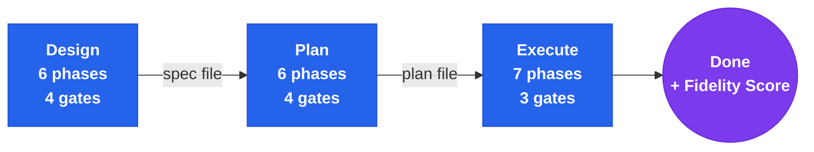

<div align="center">

# Build Feature

**End-to-end design-to-delivery pipeline for Claude Code**

Brainstorm. Plan. Execute. One command.

<p>
  
  
  
</p>

</div>

A Claude Code meta-orchestrator skill that chains brainstorming, plan-writing, and plan-execution into a single pipeline. Takes a feature idea from initial exploration through DAG-based planning to verified, committed code — with user gates at every transition.

---

## What It Does

- **Design** -- runs the full brainstorming workflow (6 phases, 4 gates) to produce a validated design spec
- **Plan** -- feeds the spec into plan-writing (6 phases, 4 gates) to produce a zero-ambiguity implementation plan
- **Execute** -- feeds the plan into plan-execution (7 phases, 3 gates) to deliver verified code with a fidelity score

---

## Quick Start

```
/stn-skills:build-feature
```

Or use natural language: `Build this feature` | `Implement end-to-end` | `Full pipeline for X` | `Design and build this`

---

## How It Works



---

## What Each Phase Produces

| Phase | Output | Location |
|---|---|---|
| Design | Validated design spec | `docs/specs/YYYY-MM-DD-<topic>-design.md` |
| Plan | DAG-based implementation plan | `.plan/plan-{YYYYMMDD}-{slug}.md` |
| Execute | Completion report + fidelity score | Printed to session |

All artifacts persist on disk. The pipeline is resumable -- if a session ends after Design, start Plan in a new session by pointing to the spec file.

---

## When to Use This vs Individual Skills

| Scenario | Use |
|---|---|
| Building a complete feature from scratch | **build-feature** |
| Exploring options without committing to build | brainstorming |
| You already have a spec and need a plan | plan-writing |
| You already have a plan and need to execute | plan-execution |
| You want to exit after design or planning | **build-feature** (exit at any gate) |
