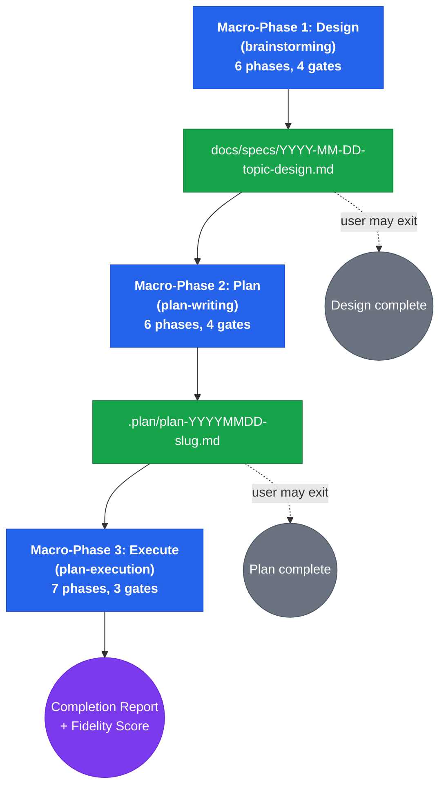

# Build Feature

## Overview

Meta-orchestrator that chains three complete workflows — brainstorming, plan-writing, and plan-execution — into a single design-to-delivery pipeline. Each macro-phase runs its full sub-workflow with all phases and gates preserved. Pipeline state transfers between macro-phases via file paths on disk, making the pipeline resumable across sessions.

**Core principle:** From idea to verified code in one pipeline. No shortcuts. No skipped gates. No unverified claims. No deprecated code. No legacy patterns.

**Announce:** "I'm using the build-feature skill to run the full design-to-delivery pipeline."

## The Iron Law

```
FROM IDEA TO VERIFIED CODE IN ONE PIPELINE.
NO SHORTCUTS. NO SKIPPED GATES. NO UNVERIFIED CLAIMS.
```

## Pipeline



## Pipeline State

State transfers between macro-phases via files — no in-memory coupling:

| Transition | Artifact | Location |
|---|---|---|
| Design to Plan | Design spec | `docs/specs/YYYY-MM-DD-<topic>-design.md` |
| Plan to Execute | Implementation plan | `.plan/plan-{YYYYMMDD}-{slug}.md` |

This makes every macro-phase independently resumable. If a session ends after Design, start a new session at Plan by pointing to the spec file.

---

## Macro-Phase 1: Design (Brainstorming)

**How to execute:** Read `skills/brainstorming/SKILL.md` and follow its complete 6-phase workflow from Phase 1 through Phase 6, including all 4 gates. Dispatch agents from `skills/brainstorming/agents/` and load references from `skills/brainstorming/references/` exactly as that SKILL.md specifies.

- **Agents:** `skills/brainstorming/agents/` (problem-decomposer, assumptions-surfacer, multi-lens-explorer, approach-evaluator, adversarial-reviewer)
- **References:** `skills/brainstorming/references/` (cognitive-lenses, decision-matrix-template, design-spec-template, reasoning-flaw-catalog)
- **Gates:** Problem Confirmation, Exploration Review, Approach Selection, Final Spec Approval
- **Output:** Design spec saved to `docs/specs/YYYY-MM-DD-<topic>-design.md`

**Error handling:** If adversarial review finds Blockers (Phase 4), resolve them within brainstorming — do NOT escalate to build-feature level. The brainstorming SKILL.md defines its own blocker resolution loop.

After GATE 4 (Final Spec Approval), ask the user:

> "Design spec saved to `{path}`. Continue to plan-writing, or stop here?"

If the user stops, the pipeline ends. The design spec is on disk and can be used independently with `/stn-skills:plan-writing` in a future session.

### Handoff Validation: Design → Plan

Before starting Macro-Phase 2, run `skills/pipeline-handoff-validator/SKILL.md` **Mode A** on the design spec file. Present the Handoff Compliance Table. If gaps are found, offer to return to brainstorming or proceed with acknowledged gaps.

---

## Macro-Phase 2: Plan (Plan-Writing)

**How to execute:** Read the design spec file from Macro-Phase 1. Then read `skills/plan-writing/SKILL.md` and follow its complete 6-phase workflow. In Phase 1, pass the design spec file path as input. Dispatch agents from `skills/plan-writing/agents/` and load references from `skills/plan-writing/references/` exactly as that SKILL.md specifies.

- **Agents:** `skills/plan-writing/agents/` (codebase-cartographer, task-decomposer, step-author, plan-verifier)
- **References:** `skills/plan-writing/references/` (plan-document-template, task-anatomy, placeholder-detector-rules)
- **Gates:** Scope Confirmation, DAG Review, Verification Results, Final Plan Approval
- **Output:** Plan saved to `.plan/plan-{YYYYMMDD}-{slug}.md`

**Error handling:** If Plan Quality Score < 90 after 2 rework cycles (Phase 5), present remaining defects to user at GATE 3. User decides: accept with known gaps, or stop pipeline.

After GATE 4 (Final Plan Approval), ask the user:

> "Plan saved to `{path}`. Continue to execution, or stop here?"

If the user stops, the pipeline ends. Both spec and plan are on disk. Resume execution later with `/stn-skills:plan-execution` pointing to the plan file.

### Handoff Validation: Plan → Execution

Before starting Macro-Phase 3, run `skills/pipeline-handoff-validator/SKILL.md` **Mode B** on the plan file. Present the Handoff Compliance Table. If gaps are found, offer to return to plan-writing or proceed with acknowledged gaps.

---

## Macro-Phase 3: Execute (Plan-Execution)

**How to execute:** Read the plan file from Macro-Phase 2. Then read `skills/plan-execution/SKILL.md` and follow its complete 7-phase workflow. In Phase 1, pass the plan file path as input. Dispatch agents from `skills/plan-execution/agents/` and load references from `skills/plan-execution/references/` exactly as that SKILL.md specifies.

- **Agents:** `skills/plan-execution/agents/` (task-implementer, spec-compliance-reviewer, code-quality-reviewer, integration-reviewer, completion-verifier)
- **References:** `skills/plan-execution/references/` (checkpoint-protocol, circuit-breaker-thresholds, completion-report-template, drift-detection-rules, reflect-retry-escalate, status-codes, task-handoff-template)
- **Gates:** Plan Confirmation, Completion Review, Acceptance
- **Output:** Completion report with Execution Fidelity Score

**Error handling:** Circuit breakers (YELLOW/RED) and adaptive replanning are handled within plan-execution's Phase 3. If execution halts (RED circuit breaker), the `.claude/plan-execution-state.json` state file preserves progress for resumption.

---

## Rules

1. **Follow sub-skill SKILL.md files** — Each macro-phase means reading and executing the referenced SKILL.md in full. This SKILL.md tells you WHICH sub-skill to run and WHEN. The sub-skill SKILL.md tells you HOW.
2. **All gates preserved** — The pipeline has 11 total gates (4 + 4 + 3). User confirms at each one. Present exactly what the sub-skill's gate specifies.
3. **Exit at any gate** — User can stop the pipeline at any gate boundary. Work is saved to disk. Inform the user which command resumes from here.
4. **File-based handoff** — Macro-Phase 1 output file → Macro-Phase 2 input. Macro-Phase 2 output file → Macro-Phase 3 input. Read the file path from the previous macro-phase's final output.
5. **Error containment** — Errors within a sub-skill are handled by that sub-skill's own mechanisms (blocker loops, rework cycles, circuit breakers). Only escalate to user when the sub-skill's error handling is exhausted.
6. **Resumable** — If a session ends mid-pipeline, resume by invoking the appropriate individual skill with the last artifact path. After Design: `/stn-skills:plan-writing` with spec path. After Plan: `/stn-skills:plan-execution` with plan path.
