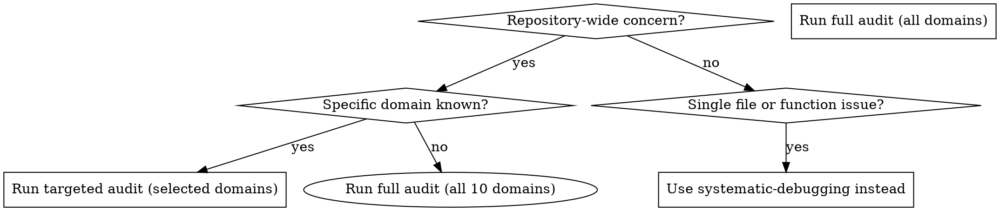
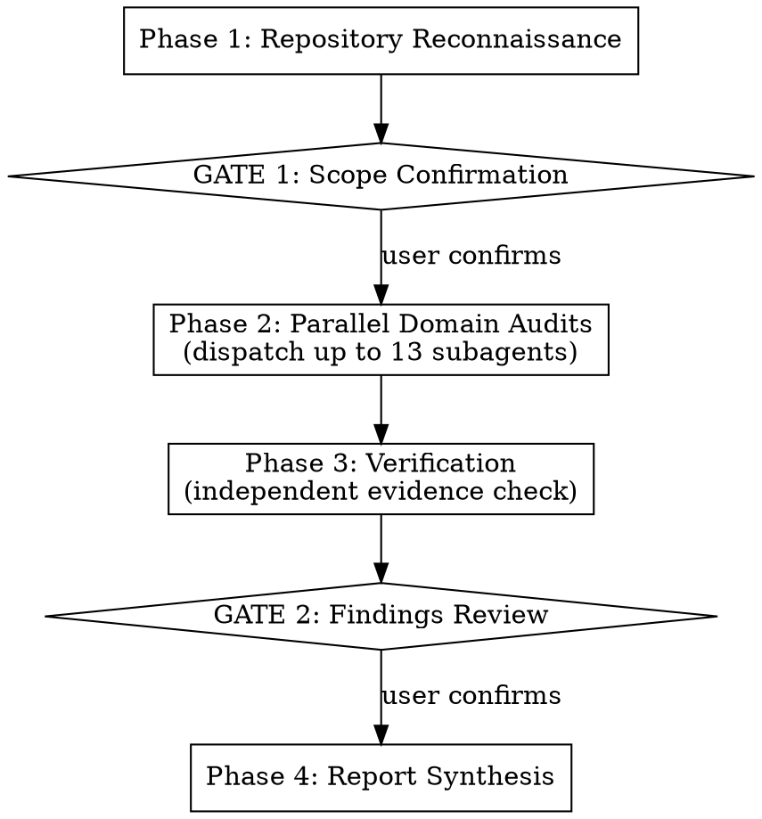

# Codebase Audit

## Overview

Systematic, multi-dimensional audit of an entire repository. Dispatches specialized auditor subagents in parallel across up to 13 domains, verifies every finding independently, and synthesizes a prioritized report with actionable remediation.

**Core principle:** Every finding requires file:line evidence. Assertions without evidence are false positives.

**Announce:** "I'm using the codebase-audit skill to perform a comprehensive repository audit."

## The Iron Law

```
EVERY FINDING REQUIRES FILE:LINE EVIDENCE.
SPECULATION IS NOT A FINDING. EVIDENCE IS.
```

If an auditor reports an issue without citing the exact file and line — that finding is rejected. If a finding cannot be verified by reading the cited location — that finding is rejected.

## When to Use



**Use this skill when:**
- Auditing an entire codebase for production readiness
- Performing periodic code health assessments
- Onboarding to understand existing code quality
- After major refactoring to verify quality
- Assessing technical debt across a project
- Preparing for a compliance or security review

**Use a different skill when:**
- Debugging a single bug → `superpowers:systematic-debugging`
- Reviewing a specific PR → `superpowers:requesting-code-review`
- Planning implementation → `superpowers:writing-plans`

---

## The Four Phases

Complete each phase before proceeding to the next. Two user gates ensure alignment.



---

### Phase 1: Repository Reconnaissance

Before dispatching any auditor, understand what you are auditing.

**1. Detect tech stack** by scanning for build and config files:

| Category | Files to scan |
|----------|--------------|
| **Build systems** | `build.gradle.kts`, `build.gradle`, `pom.xml`, `package.json`, `Cargo.toml`, `go.mod`, `go.sum`, `Gemfile`, `requirements.txt`, `pyproject.toml`, `setup.py`, `*.csproj`, `*.sln`, `Makefile`, `CMakeLists.txt`, `mix.exs`, `build.sbt`, `pubspec.yaml`, `Package.swift`, `composer.json`, `Rakefile`, `BUILD`, `WORKSPACE` |
| **Frameworks** | Inspect imports, configs, directory conventions (e.g., `src/main/java` = Spring, `app/` = Rails, `pages/` = Next.js) |
| **Containers** | `Dockerfile`, `docker-compose.yml`, `docker-compose.yaml`, `Containerfile`, `.dockerignore` |
| **CI/CD** | `.github/workflows/`, `.gitlab-ci.yml`, `Jenkinsfile`, `.circleci/`, `bitbucket-pipelines.yml`, `.travis.yml`, `azure-pipelines.yml` |
| **Project rules** | `CLAUDE.md`, `AGENTS.md`, `.context/`, `.editorconfig`, `CONTRIBUTING.md` |

**2. Read project rules** from CLAUDE.md, AGENTS.md, or similar files. Extract any project-specific quality mandates, non-negotiable rules, or architectural constraints that auditors must enforce.

**3. Map module structure** — identify module boundaries, packages, workspaces, or subprojects. Note which modules are active vs. potentially abandoned.

**4. Classify repository size:**

| Class | Source files | Strategy |
|-------|-------------|----------|
| Small | < 50 | Full audit, all files examined |
| Medium | 50 – 500 | Standard parallel dispatch |
| Monorepo | 500+ or multi-module | Scope to user-selected modules |

**5. Identify primary and secondary languages** — note all languages present and their approximate proportion.

---

### GATE 1: Scope Confirmation

Present to the user:
- Detected tech stack (languages, frameworks, build tools, infrastructure)
- Repository size classification
- Module structure (if multi-module)
- Proposed audit domains (all 10 by default)

Ask: **"Confirm this scope, or specify which domains to audit and which modules to focus on."**

Proceed only after user confirmation. Assumptions about scope lead to wasted work.

---

### Phase 2: Parallel Domain Audits

Dispatch specialized auditor subagents in parallel. Each auditor receives the same context package and its domain-specific prompt.

**Context package for every auditor:**
```
- Repository path: [REPO_PATH]
- Tech stack: [DETECTED_STACK summary]
- Project rules: [CLAUDE_MD_CONTENT or "none detected"]
- Scope: [MODULE_LIST or "all"]
- Instruction: Read your domain prompt at agents/[domain]-auditor.md
```

**Dispatch table:**

| Domain | Agent prompt file | Focus |
|--------|------------------|-------|
| Security | `agents/security-auditor.md` | OWASP Top 10, secrets, injection, auth, headers |
| Documentation | `agents/documentation-auditor.md` | Doc currency, completeness, accuracy |
| Dead Code | `agents/dead-code-auditor.md` | Unused code, unreachable branches, orphaned files |
| Deprecated Patterns | `agents/deprecated-patterns-auditor.md` | Outdated APIs, legacy patterns, superseded features |
| Enterprise Mandates | `agents/enterprise-mandates-auditor.md` | The 7 non-negotiable rules enforcement |
| Code Quality | `agents/code-quality-auditor.md` | SOLID, DRY, naming, complexity, idioms |
| Architecture | `agents/architecture-auditor.md` | Coupling, cohesion, layering, dependency direction |
| Dependencies | `agents/dependency-auditor.md` | Outdated versions, CVEs, unused deps, license conflicts |
| Test Coverage | `agents/test-coverage-auditor.md` | Gaps, anti-patterns, assertions, edge cases |
| Infrastructure | `agents/infrastructure-auditor.md` | Containers, CI/CD, env vars, build config |
| Performance | `agents/performance-auditor.md` | N+1 queries, blocking I/O, unbounded data, resource leaks |
| Concurrency | `agents/concurrency-auditor.md` | Race conditions, deadlocks, TOCTOU, async pitfalls |
| Data Privacy | `agents/data-privacy-auditor.md` | PII in logs, data retention, consent, third-party transmission |

**Conditional dispatch:**
- **Concurrency**: dispatch only when Phase 1 detects threading, goroutines, async runtimes, or multiprocessing in the codebase. Skip for single-threaded applications.

**Model selection:**
- Security + Architecture + Concurrency: use the most capable model (judgment-heavy, high stakes)
- All other domains: use standard model

**Dispatch all auditors in a single message** to maximize parallelism. Each auditor works independently — no cross-domain dependencies during Phase 2.

---

### Phase 3: Verification

After all auditors complete, dispatch the `agents/findings-verifier.md` subagent with the combined findings.

The verifier's mandate:
1. Sample at least **30% of all findings** (all Criticals are mandatory)
2. For each sampled finding: **read the actual file:line cited**
3. Confirm the issue exists exactly as described
4. Mark each finding: **Verified** / **False Positive** / **Needs Context**
5. Remove all False Positives from the findings set

**Re-dispatch threshold:** If any single domain has a false positive rate above 25%, re-dispatch that domain's auditor with a stricter prompt emphasizing evidence requirements. This happens automatically — the verifier identifies which domains need re-audit.

---

### GATE 2: Findings Review

Present to the user:
- Findings count by severity: Critical | High | Medium | Low
- Findings count by domain
- Top 5 most impactful findings (brief summary with file references)
- Verification statistics (how many checked, how many removed)

Ask: **"These are the verified findings. Proceed to full report, or investigate any area deeper?"**

---

### Phase 4: Report Synthesis

Dispatch `agents/report-synthesizer.md` with all verified findings. The synthesizer:

1. **Deduplicates** findings that overlap across domains (same file:line from different auditors)
2. **Organizes** by severity, then by domain within each severity level
3. **Generates** the structured report following `references/report-template.md`
4. **Builds** the enterprise mandate compliance matrix
5. **Creates** a prioritized remediation roadmap (severity x effort)

Present the complete report to the user.

---

## Severity Classification

| Severity | Criteria | Expected response |
|----------|----------|-------------------|
| **Critical** | Exploitable security vulnerability, data loss risk, authentication bypass, secrets exposed in code | Fix immediately, block deployment |
| **High** | Significant quality issue, deprecated API in critical path, architectural violation in core module, missing tests for critical logic | Fix this sprint |
| **Medium** | Code quality issue, documentation gap, moderate technical debt, non-critical deprecated usage | Fix this cycle |
| **Low** | Style inconsistency, minor optimization opportunity, cosmetic documentation issue | Track, fix opportunistically |

Full classification details in `references/severity-classification.md`.

---

## Finding Format

Every finding follows this exact structure:

```markdown
**[SEVERITY] [DOMAIN-CODE]: [Descriptive title]**
- **File:** `path/to/file.ext:line-range`
- **Evidence:** [exact code snippet or description of what was found at that location]
- **Impact:** [what happens if this is not addressed]
- **Remediation:** [specific action to take, with idiomatic code example for the detected language]
```

Domain codes: `SEC`, `DOC`, `DEAD`, `DEPR`, `MAND`, `QUAL`, `ARCH`, `DEP`, `TEST`, `INFRA`, `PERF`, `CONC`, `PRIV`

---

## Red Flags — STOP and Return to Phase 1

If you catch yourself or an auditor:
- Generating findings without reading actual source files
- Reporting issues based on assumptions about what code "probably" does
- Citing Critical severity without demonstrating exploitability or data loss
- Reporting deprecated patterns without verifying the actual version in use
- Claiming "no issues found" without examining specific files as evidence
- Skipping the verification phase
- Proceeding past a gate without user confirmation
- Reporting findings for files outside the agreed scope

**ALL of these mean: STOP. Gather real evidence before continuing.**

---

## Common Rationalizations

| Excuse | Reality |
|--------|---------|
| "This pattern is commonly deprecated" | Check the actual version in the project. Generic assumptions produce false positives. |
| "This is a well-known security issue" | Show the exact vulnerable code path. Generic warnings waste the user's time. |
| "Too many files to check thoroughly" | Scope to modules, but examine those modules deeply. A shallow scan across everything produces noise. |
| "Verification is redundant if I'm careful" | Without verification, 25%+ false positive rate is normal. Always verify. |
| "The user wants results fast" | An audit with false positives erodes trust. Accurate findings beat fast noise. |
| "This finding is obvious enough to skip evidence" | Evidence distinguishes signal from noise. Every finding, every time. |
| "I can infer the issue from the file name" | File names lie. Read the actual code. |
| "I checked a similar file, this one is probably the same" | Each file gets its own assessment. Probably is not evidence. |

---

## Enterprise Mandate Compliance

When CLAUDE.md or project rules define non-negotiable mandates, the enterprise-mandates-auditor evaluates compliance. The standard mandates (configurable per project):

| Mandate | Target state |
|---------|-------------|
| **Current APIs** | All code uses current, officially recommended APIs and language idioms |
| **Clean-slate system** | The codebase operates without migration scripts, transition logic, or compatibility layers |
| **State-of-the-art** | Every component applies current best practices for its technology |
| **Forward-only** | Code contains no backward compatibility shims, version checks, or legacy adapters |
| **Unified codebase** | No code is labeled "new", "old", "legacy", or "replaced" — everything is the current state |
| **Full rewrite approach** | No partial patches, minimal diffs, or preservation of outdated structures |
| **Zero legacy assumptions** | No code assumes pre-existing users, data, schemas, or runtime dependencies |

---

## Related Skills

**Use during audit:**
- `superpowers:dispatching-parallel-agents` — For efficient parallel subagent dispatch in Phase 2

**Use after audit:**
- `superpowers:systematic-debugging` — To investigate specific findings deeper
- `superpowers:writing-plans` — To convert the remediation roadmap into an implementation plan
- `superpowers:subagent-driven-development` — To execute remediation tasks efficiently
- `superpowers:verification-before-completion` — To verify remediation was successful
