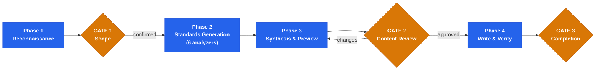

<div align="center">

# Codebase Quality Bootstrap

**Zero-finding audit compliance for Claude Code**

6 analyzers. 13 audit domains. Tech-stack-specific rules. Automated hooks.

<p>
  
  
  
</p>

</div>

A Claude Code skill that analyzes a repository's tech stack, dispatches 6 specialized analyzer agents in parallel, and generates a production-grade CLAUDE.md with `.claude/settings.json` hooks — all aligned with the 13 codebase-audit domains. The preventive counterpart to codebase-audit: bootstrap first, then audit with zero findings.

---

## Why This Exists

Claude Code follows the rules you give it. Vague CLAUDE.md files produce inconsistent code. Missing hooks mean formatting, linting, and security checks run only when someone remembers to trigger them. Projects without explicit standards accumulate the exact problems a codebase audit later finds — security gaps, deprecated patterns, dead code, documentation drift.

This skill solves the problem at the source. It reads your tech stack, generates tech-stack-specific rules (not generic advice), and configures hooks that enforce deterministically. The result: Claude Code writes code that passes all 13 audit domains from the first line.

---

## Quick Start

Open Claude Code in any repository and run:

```
/stn-skills:codebase-quality-bootstrap
```

Or use natural language: `Bootstrap this project` | `Set up quality standards` | `Generate CLAUDE.md` | `Configure development standards` | `Set up hooks for this project`

The skill detects your tech stack, confirms scope with you, generates rules and hooks, previews everything for your approval, then writes the files.

---

## How It Works



| Phase | What happens | Key detail |
|-------|-------------|------------|
| **Phase 1** | Detect tech stack, read existing CLAUDE.md, scan formatters/linters/test runners | Classifies greenfield (new) vs brownfield (existing CLAUDE.md) |
| **Gate 1** | You confirm the detected stack and scope | Correct misdetections before spending compute |
| **Phase 2** | 6 clustered analyzers generate rules in parallel | Each analyzer covers related audit domains with tech-stack-specific rules |
| **Phase 3** | Assemble CLAUDE.md + hooks, enforce 150-250-line budget | Brownfield: custom sections preserved, stale content flagged |
| **Gate 2** | You review the complete generated content | Modify specific sections before writing |
| **Phase 4** | Write files, read back to verify correctness | Both CLAUDE.md and .claude/settings.json are written atomically |
| **Gate 3** | Completion summary with audit domain coverage | Recommendation: run codebase-audit to verify zero findings |

---

## Audit Domain Coverage

All 13 codebase-audit domains are addressed through 6 clustered analyzers:

| Analyzer | Domains | What It Generates |
|----------|---------|------------------|
| **Security Standards** | `SEC`, `PRIV` | OWASP Top 10 prevention rules, data privacy rules, secrets management, protected file hooks |
| **Code Quality** | `QUAL`, `DEAD`, `DEPR`, `MAND` | SOLID/DRY rules, dead code prevention, deprecated pattern avoidance, 7 enterprise mandates, auto-format hooks |
| **Architecture** | `ARCH`, `CONC` | Dependency direction rules, circular dep prohibition, concurrency guidelines (when detected) |
| **Testing Standards** | `TEST` | Test commands, file conventions, assertion quality, mock usage guidelines, auto-test hooks |
| **Infrastructure** | `INFRA`, `DEP`, `PERF` | Dependency management, container rules, CI/CD expectations, N+1 prevention, resource lifecycle |
| **Documentation** | `DOC` | README requirements, API docs, config docs, architecture docs, freshness rules |

---

## Language Support

The skill is fully technology-agnostic. Rules are generated specific to whatever tech stack is detected — not as generic advice.

| Ecosystem | Languages and Frameworks |
|-----------|------------------------|
| **JVM** | Java, Kotlin, Scala, Groovy — Spring Boot, Quarkus, Micronaut, Gradle, Maven |
| **JavaScript / TypeScript** | Node.js, Deno, Bun — React, Angular, Vue, Next.js, NestJS, Express, Fastify |
| **Python** | Django, Flask, FastAPI, SQLAlchemy, Poetry, pip |
| **Go** | Standard library, Gin, Echo, Fiber, Chi |
| **Rust** | Actix, Axum, Rocket, Cargo |
| **C# / .NET** | ASP.NET Core, Blazor, Entity Framework, NuGet |
| **PHP** | Laravel, Symfony, Composer |
| **Ruby** | Rails, Sinatra, Bundler |
| **Swift** | iOS, macOS, Swift Package Manager |
| **C / C++** | CMake, Make, Bazel, Conan, vcpkg |
| **Others** | Elixir/Phoenix, Haskell/Stack, Clojure/Leiningen, Dart/Flutter, Zig, Nim |

---

## Example Output

### Generated CLAUDE.md (excerpt for a Next.js + Prisma project)

```markdown
# my-app

This file provides guidance to Claude Code when working with code in this repository.

## Project

Next.js 14 App Router application with Prisma ORM and PostgreSQL.

## Commands

```bash
# Setup
npm install

# Development
npm run dev                           # Start dev server on port 3000
npm run build                         # Production build

# Testing
npm test                              # Run all tests (Vitest)
npx vitest path/to/test.ts            # Run single test file

# Code Quality
npx eslint .                          # Lint
npx prettier --write .                # Format
npx tsc --noEmit                      # Type check
```

## Architecture

```
src/
  app/                                # Next.js App Router pages and layouts
  components/                         # Shared React components
  lib/                                # Core utilities, config, database client
  server/                             # Server-side services and API logic
prisma/                               # Prisma schema and migrations
```

## Development Standards

These standards cover all code changes. Critical rules are enforced by hooks in `.claude/settings.json`.

### Security

- **Parameterized queries only.** Use Prisma's query builder for all database access -- never use `$queryRawUnsafe()` or concatenate user input into SQL.
- **Secrets from environment.** Load all secrets via `src/lib/config.ts` which reads `process.env` -- never hardcode credentials, tokens, or API keys.
- **CORS restricted.** Configure allowed origins explicitly in `next.config.js` -- never use wildcard `*`.
- **No PII in logs.** Use the structured logger from `src/lib/logger.ts` -- never log raw user emails, IPs, or tokens.
- **Auth on every route.** Use NextAuth.js middleware for all non-public routes -- never expose unprotected API endpoints.

### Code Quality

- **Current APIs only.** Use App Router patterns (server components, `fetch` with caching) -- no `getServerSideProps` or `getStaticProps`.
- **State-of-the-art practices.** Apply current Next.js 14 idioms to every component -- no legacy patterns.
- **No dead code.** Remove unused imports, components, and variables -- use git history for recovery, not comments.
- **Clean codebase.** All code is the current state -- no "old", "v2", or "legacy" labeling.

### Enterprise Mandates

- **Current APIs exclusively.** Use current, officially recommended APIs and language idioms for all code.
- **State-of-the-art practices.** Apply current best practices consistently to every component.
- **Forward-only development.** Write code for the current version only -- no backward compatibility shims.
- ...

### TypeScript Conventions

- **Strict mode.** TypeScript strict mode with `noUncheckedIndexedAccess` enabled -- no `any` types.
- **Functional components.** Use function components with hooks -- no class components.
- **Path aliases.** Use `@/` path aliases for all imports -- no relative `../../` paths.
- **Naming.** `camelCase` for functions/variables, `PascalCase` for components/types, `UPPER_SNAKE_CASE` for constants.

### Testing

- **Test commands.** `npm test` for all tests, `npx vitest path/to/test.ts` for single files.
- **Co-located tests.** Test files next to source: `foo.ts` -> `foo.test.ts`.
- **Meaningful assertions.** Verify specific values with `expect(result).toEqual(expected)` -- not just `toBeTruthy()`.
- **Real implementations preferred.** Use mocks only for external boundaries (HTTP, database) -- never mock internal modules.

### Error Handling

- **Structured responses.** Return `{ error: { code, message } }` shape from all API routes -- no raw error strings.
- **Structured logging.** Use `src/lib/logger.ts` with context -- never bare `console.log()` or `console.error()`.
- **Fail fast on startup.** Validate all required env vars in `src/lib/config.ts` -- missing config causes immediate exit.
```

### Generated Hooks (`.claude/settings.json`)

```json
{
  "hooks": {
    "PostToolUse": [
      {
        "matcher": "Edit|Write|MultiEdit",
        "hooks": [
          {
            "type": "command",
            "command": "npx prettier --write \"$CLAUDE_FILE_PATH\" 2>/dev/null; npx eslint --fix \"$CLAUDE_FILE_PATH\" 2>/dev/null || true",
            "timeout": 30
          }
        ]
      }
    ],
    "PreToolUse": [
      {
        "matcher": "Edit|Write|MultiEdit",
        "hooks": [
          {
            "type": "command",
            "command": "case \"$CLAUDE_FILE_PATH\" in *.env|*.env.*|*credentials*|*secrets*|*.pem|*.key|*/package-lock.json|*/yarn.lock|*/pnpm-lock.yaml) echo '{\"decision\":\"block\",\"reason\":\"Protected file: direct edits blocked.\"}' ;; *) echo '{}' ;; esac",
            "timeout": 5
          }
        ]
      }
    ]
  }
}
```

---

## Greenfield vs Brownfield

| Mode | Detection | Behavior |
|------|-----------|----------|
| **Greenfield** | No CLAUDE.md exists | Generates complete CLAUDE.md + hooks from scratch |
| **Brownfield** | CLAUDE.md exists | Classifies sections as STANDARD (update), CUSTOM (preserve), or STALE (flag for removal) |

**Re-running the skill** updates standard sections with current analyzer output while preserving all custom content. A sentinel comment at the bottom of the CLAUDE.md tracks when it was last bootstrapped.

---

## Generated Hooks

The skill generates three types of hooks in `.claude/settings.json`, each preventing specific audit findings:

| Hook | Event | Purpose | Audit Domains |
|------|-------|---------|---------------|
| **Auto-Format** | PostToolUse | Runs detected formatter after every Edit/Write | QUAL, DEAD, DEPR |
| **Protected Files** | PreToolUse | Blocks edits to .env, credentials, keys, lock files | SEC, INFRA, PRIV |
| **Auto-Test** | PostToolUse | Runs related tests after source changes (optional) | TEST |

Hooks are only generated for tools that are already configured in the project. Supported formatters: Prettier, ESLint, Biome, Ruff, Black, gofmt, rustfmt, clang-format, rubocop, PHP-CS-Fixer, dart format, swift-format, mix format.

---

## Enterprise Mandates

The generated CLAUDE.md always includes these 7 non-negotiable mandates — the same mandates enforced by the codebase-audit:

| # | Mandate | Target State |
|---|---------|-------------|
| 1 | **Current APIs exclusively** | All code uses current, officially recommended APIs and language idioms |
| 2 | **Clean-slate architecture** | No migration scripts, compatibility layers, or transition logic |
| 3 | **State-of-the-art practices** | Current best practices applied consistently to every component |
| 4 | **Forward-only development** | No backward compatibility shims, version checks, or legacy adapters |
| 5 | **Unified codebase** | No "old/new/legacy" labeling — everything is the current state |
| 6 | **Complete implementations** | No partial patches preserving outdated structures |
| 7 | **Zero legacy assumptions** | No assumptions about pre-existing users, data, or state |

---

## Relationship to Codebase Audit

The two skills form a complementary pair:

```
┌─────────────────────────────┐     ┌─────────────────────────────┐
│  codebase-quality-bootstrap │     │       codebase-audit        │
│        (PREVENTIVE)         │     │        (DETECTIVE)          │
│                             │     │                             │
│  Generates rules + hooks    │────>│  Verifies rules are         │
│  that prevent findings      │     │  being followed             │
│                             │     │                             │
│  Run FIRST on any project   │     │  Run AFTER to verify        │
│  to establish standards     │     │  zero findings              │
└─────────────────────────────┘     └─────────────────────────────┘
```

**Recommended workflow:** Bootstrap a project, develop with the generated standards, then audit. The audit should produce zero findings.

---

## CI/CD Integration

The skill runs interactively by default (3 user gates). For CI/CD pipelines, use Claude Code's headless mode with pre-confirmed scope:

```yaml
# GitHub Actions example — regenerate standards on dependency updates
- name: Update quality standards
  run: |
    claude --print "Run codebase-quality-bootstrap on this repository. \
      At Gate 1: confirm full scope. \
      At Gate 2: approve all generated content. \
      Output the CLAUDE.md and hooks."
```

---

## Acknowledgments

- Security rules reference the [OWASP Top 10](https://owasp.org/Top10/), published by the OWASP Foundation under [CC BY-SA 4.0](https://creativecommons.org/licenses/by-sa/4.0/). OWASP is a registered trademark of the OWASP Foundation, Inc. This project is not affiliated with or endorsed by the OWASP Foundation.
