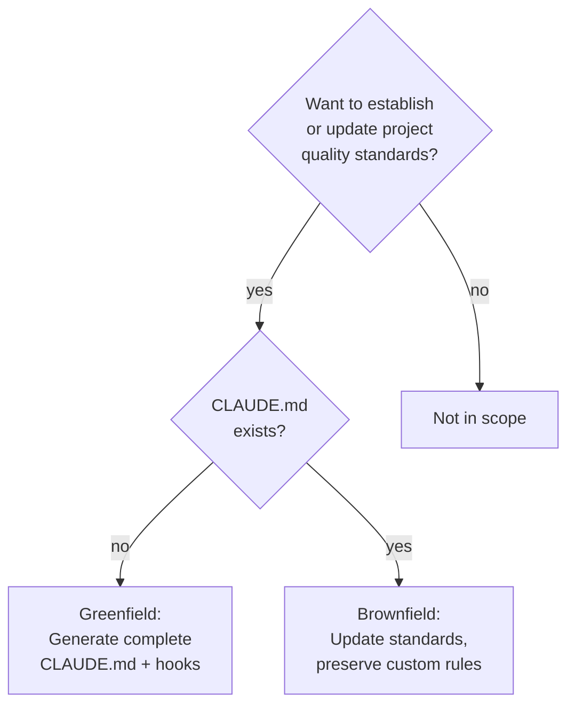
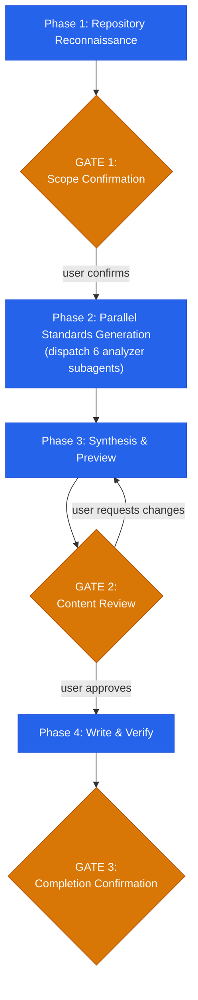

# Codebase Quality Bootstrap

## Overview

Analyzes a repository's tech stack, structure, and existing configuration, then generates a production-grade CLAUDE.md and `.claude/settings.json` hooks. Every generated rule is tech-stack-specific and aligned with the 13 codebase-audit domains -- so that projects bootstrapped with this skill produce zero findings when audited.

**Core principle:** This skill is the preventive counterpart to `codebase-audit`. The audit *finds* problems. The bootstrap *prevents* them.

**Announce:** "I'm using the codebase-quality-bootstrap skill to generate production-grade development standards for this project."

## The Iron Law

```
EVERY RULE MUST BE TECH-STACK-SPECIFIC.
GENERIC ADVICE PRODUCES AUDIT FINDINGS.
```

If a generated rule would apply identically to any tech stack -- that rule is rejected. "Follow best practices" is not a rule. "All Express route handlers validate request bodies using zod schemas before passing to service layer" is a rule. Tech-stack detection in Phase 1 provides the context every analyzer needs to produce specific, actionable rules.

## When to Use



**Use this skill when:**
- Setting up a new project for AI-assisted development
- Onboarding an existing project to quality standards
- Updating standards after major framework upgrades
- Preparing a repository for codebase-audit compliance
- Generating or improving CLAUDE.md from scratch
- Configuring automated quality hooks

**Not designed for:**
- Auditing existing code for issues -- use `codebase-audit` for that
- Setting up external tools (ESLint, Prettier configs) -- this skill only generates CLAUDE.md + hooks
- One-off code fixes -- this skill generates standards, not patches

---

## The Four Phases

Complete each phase before proceeding to the next. Three user gates ensure alignment.



---

### Phase 1: Repository Reconnaissance

Before dispatching any analyzer, understand what you are configuring.

**1. Detect tech stack** by scanning for build and config files:

| Category | Files to scan |
|----------|--------------|
| **Build systems** | `build.gradle.kts`, `build.gradle`, `pom.xml`, `package.json`, `Cargo.toml`, `go.mod`, `go.sum`, `Gemfile`, `requirements.txt`, `pyproject.toml`, `setup.py`, `*.csproj`, `*.sln`, `Makefile`, `CMakeLists.txt`, `mix.exs`, `build.sbt`, `pubspec.yaml`, `Package.swift`, `composer.json`, `Rakefile`, `BUILD`, `BUILD.bazel`, `WORKSPACE` |
| **Frameworks** | Inspect imports, configs, directory conventions (e.g., `src/main/java` = Spring, `app/` = Rails, `pages/` or `app/` = Next.js) |
| **Containers** | `Dockerfile`, `docker-compose.yml`, `docker-compose.yaml`, `Containerfile`, `.dockerignore` |
| **CI/CD** | `.github/workflows/`, `.gitlab-ci.yml`, `Jenkinsfile`, `.circleci/`, `bitbucket-pipelines.yml`, `.travis.yml`, `azure-pipelines.yml` |
| **Project rules** | `CLAUDE.md`, `AGENTS.md`, `.context/`, `.editorconfig`, `CONTRIBUTING.md` |
| **Formatters/Linters** | `.prettierrc*`, `prettier.config.*`, `eslint.config.*`, `.eslintrc*`, `ruff.toml`, `pyproject.toml` (check `[tool.ruff]`, `[tool.black]`, `[tool.isort]`), `rustfmt.toml`, `.rustfmt.toml`, `biome.json`, `.clang-format`, `.rubocop.yml`, `.php-cs-fixer.php`, `.swift-format` |
| **Test frameworks** | `jest.config.*`, `vitest.config.*`, `pytest.ini`, `conftest.py`, `setup.cfg` (pytest section), `*.test.*`, `*_test.*`, `test/`, `tests/`, `spec/`, `__tests__/` |

**2. Read existing CLAUDE.md** — Determine greenfield (no CLAUDE.md) or brownfield (CLAUDE.md exists).

If brownfield, parse each section and classify:

| Classification | Meaning | Action |
|---------------|---------|--------|
| **STANDARD** | Heading matches a template section | Update with analyzer output, merge with existing specific rules |
| **CUSTOM** | Heading does not match any template section | Preserve verbatim in original position |
| **STALE** | References files, commands, or configs that no longer exist | Flag for removal at GATE 2 |

Standard headings (case-insensitive match): Project, Commands, Architecture, Development Standards, Security, Architecture Compliance, Code Quality, Enterprise Mandates, Testing, Database, Dependencies, Error Handling, Infrastructure, Performance, Concurrency, Configuration, Documentation, Gotchas

**Structural transformation (brownfield):**
When the existing CLAUDE.md has development-related sections (Security, Code Quality, Code Conventions, Testing, Performance, etc.) as standalone H2 sections instead of H3 subsections under `## Development Standards`:
1. Create the `## Development Standards` parent section with its enforcement callout
2. Convert matching H2 sections to H3 subsections under Development Standards
3. Insert ALL missing standard subsections (especially `### Enterprise Mandates`) at their canonical position per the template
4. Sections that don't match any standard heading remain as standalone H2 CUSTOM sections

This structural transformation is REQUIRED when the existing CLAUDE.md lacks a `## Development Standards` parent section. Present the transformation plan at GATE 1 so the user sees how the document will be restructured.

**Missing standard sections (brownfield):**
If ANY standard section from the template does NOT exist in the existing CLAUDE.md — not even in a different form or under a different heading — it MUST be INSERTED at its canonical position per the template structure. This applies regardless of document length. Specifically:
- `### Enterprise Mandates` with all 7 mandates is NEVER optional — insert it even if the line budget would be exceeded
- The 7 Enterprise Mandates override the line budget — they are mandatory content that cannot be condensed, omitted, or represented by similar content in other sections
- A "Design Philosophy" or similar section that partially covers mandate themes does NOT satisfy this requirement — the explicit `### Enterprise Mandates` section with all 7 verbatim mandates must exist

**Brownfield projects run the full workflow.** Even if the existing CLAUDE.md appears comprehensive, run all 4 phases. The skill verifies that all of the following are present and correctly formatted:

1. **Enterprise Mandates** — All 7 mandates present, positively framed, with bold-header format
2. **Current APIs / state-of-the-art** — Explicit rules requiring current patterns, prohibiting deprecated code
3. **Forward-only development** — Explicit rule prohibiting backward compatibility shims and legacy adapters
4. **Clean codebase** — Explicit rule prohibiting "old/new/legacy" labeling and migration scaffolding
5. **Bold-header rule format** — Every rule uses `- **{Name}.** {instruction} -- {prohibition}` format
6. **Enforcement callout** — "These standards cover all code changes. Critical rules are enforced by hooks."
7. **Development Standards parent section** — All rules nested under `## Development Standards` with H3 subsections

If any of these are missing or incorrectly formatted, the CLAUDE.md requires updates. "Looks comprehensive" is not the same as "meets enterprise mandates."

**Always complete the verification checklist.** Minimum output: compliance report with all 7 mandatory checks verified. If all pass, report specific compliance status at GATE 2.

**3. Read existing `.claude/settings.json`** — Detect current hooks and permissions.

**4. Detect formatters and linters** — Record which formatter/linter is configured and its config file path. This determines which auto-format hooks can be generated.

**5. Detect test framework** — Record the test runner, config file, test directory pattern, and test file naming convention.

**6. Detect concurrency model** — Check for threading, goroutines, async runtimes, multiprocessing, or actor systems. This determines whether CONC rules are generated.

**7. Map directory structure** — Identify module boundaries, entry points, layer structure. This feeds the architecture analyzer.

**8. Identify common commands** — Extract build/test/lint/format/dev commands from:
- `package.json` scripts
- `Makefile` targets
- `pyproject.toml` scripts
- `Cargo.toml` metadata
- `go` tool conventions
- `mix.exs` tasks

**9. Classify repository size:**

| Class | Source files | Strategy |
|-------|-------------|----------|
| Small | < 50 | Full analysis |
| Medium | 50 – 500 | Standard parallel dispatch |
| Monorepo | 500+ | Focus on user-selected modules |

**Monorepo strategy:** For 500+ file monorepos:
- Generate ONE root CLAUDE.md covering shared standards, plus per-module sections where conventions differ
- The Architecture section should include a module dependency diagram
- Per-language conventions may vary by module (e.g., Python ML pipeline vs TypeScript API)
- Hooks apply globally — use file path patterns in matchers if different modules need different formatters

---

### GATE 1: Scope Confirmation

Present to the user:
- Detected tech stack (languages, frameworks, build tools, versions)
- Greenfield/brownfield classification
- If brownfield: sections found in existing CLAUDE.md classified as STANDARD/CUSTOM/STALE
- Detected formatters and linters (with config files)
- Detected test framework (with config and test patterns)
- Concurrency detected (yes/no, which model)
- Existing hooks in `.claude/settings.json`
- Repository size classification
- Detected commands (build, test, lint, format, dev)

**Present all content above to the user first.** Then use the AskUserQuestion tool:
- Question: "Confirm this assessment, or correct any misdetections before I generate standards."
- Options: ["Confirmed", "Correct misdetections"]

**Do not proceed until the user responds.** Wrong stack detection produces wrong rules.

---

### Phase 2: Parallel Standards Generation

Dispatch 6 specialized analyzer subagents in parallel. Each analyzer reads its prompt file from `agents/` and receives the same context package.

**Context package for every analyzer:**
```
- Repository path: [REPO_PATH]
- Tech stack: [DETECTED_STACK summary including versions]
- Existing CLAUDE.md: [EXISTING_CLAUDEMD content or "none"]
- Formatters: [DETECTED_FORMATTERS with config file paths]
- Test framework: [DETECTED_TEST_FRAMEWORK with config and patterns]
- Concurrency: [HAS_CONCURRENCY + detected model or "none"]
- Directory structure: [DIR_STRUCTURE with module purposes]
- Audit domain alignment: references/audit-domain-alignment.md
- Instruction: Read your analyzer prompt at agents/[name].md
```

**Dispatch table:**

| # | Analyzer | Agent prompt file | Audit domains covered |
|---|----------|------------------|----------------------|
| 1 | Security Standards | `agents/security-standards-analyzer.md` | SEC, PRIV |
| 2 | Code Quality | `agents/code-quality-analyzer.md` | QUAL, DEAD, DEPR, MAND |
| 3 | Architecture | `agents/architecture-analyzer.md` | ARCH, CONC |
| 4 | Testing Standards | `agents/testing-standards-analyzer.md` | TEST |
| 5 | Infrastructure | `agents/infrastructure-analyzer.md` | INFRA, DEP, PERF |
| 6 | Documentation | `agents/documentation-standards-analyzer.md` | DOC |

**Model selection:** All analyzers use the standard model. Unlike the codebase-audit where security/architecture auditors need the most capable model for judgment-heavy evidence verification, the bootstrap analyzers generate rules from well-defined checklists -- standard model suffices.

**Conditional dispatch:**
- The **Architecture** analyzer generates CONC rules only if Phase 1 detected concurrency patterns. Single-threaded projects skip concurrency rules entirely.
- The **Infrastructure** analyzer generates INFRA rules only if containers, CI/CD, or IaC configs were detected.

Each analyzer returns:
1. CLAUDE.md section content (tech-stack-specific bullet-point rules)
2. Hook recommendations (JSON configuration, if applicable)
3. Audit domain alignment table (which audit check each rule prevents)

---

### Phase 3: Synthesis & Preview

The orchestrator assembles the final output from all 6 analyzer results.

**1. Assemble CLAUDE.md:**

Follow the template structure from `references/claudemd-template.md`:

```
# {Project Name}
{Project description + optional design constraint}

## Commands                          <- From Phase 1 reconnaissance
## Architecture                      <- From Phase 1 directory mapping
## Development Standards             <- Section header with enforcement callout
### Security                         <- From security-standards-analyzer (SEC, PRIV)
### Architecture Compliance          <- From architecture-analyzer (ARCH)
### Code Quality                     <- From code-quality-analyzer (QUAL, DEAD, DEPR)
### Enterprise Mandates              <- From code-quality-analyzer (MAND)
### {Language} Conventions           <- From code-quality-analyzer (per language)
### Testing                          <- From testing-standards-analyzer (TEST)
### Database                         <- From infrastructure-analyzer [CONDITIONAL]
### Dependencies                     <- From infrastructure-analyzer (DEP)
### Error Handling                   <- From infrastructure-analyzer (QUAL elevated)
### Infrastructure                   <- From infrastructure-analyzer (INFRA) [CONDITIONAL]
### Performance                      <- From infrastructure-analyzer (PERF)
### Concurrency                      <- From architecture-analyzer (CONC) [CONDITIONAL]
### Configuration                    <- From infrastructure-analyzer (INFRA+SEC)
### Documentation                    <- From documentation-standards-analyzer (DOC)
## Gotchas                           <- From Phase 1 reconnaissance
## Custom Rules                      <- Preserved from existing CLAUDE.md [BROWNFIELD]

<!-- Generated by stn-skills:codebase-quality-bootstrap | Last updated: {YYYY-MM-DD} -->
```

**Enterprise Mandates injection (unconditional):**
The `### Enterprise Mandates` section with all 7 mandates appears in the final output regardless of:
- Whether the existing CLAUDE.md already has similar content in other sections (e.g., "Design Philosophy", "Code Conventions")
- Whether the line budget would be exceeded
- Whether the user's existing rules cover similar ground
- Whether the existing CLAUDE.md "looks comprehensive"

If any of the 7 mandates are missing from the assembled output, insert the complete `### Enterprise Mandates` section from the code-quality-analyzer output. Partial coverage in other sections does NOT satisfy this requirement.

**Rule format enforcement:**
Every rule in Development Standards must use the bold-header format from `references/claudemd-template.md`:
```
- **{Bold Rule Name}.** {Positive instruction naming exact tool/lib} -- {prohibited alternative}
```
Positive framing first, prohibition after the double-dash. This format cuts violations ~50% vs negative-only rules.

**Development Standards intro:**
The section always opens with: "These standards cover all code changes. Critical rules are enforced by hooks in `.claude/settings.json`."

**Brownfield merging:**
- STANDARD sections that EXIST: replace with analyzer output, but preserve any user-added rules that don't match analyzer patterns (these are treated as custom additions within standard sections)
- STANDARD sections that are MISSING: insert at their canonical position from the template structure with full analyzer output — never silently omit a standard section
- CUSTOM sections: insert verbatim in their original position relative to other sections
- STALE content: flag for removal, do not include unless user overrides at GATE 2

**Line budget enforcement:**
- Target: 150-250 lines (enterprise projects need room for per-language conventions and architecture diagrams)
- If > 250 lines: condense by merging related rules onto single lines, converting repeated patterns to tables, or moving detailed rules to `.claude/quality-rules.md` referenced via `@.claude/quality-rules.md`
- Architecture section has a variable budget (30-50 lines for complex projects with diagrams)

**2. Assemble hooks:**

Merge all hook recommendations from analyzers into a single `.claude/settings.json` structure.

Reference `references/hooks-catalog.md` for the exact JSON format.

Deduplication:
- If multiple analyzers recommend hooks for the same event + matcher, combine their commands into a single hook entry
- Order: format first, then lint (if both recommended for PostToolUse)

Brownfield hook merging:
- Read existing `.claude/settings.json` hooks
- Preserve all existing hooks that don't conflict
- For conflicts (same event type + overlapping matcher regex): present both at GATE 2
- Never silently overwrite existing hooks

**3. Mandatory pre-preview check:**
Before preparing the preview, verify the assembled CLAUDE.md passes all three checks:
1. Does it contain `### Enterprise Mandates` as a heading? If NO → INSERT the complete section from code-quality-analyzer output at its canonical position under `## Development Standards`
2. Does the Enterprise Mandates section contain exactly 7 bullet points starting with bold text matching the canonical mandates? If NO → REPLACE with the canonical 7 mandates from `agents/code-quality-analyzer.md`
3. Is `## Development Standards` present as the parent section? If NO → CREATE it with the enforcement callout and nest all standard subsections (Security, Architecture Compliance, Code Quality, Enterprise Mandates, etc.) under it

If any check fails, fix it before proceeding. Do NOT present to user without all 7 Enterprise Mandates present under `## Development Standards`.

**4. Prepare preview:**
- Greenfield: show complete CLAUDE.md + hooks JSON
- Brownfield: show diff (what changes, what's preserved, what's removed)

---

### GATE 2: Content Review

Present to the user:
- **Complete CLAUDE.md** (greenfield) or **diff** (brownfield)
- **Complete `.claude/settings.json` hooks** (greenfield) or **diff** (brownfield)
- **Section-by-section audit domain coverage** — which domains each section addresses
- If brownfield:
  - CUSTOM sections preserved (listed)
  - STALE content flagged for removal (listed with reason)
  - Hook conflicts (if any)
- **Line count** and budget status

**Present all content above to the user first.** Then use the AskUserQuestion tool:
- Question: "Review the generated standards. Approve to write, or request changes to specific sections."
- Options: ["Approve and write", "Request changes"]

**Do not proceed until the user responds.** User can request modifications. Adjust and re-present until approved. Do not proceed without explicit approval.

---

### Phase 4: Write & Verify

After user approval:

**1. Write CLAUDE.md** at project root.

**2. Write `.claude/settings.json`** — create `.claude/` directory if needed. If file exists, merge hooks into existing content (preserve non-hook settings).

**3. Verify** — Read back both files to confirm they were written correctly. Compare against the approved content.

**4. Add sentinel** — Ensure the CLAUDE.md ends with:
```
<!-- Generated by stn-skills:codebase-quality-bootstrap | Last updated: {YYYY-MM-DD} -->
```

---

### GATE 3: Completion Confirmation

Present to the user:
- Files written (with full paths)
- Summary: X rules across Y sections, Z hooks configured
- Audit domain coverage: all 13 domains addressed (or which are not applicable and why)
- **Recommendation:** "Run `/stn-skills:codebase-audit` to verify zero findings"
- **Re-run instruction:** "Re-run `/stn-skills:codebase-quality-bootstrap` anytime to update standards after project changes"

---

## Re-Run Behavior

When the skill is re-run on a previously bootstrapped project:

**Detection:** The sentinel comment `<!-- Generated by stn-skills:codebase-quality-bootstrap | Last updated: ... -->` at the bottom of CLAUDE.md indicates a prior bootstrap.

**Preservation rules:**
- CUSTOM sections (headings not matching any STANDARD heading): preserved verbatim
- User additions within STANDARD sections (rules not matching analyzer patterns): preserved
- Existing custom hooks in `.claude/settings.json`: preserved untouched
- Sentinel date: updated to current date

**What changes:**
- STANDARD sections: regenerated with current analyzer output, reflecting any tech stack changes
- Generated hooks: updated if formatter/linter/test runner changed
- Stale references: flagged for removal

---

## Common Rationalizations

| Excuse | Reality |
|--------|---------|
| "This project is too simple for standards" | Simple projects grow. Standards prevent debt from day one. |
| "I'll add CLAUDE.md later" | Later never comes. Standards are cheapest when established first. |
| "Generic rules are fine, Claude is smart" | Claude follows what you write. Vague rules produce inconsistent behavior. |
| "We don't need hooks, discipline is enough" | Hooks enforce deterministically. Discipline fails under pressure. |
| "Existing CLAUDE.md is good enough" | "Good enough" is not enterprise-grade. Check all 7 mandatory items. If any missing, it needs updating. |
| "CLAUDE.md already looks comprehensive" | Looking comprehensive is not the same as having the enterprise mandates, bold-header format, and enforcement callout. Always verify. |
| "No changes needed" | Always verify and report compliance with all mandatory checks. Verification is the minimum output. |
| "250 lines is too limiting" | Instruction bloat causes Claude to ignore rules. Concise standards are followed. |
| "We'll set up standards after the first sprint" | First sprint sets the patterns. Bad patterns compound. |
| "This framework is too niche for specific rules" | Read the detected framework. Every stack has specific idioms. Write those. |

---

## Red Flags — Auto-Stop

If you catch yourself doing any of these, STOP and return to the relevant phase:

- Generating rules without completing Phase 1 reconnaissance
- Writing rules that don't name the specific framework, library, or language construct
- Generating CONC rules for a single-threaded project
- Generating INFRA rules when no containers or CI/CD are detected
- Overwriting existing CLAUDE.md without brownfield classification
- Silently replacing existing hooks without presenting conflicts
- Exceeding 250 lines without condensing or using @import
- Proceeding past a gate without user confirmation
- Generating hooks for formatters/linters not present in the project
- Including rules that reference libraries not in the detected stack
- Producing a CLAUDE.md that would apply identically to any tech stack
- **Declaring "no changes needed" or "already production-grade" without verifying all 7 mandatory items**
- **Skipping the full workflow because the existing CLAUDE.md "looks good"**
- Writing rules without bold-header format (`- **{Name}.** {instruction}`)
- Writing rules with only negative framing (no positive alternative stated first)

---

## Verification Checklist

Before completing at GATE 3, verify:

**Mandatory items:**
- [ ] All 7 Enterprise Mandates present, positively framed, with bold-header format
- [ ] "Current APIs exclusively" mandate present (prohibits deprecated code)
- [ ] "State-of-the-art practices" mandate present (requires current best practices)
- [ ] "Forward-only development" mandate present (prohibits backward compatibility)
- [ ] "Clean-slate architecture" mandate present (prohibits migration scaffolding)
- [ ] Every rule uses bold-header format: `- **{Name}.** {instruction} -- {prohibition}`
- [ ] Development Standards section opens with enforcement callout
- [ ] All rules nested under `## Development Standards` with H3 subsections

**Quality checks:**
- [ ] Every section contains tech-stack-specific rules (not generic advice)
- [ ] All 13 audit domains are addressed (or explicitly noted as not applicable)
- [ ] CLAUDE.md is under 250 lines (or overflow is in @imported file)
- [ ] Hooks reference only tools that are actually configured in the project
- [ ] If brownfield: custom sections preserved, stale content flagged
- [ ] Commands section reflects actual project commands with copy-paste ready syntax
- [ ] Architecture section reflects actual directory structure
- [ ] Sentinel comment present at bottom of CLAUDE.md
- [ ] `.claude/settings.json` is valid JSON
- [ ] Both files read back and verified after writing
