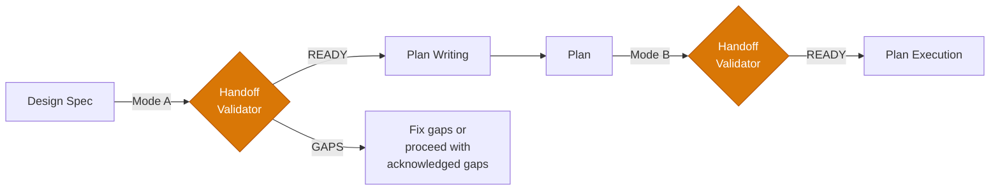

<div align="center">


# Pipeline Handoff Validator

**Validate artifacts at pipeline boundaries before the next phase consumes them.**

Catch gaps before they propagate. Contracts, not assumptions.

<p>
  
  
  
</p>

</div>

Part of the [stn-skills](https://github.com/sthiermann/stn-skills) pipeline. Validates handoff artifacts between pipeline phases. Integrated into build-feature, or use standalone.

A validation skill that catches incomplete design specs and defective plans before they propagate through the pipeline. Two validation modes cover both pipeline boundaries: Mode A validates design specs before plan-writing (6 contract checks), Mode B validates plans before plan-execution (7 contract checks). Produces structured Handoff Compliance Tables with PASS/GAP per check and specific remediation suggestions.

**Typical duration:** 1–3 min per validation

---

## What It Does

- **Mode A: Design Spec → Plan-Writing** — validates structure, testable criteria, scope boundaries, risk coverage, assumption resolution, approach clarity (6 checks)
- **Mode B: Plan → Plan-Execution** — validates structure, quality score, rollback blocks, DAG integrity, file structure, zero placeholders, requirements traceability (7 checks)
- **Integrated** — build-feature invokes this automatically between macro-phases
- **Standalone** — validate any spec or plan artifact independently

---

## Quick Start

```
/stn-skills:pipeline-handoff-validator
```

Or automatically between build-feature macro-phases.

---

## Contract Checks

### Mode A: Design Spec Validation

| # | Check | What it validates |
|---|-------|------------------|
| A1 | Structure | All required sections present per design-spec-template |
| A2 | Testable criteria | Acceptance criteria have verifiable assertions |
| A3 | Scope boundaries | Always/Ask First/Never table defined |
| A4 | Risk coverage | Risks documented with likelihood, impact, mitigation |
| A5 | Assumptions resolved | No unverified critical assumptions |
| A6 | Approach clarity | Specific technology choices, not abstract patterns |

### Mode B: Plan Validation

| # | Check | What it validates |
|---|-------|------------------|
| B1 | Structure | All required plan sections present per plan-document-template |
| B2 | Quality score | Plan Quality Score documented and >= 90 |
| B3 | Rollback blocks | Every task has rollback commands |
| B4 | DAG integrity | No circular dependencies in Mermaid graph |
| B5 | File structure | Lock-In table with CREATE/MODIFY actions |
| B6 | Zero placeholders | No placeholder patterns in code blocks |
| B7 | Requirements traced | Every requirement maps to at least one task |

---

## Output

Produces a **Handoff Compliance Table** displayed to the user:

```
| # | Check | Result | Detail |
|---|-------|--------|--------|
| A1 | Structure | PASS | All sections present |
| A2 | Testable criteria | GAP | R3 acceptance criterion is vague |
| ... |

Verdict: GAPS FOUND (1 gap)
```

Each gap includes the specific section, what the contract requires, and a suggested fix.

---

## Workflow



---

## Pipeline Context

This skill sits between the pipeline phases:

| Transition | Validates | Checks |
|---|---|---|
| Brainstorming → Plan-Writing | Design spec completeness | 6 contract checks (Mode A) |
| Plan-Writing → Plan-Execution | Plan document integrity | 7 contract checks (Mode B) |

**Upstream:** [Brainstorming](../brainstorming/README.md) or [Plan Writing](../plan-writing/README.md)
**Downstream:** [Plan Writing](../plan-writing/README.md) or [Plan Execution](../plan-execution/README.md)
**Full pipeline:** [Build Feature](../build-feature/README.md) (invokes this automatically)
