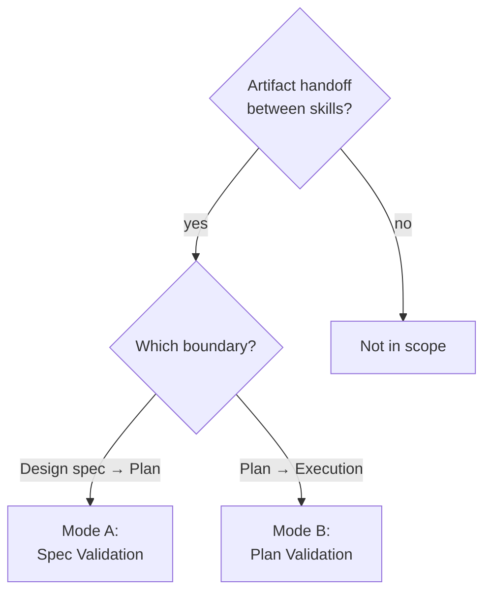

# Pipeline Handoff Validator

## Overview

Validates artifacts at pipeline boundaries before they are consumed by the next phase. Catches incomplete specs, ambiguous acceptance criteria, and plan defects before they propagate through the pipeline and compound into larger failures.

**Core principle:** Artifacts at pipeline boundaries are contracts. Unvalidated contracts produce downstream failures that are harder to diagnose than the original defect.

**Announce:** "I'm using the pipeline-handoff-validator to check this artifact before proceeding."

## The Contract Rule

```
EVERY ARTIFACT CROSSING A PIPELINE BOUNDARY IS VALIDATED AGAINST ITS CONTRACT.
GAPS FOUND HERE COST MINUTES. GAPS FOUND DOWNSTREAM COST HOURS.
```

## When to Use



**Invoked automatically by** `build-feature` between macro-phases.
**Invoked manually** when using pipeline skills individually (e.g., running plan-writing on a spec produced in a previous session).

---

## Mode A: Design Spec → Plan-Writing Validation

Validates a design spec before plan-writing consumes it.

**Input:** Path to design spec document (typically `docs/specs/YYYY-MM-DD-<topic>-design.md`)

**Contract checks:**

| # | Check | What it validates | Pass condition |
|---|-------|------------------|----------------|
| A1 | **Structure** | Spec follows `skills/brainstorming/references/design-spec-template.md` | All required sections present: Problem Statement, Success Criteria, Scope Boundaries, Selected Approach, Acceptance Criteria, Risk Register |
| A2 | **Testable criteria** | Every acceptance criterion has a verification method | Each criterion contains a concrete assertion (not vague goals like "should be fast") |
| A3 | **Scope boundaries** | Always/Ask First/Never table is defined | Table exists with at least 1 entry in each column |
| A4 | **Risk coverage** | Selected approach has documented risks | At least 1 risk with likelihood, impact, and mitigation |
| A5 | **Assumptions resolved** | No critical unverified assumptions | Zero assumptions marked "Unverified" that gate a design decision |
| A6 | **Approach clarity** | Selected approach has sufficient detail for decomposition | Approach section contains specific technology choices, not abstract patterns |

**Procedure:**

1. Read the design spec file
2. Parse sections against the template structure
3. Run each contract check
4. Produce the Handoff Compliance Table (see output format below)
5. If any check is GAP: present gaps with specific remediation suggestions
6. If all checks PASS: confirm the artifact is ready for plan-writing

---

## Mode B: Plan → Plan-Execution Validation

Validates a plan document before plan-execution consumes it.

**Input:** Path to plan document (typically `.plan/plan-{YYYYMMDD}-{slug}.md`)

**Contract checks:**

| # | Check | What it validates | Pass condition |
|---|-------|------------------|----------------|
| B1 | **Structure** | Plan follows `skills/plan-writing/references/plan-document-template.md` | All required sections present: Metadata, Requirements, File Structure, Tasks, DAG, Waves |
| B2 | **Quality score** | Plan passed adversarial verification | Plan Quality Score documented and >= 90 |
| B3 | **Rollback blocks** | Every task has a rollback strategy | Each task contains a rollback block with specific commands |
| B4 | **DAG integrity** | No circular dependencies | Mermaid graph parseable, no cycles in dependency chain |
| B5 | **File structure** | Lock-In table present | File Structure Lock-In table exists with Action column (CREATE/MODIFY) |
| B6 | **Zero placeholders** | No placeholder patterns in code blocks | Scan all code blocks against `skills/plan-writing/references/placeholder-detector-rules.md` patterns: zero matches |
| B7 | **Requirements traced** | Every requirement maps to at least one task | Traceability matrix present with R(N) → T(M) mappings, no orphans |

**Procedure:**

1. Read the plan document file
2. Parse sections against the template structure
3. Run each contract check
4. For B6 (placeholder scan): extract all fenced code blocks, match against patterns from `skills/plan-writing/references/placeholder-detector-rules.md`
5. Produce the Handoff Compliance Table
6. If any check is GAP: present gaps with specific remediation suggestions
7. If all checks PASS: confirm the artifact is ready for plan-execution

---

## Output Format

Both modes produce a **Handoff Compliance Table** displayed to the user:

```markdown
## Handoff Compliance — [Mode A: Spec / Mode B: Plan]

**Artifact:** `<file path>`
**Validated:** <timestamp>

| # | Check | Result | Detail |
|---|-------|--------|--------|
| A1/B1 | Structure | PASS/GAP | [missing sections or "all sections present"] |
| A2/B2 | ... | PASS/GAP | [specific evidence] |
| ... |

**Verdict:** READY / GAPS FOUND (N gaps)
```

If gaps are found, each gap includes:
- Which section or field is missing/incomplete
- What the contract requires
- Suggested fix (specific, actionable)

---

## Integration with build-feature

The `build-feature` skill invokes this validator automatically:

1. After Macro-Phase 1 (brainstorming) completes → **Mode A** validates the design spec
2. After Macro-Phase 2 (plan-writing) completes → **Mode B** validates the plan

If the validator reports gaps:
- Present the Handoff Compliance Table to the user
- Offer: "Fix these gaps before proceeding, or proceed with known gaps?"
- If the user chooses to fix: return to the preceding skill phase
- If the user chooses to proceed: log acknowledged gaps in the pipeline state

---

## Red Flags — STOP and Investigate

- Skipping validation "because the spec/plan looks complete"
- Marking a GAP as PASS because "it's close enough"
- Proceeding to the next phase without showing the Compliance Table
- Validating from memory instead of reading the actual artifact file
- Reporting READY without checking every contract item

---

## Common Rationalizations

| Excuse | Reality |
|--------|---------|
| "The spec was just written, it's fine" | Freshness does not equal completeness. Validate. |
| "Plan-writing will catch any issues" | Plan-writing assumes valid input. Garbage in, garbage out. |
| "This is a simple feature, validation is overkill" | Simple features with unclear acceptance criteria produce the most rework. |
| "I can see the spec has all sections" | Seeing sections is not the same as verifying their content. Read them. |
| "The user already approved the spec at GATE 4" | User approval validates direction. Contract validation checks completeness. Different concerns. |
| "Validation slows down the pipeline" | Catching gaps here takes minutes. Catching them during execution takes hours. |
