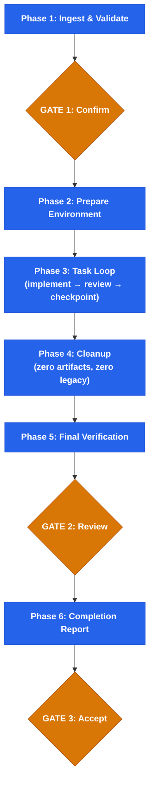

<div align="center">


# Plan Execution

**Verified implementation — every task checked, every claim proven**

<p>
  
  
  
</p>

</div>

Part of the [stn-skills](https://github.com/sthiermann/stn-skills) pipeline. Accepts plans from plan-writing. Use `/stn-skills:build-feature` for the full pipeline.

Execute implementation plans with absolute fidelity. Fresh subagent per task with mandatory context refresh. Three-stage review before every commit by independent reviewer agents. Drift detection after every implementation. Circuit breakers that stop before damage spreads. Post-execution cleanup that leaves the codebase cleaner than it was found.

**The user never needs to manually check if work was done correctly.** Every claim is backed by fresh verification evidence. Every acceptance criterion is independently verified. The completion report proves it.

Research shows that separating generators from reviewers and verifying at every step prevents the 20–27% quality degradation observed in unchecked multi-turn generation.

**Typical duration:** ~2–5 min per task (implementation + 3-stage review + checkpoint)

---

## What It Does

- **Checkpoint-based execution** — atomic git commit per task, revertible to any checkpoint
- **Drift detection** — 3 checks (scope, content, overreach) after every implementation catch deviations early
- **Three-stage review** — spec compliance → code quality → integration, each a separate reviewer agent reading the actual diff
- **Reflect-Retry-Escalate** — structured self-reflection on failure, model escalation, best-candidate tracking
- **Post-execution cleanup** — removes debug artifacts, dead code, deprecated patterns, unused imports
- **Modernization guarantee** — every file touched uses current APIs and best practices; legacy patterns are replaced, not preserved

---

## Quick Start

```
/stn-skills:plan-execution
```

Or: `Execute this plan` | `Run this plan` | `Implement this plan`

Requires a plan document with tasks, acceptance criteria, and verification commands. Produces one from `/stn-skills:plan-writing`.

---

## How It Works



### Per-Task Execution (Phase 3)

Every task goes through 7 steps:

| Step | What Happens | Why |
|------|-------------|-----|
| Role Anchoring | "Implement ONLY this task" injected into agent | Prevents scope creep |
| Implementer Dispatch | Fresh subagent with task spec + handoff from prior task | Context isolation + knowledge transfer |
| Drift Detection | 3 checks against planned scope | Catches deviations immediately |
| Spec Compliance Review | Reviewer reads diff, verifies each criterion | Trust nothing — verify everything |
| Code Quality Review | Conventions, security, modernization check | No deprecated patterns pass |
| Integration Review | Cross-task consistency | Later tasks don't break earlier work |
| Checkpoint | Selective git commit with structured message | Known-good recovery point |

---

## Key Outputs

| Output | What It Proves |
|--------|---------------|
| Per-task checkpoints | Every task independently revertible |
| Verification matrix | Every acceptance criterion met with evidence |
| Traceability matrix | Requirements → tasks → code → tests — complete chain |
| Drift detection log | No unplanned changes slipped through |
| Cleanup summary | Zero debug artifacts, zero legacy code remaining |
| Completion report | Formal proof of correct implementation |

---

## Execution Fidelity Score

Quantitative measure of execution quality (0-100):

| Dimension | Weight | What It Measures |
|-----------|--------|-----------------|
| Acceptance criteria verified | 35% | % independently verified with evidence |
| First-pass review rate | 25% | % of tasks passing all reviews first try |
| Drift-free rate | 20% | Tasks with zero drift events |
| Circuit breaker events | 10% | Fewer events = smoother execution |
| Cleanup items | 10% | Fewer items = cleaner implementation |

**Target: 95+.** The score is informational. The binding verdict is **PASS** (all criteria verified) or **GAPS_FOUND** (with specifics).

---

## Failure Handling

| Situation | What Happens |
|-----------|-------------|
| Review fails | Reflect-Retry-Escalate: self-reflection → enriched retry → model escalation (max 3 attempts) |
| Major drift detected | Execution pauses. User chooses: accept, revert, or replan |
| Circuit breaker YELLOW | Pause + pattern analysis presented to user |
| Circuit breaker RED | Hard stop. Checkpoint preserved. User must intervene |
| Session interrupted | State file enables resume from last checkpoint in new session |

