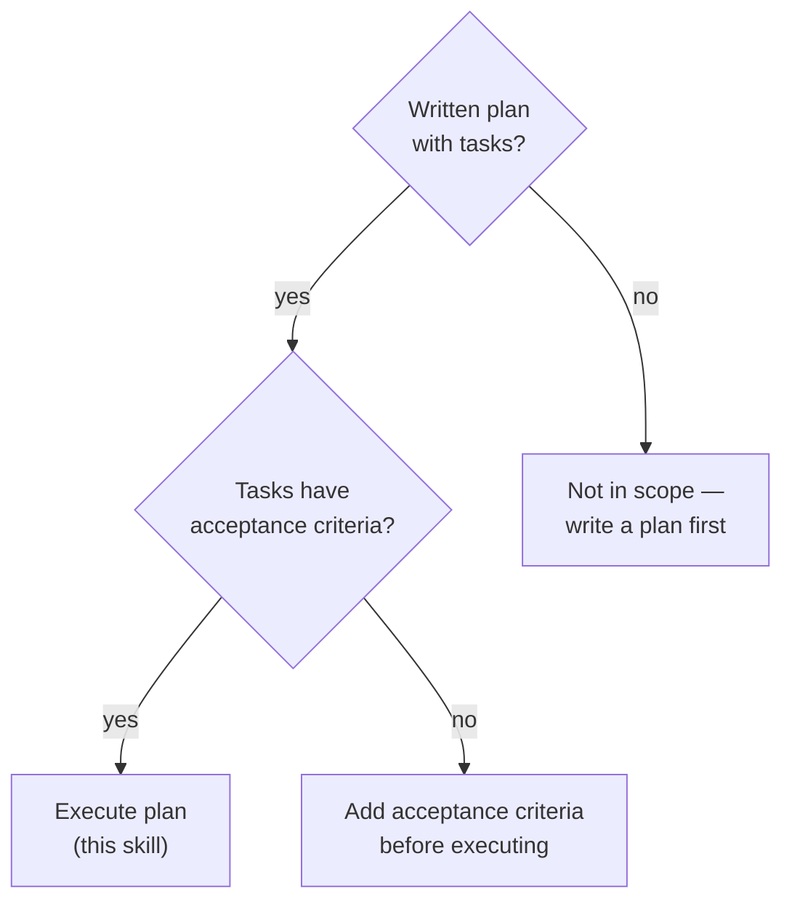
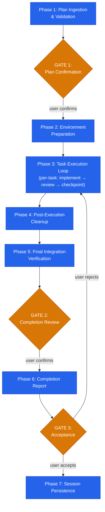

# Plan Execution

## Overview

Executes structured implementation plans task-by-task with checkpoint-based recovery, drift detection, three-stage review, circuit breakers, and reflect-retry-escalate retry protocol. Each task is dispatched to a fresh subagent, verified independently, and committed as an atomic checkpoint. Produces a formal completion report with end-to-end traceability and Execution Fidelity Score.

**Core principle:** Every completion claim requires fresh verification evidence from this execution.

**Announce:** "I'm using the plan-execution skill to execute this implementation plan with checkpoint-based recovery and verification."

## The Iron Law

```
NO COMPLETION CLAIMS WITHOUT FRESH VERIFICATION EVIDENCE.
IF YOU HAVE NOT RUN THE COMMAND IN THIS STEP, YOU CANNOT CLAIM IT PASSES.
```

If a task reports DONE without verification command output captured during this execution -- that report is rejected. If evidence references a prior run or memory -- that evidence is rejected.

## Modernization Mandate

```
EVERY LINE WRITTEN MUST USE CURRENT APIs AND BEST PRACTICES.
EVERY FILE TOUCHED MUST BE LEFT CLEANER THAN IT WAS FOUND.
DEPRECATED PATTERNS IN TOUCHED FILES MUST BE MODERNIZED.
```

This is enforced at three levels:
- **Per-task (Phase 3):** Code-quality-reviewer (Stage 2) has explicit modernization check. Deprecated API usage or legacy patterns = FAIL verdict.
- **Post-execution (Phase 4):** Dedicated cleanup phase scans all modified files for deprecated patterns, legacy code, debug artifacts, and dead code. Replaces them with modern equivalents.
- **Final verification (Phase 5):** Completion-verifier independently checks the final codebase state — no deprecated patterns may remain in any file touched during execution.

## Session Resumption Protocol

At the start of EVERY turn — before any other action — read `references/pipeline-state-protocol.md` and follow its procedure:

1. **Read** `.claude/stn-skills-pipeline-state.json` (if it exists).
2. **State exists, `active_skill` is `plan-execution`:** Report "Resuming plan-execution at Phase {current_phase}/7. Gates passed: {gates_passed}." Continue from that phase. Also read `.claude/plan-execution-state.json` for per-task checkpoint state.
3. **State exists, `active_skill` is a different skill:** Report the mismatch. Use AskUserQuestion: "Pipeline state shows {active_skill} is active at Phase {current_phase}. Resume that skill, or start fresh with plan-execution?"
4. **No state file:** Initialize the state file with `active_skill: "plan-execution"`, `current_phase: 1`, `total_phases: 7`, `gates_total: 3`.
5. **Update the state file** before starting each phase.

The state file determines what happens next — not the user's phrasing. Any continuation message means: read state, continue from current phase.

---

## When to Use



**Use this skill when:**
- Executing a multi-task implementation plan with defined acceptance criteria
- Resuming a previously checkpointed plan execution
- Running a plan that requires atomic per-task commits and rollback capability
- Implementing a spec where traceability from requirement to code is required

**Not designed for:**
- Writing the plan itself -- use a planning skill first
- Single-file changes with no multi-step structure
- Exploratory prototyping without defined acceptance criteria

---

## The Seven Phases

Complete each phase before proceeding to the next. Three user gates ensure alignment.



---

### Phase 1: Plan Ingestion & Validation

**Input Provenance Guard:** Before parsing the plan, check pipeline state:
- [ ] If `.claude/stn-skills-pipeline-state.json` exists and shows `handoff_validated: true` from plan-writing → proceed
- [ ] If state exists but `handoff_validated: false` → run `Skill(skill: "stn-skills:pipeline-handoff-validator", args: "MODE_B {plan_file}")` BEFORE proceeding
- [ ] If no state file → validate plan structure independently in step 2 below (stricter: halt on any missing field)

Parse the plan document and validate it is executable.

**1. Accept plan** -- read the full plan document. Identify plan name, task list, dependency graph, and requirements.

**2. Validate plan structure** -- verify every task has ALL required fields: id, title, acceptance criteria, dependencies, files_modified, verification command, rollback strategy. If any task is missing required fields, report the exact gaps and halt. Do NOT proceed with an incomplete plan.

**3. Parse tasks** -- extract for each task:
- Task ID (T1, T2, ...)
- Title and description
- Files in scope
- Acceptance criteria (mandatory -- reject plan if missing)
- Verification command
- Dependencies on other tasks
- Estimated complexity

**4. Validate DAG** -- build dependency graph. Confirm acyclic. If cycle detected, report exact cycle path and halt.

**5. Build execution order** -- topological sort of task DAG. Serial by default; parallel only when tasks share zero file overlap and zero dependency.

**6. Detect tech stack** -- scan for build and config files (same detection as codebase-audit Phase 1). Record detected languages, frameworks, test runners, and linters.

**7. Run baseline tests** -- execute the project's test command (from `package.json` scripts.test, `pytest`, `cargo test`, `go test`, or equivalent). Record: total tests, passed, failed, skipped. This is the pre-execution baseline — Phase 5 compares against these exact numbers for regression detection.

---

### GATE 1: Plan Confirmation

Present to the user:
- Task count and execution order
- Dependency graph summary
- Detected tech stack
- Baseline test results
- Any tasks missing acceptance criteria (these block execution)

**Present all content above to the user first.** Then use the AskUserQuestion tool:
- Question: "Confirm this execution plan, or adjust task order/scope before I begin."
- Options: ["Confirmed — begin execution", "Adjust task order or scope"]

**Do not proceed until the user responds. After confirmation, proceed immediately to Phase 2. Do not ask "Should I start?", "Which task first?", or similar.**

**On confirmation:** Update state file: append `1` to `gates_passed`, set `current_phase: 2`.

---

### Phase 2: Environment Preparation

**Artifact Gate:** Before starting, verify Phase 1 produced:
- [ ] Plan parsed with task list, dependency graph, and requirements
- [ ] DAG validated (acyclic, topological sort succeeded)
- [ ] Baseline test results recorded
- [ ] GATE 1 passed (user confirmed execution plan)
- [ ] State file shows `current_phase >= 2` and `gates_passed` includes `1`

If any check fails: return to Phase 1. Do not proceed.

**1. Clean git tree** -- verify `git status` shows clean working tree. If uncommitted changes exist, halt and ask user to commit or stash.

**2. Record starting SHA:**
```bash
git rev-parse HEAD
```
Store as rollback point for full recovery.

**3. Create state file** at `.claude/plan-execution-state.json` with plan ID, starting SHA, task counter, empty checkpoint array, and circuit breaker counters (all at 0/GREEN). Format per `references/checkpoint-protocol.md`.

---

### Phase 3: Task Execution Loop

**Artifact Gate:** Before starting, verify Phase 2 produced:
- [ ] Clean git tree confirmed
- [ ] Starting SHA recorded
- [ ] State file at `.claude/plan-execution-state.json` initialized with plan ID, starting SHA, empty checkpoint array, circuit breaker at GREEN
- [ ] State file shows `current_phase >= 3`

If any check fails: return to Phase 2. Do not proceed.

For each task in execution order, execute steps 3.1 through 3.7. Do not skip steps.

#### Step 3.0: Scope Enforcement File

**Before dispatching each task**, write `.claude/current-task-scope.json`:
```json
{
  "task_id": "T{N}",
  "allowed_files": ["{files_modified list from task spec}"]
}
```
This scope file defines the task's boundary. **The orchestrator and reviewers use it to detect scope drift.** If a task-implementer needs a file outside the declared scope, it must document the reason and the orchestrator adds it to the scope before proceeding. **After the task completes** (regardless of status), delete `.claude/current-task-scope.json`.

#### Step 3.1: Role Anchoring

Inject at the top of every subagent dispatch:

```
You are implementing ONLY task T{N}: {Title}.
Do NOT modify files outside scope: {file_list}.
Do NOT add features, refactor, or "improve" anything beyond the spec.
```

This anchors the subagent to its bounded task. Without it, agents drift.

#### Step 3.2: Context Isolation + Handoff & Implementer Dispatch

**Build context package:**
```
- Repository path: {REPO_PATH}
- Tech stack: {DETECTED_STACK}
- Project rules: {CLAUDE.md content or "none"}
- Task: T{N} spec from plan
- Acceptance criteria: {criteria list}
- Context files: {files the task reads or modifies}
- Scope: {files permitted to modify}
- Verification command: {command}
- Role anchor: {from step 3.1}
- Prior handoff: {from previous task, per references/task-handoff-template.md}
```

**CONTEXT FRESHNESS:** For every task after T1, the orchestrator MUST re-read all files in the task's scope before building the context package. Plans describe expected state; actual state may have diverged due to prior task adaptations or drift-accepted deviations. Pass current file content, not plan-time content.

**Dispatch** to `agents/task-implementer.md` as a fresh subagent.

**On return**, read the structured status report. Expected codes per `references/status-codes.md`:

| Code | Action |
|---|---|
| `DONE` | Proceed to step 3.3 |
| `DONE_WITH_CONCERNS` | Proceed to step 3.3, carry concern forward |
| `BLOCKED` | Enter reflect-retry-escalate (below) |
| `NEEDS_CONTEXT` | Provide requested context, re-dispatch |

**On BLOCKED or review failure** -- invoke `references/reflect-retry-escalate.md`. Max 3 attempts: (1) retry with enriched context + self-reflection, (2) retry with model escalation + scope simplification, (3) circuit breaker + user intervention. Each attempt must differ from previous. No identical retries.

#### Step 3.3: Drift Detection

Run 3 checks per `references/drift-detection-rules.md`:

| Check | CLEAN | MINOR_DRIFT | MAJOR_DRIFT |
|---|---|---|---|
| **Scope** | 0 extra files, 0 missing | 1 extra file | 2+ extra OR any missing file |
| **Content** | All criteria have evidence | 1 criterion without evidence | 2+ criteria without evidence |
| **Overreach** | Under 3x expected lines | 3x to 5x | Over 5x |

Overall classification = worst across all 3 checks.

- **CLEAN**: log, proceed.
- **MINOR_DRIFT**: log with details, proceed, note in commit message.
- **MAJOR_DRIFT**: stop. Present drift report to user. Offer: accept, revert, or replan. Increment `major_drift_count` in circuit breaker.

#### Step 3.4: Three-Stage Review

Run sequentially. Each stage is a separate subagent dispatch. All three must PASS before checkpoint.

**Stage 1 -- Spec Compliance:** Dispatch `agents/spec-compliance-reviewer.md` with the task spec, acceptance criteria, and `git diff` output. The reviewer reads the actual diff — NOT the implementer's summary. For each acceptance criterion, the reviewer independently finds evidence in the diff. Criteria without diff evidence = FAIL.

**Stage 2 -- Code Quality:** Only dispatch if Stage 1 passes. Dispatch `agents/code-quality-reviewer.md` with the `git diff`, detected tech stack, and project rules. Checks naming, error handling, test coverage, security, and modernization. Deprecated API usage or legacy patterns = FAIL.

**Stage 3 -- Integration:** Only dispatch if Stage 2 passes. Only for tasks with cross-task dependencies. Dispatch `agents/integration-reviewer.md` with the current task's diff, files modified by prior tasks, and current state of shared files. Checks import resolution, type consistency, and API contract adherence.

Any stage FAIL → return to implementer with specific feedback from the reviewer. Increment review failure counters. On retry, include the reviewer's feedback in the implementer context.

<details>
<summary>Example: Stage 1 Spec Compliance review output</summary>

```
Task T3 — Spec Compliance Review

| Criterion | Verdict | Evidence from diff |
|-----------|---------|-------------------|
| Rate limiter returns 429 on excess | PASS | rate-limiter.ts:8 — `message: { error: 'Too many requests' }` + test at line 14 asserts 429 |
| Window resets after 15 minutes | PASS | rate-limiter.ts:4 — `windowMs: 15 * 60 * 1000` |
| Middleware registered before routes | PASS | app.ts:12 — `app.use(apiLimiter)` appears before `app.use('/api', router)` at line 15 |
| Standard headers included | PASS | rate-limiter.ts:6 — `standardHeaders: true` |

Result: PASS (4/4 criteria met with diff evidence)
```

Each criterion maps to a specific line in the git diff — not the implementer's claim, but independently verified by reading the actual changes.

</details>

#### Step 3.5: Circuit Breaker

Check thresholds per `references/circuit-breaker-thresholds.md`:

| Metric | YELLOW | RED |
|---|---|---|
| Consecutive review failures (same task) | 2 | 4 |
| Total review failures (all tasks) | 5 | 10 |
| Consecutive BLOCKED (same task) | 1 | 2 |
| MAJOR_DRIFT count | 2 | 3 |

**GREEN**: proceed. **YELLOW**: pause. Present metrics and current task context to the user, then use AskUserQuestion — Question: "Circuit breaker YELLOW — {metric} at threshold. Continue or abort?" Options: ["Continue execution", "Abort and checkpoint"]. After confirmation, resume immediately. **RED**: hard stop, commit checkpoint, require user intervention via AskUserQuestion — Question: "Circuit breaker RED — execution halted. How to proceed?" Options: ["Adjust scope and retry", "Abort execution"].

#### Step 3.6: Checkpoint

Execute per `references/checkpoint-protocol.md`:

1. **Pre-commit verification** -- run verification command fresh.
2. **Selective staging** -- `git add` only files in task scope. Never `git add -A` or `git add .`.
3. **Structured commit**:
   ```
   plan-exec: T{N} - {Title}

   Task {N}/{TOTAL}: {description}
   Acceptance criteria: {count} met
   Review: spec PASS, quality PASS, integration PASS
   ```
4. **State file update** -- append checkpoint SHA to `.claude/plan-execution-state.json`.
5. **Post-commit check** -- `git status` must show clean tree. Warn on unexpected unstaged changes.

#### Step 3.7: Adaptive Replanning

Triggered only when a task returns BLOCKED after all retry attempts.

1. Present the blocked task, failure history, and impact on downstream tasks.
2. Use AskUserQuestion — Question: "Task {ID} blocked after all retries. How to proceed?" Options: ["Skip task", "Replan remaining tasks", "Abort execution"]. After selection, execute the chosen option immediately.
3. If user approves replanning, rebuild execution order for remaining tasks, re-validate DAG, and resume from next executable task.

---

### Phase 4: Post-Execution Cleanup

**Artifact Gate:** Before starting, verify Phase 3 produced:
- [ ] All tasks in execution order have checkpoint entries in `.claude/plan-execution-state.json`
- [ ] Circuit breaker state is not RED (if RED, execution was halted — do not proceed to cleanup)
- [ ] State file shows `current_phase >= 4`

If any check fails: return to Phase 3. Do not proceed.

**Purpose:** Guarantee zero development artifacts, zero deprecated code, and zero legacy patterns remain after execution. This phase is what ensures the codebase is cleaner AFTER execution than before.

**Step 0: Full context refresh.** Before scanning for cleanup items, read the COMPLETE final state of every modified file (not just the diff). Incremental reviews during Phase 3 see changes in isolation. The cleanup scan sees the final integrated result — it catches issues that emerge only in combination of multiple task changes.

Scan ALL files modified during execution (`git diff --name-only {starting_sha}..HEAD`) for:

**1. Development artifacts:**
- Unused imports (modules imported but never referenced)
- Debug statements: `console.log`, `console.debug`, `print()` (non-production), `debugger`, `binding.pry`, `pdb.set_trace()`, `dd()`, `dump()`, `var_dump()`
- Debug comments: `// DEBUG`, `// TEMP`, `// HACK`, `# TODO`, `# FIXME`, `// XXX`
- Temporary variables: `temp`, `tmp`, `test123`, `foo`, `bar`, `baz` (non-test files)

**2. Dead code:**
- Unreachable branches (code after `return`, `throw`, `break` with no conditional path)
- Unused variables and functions introduced during implementation
- Commented-out code blocks (>2 lines of commented code)

**3. Deprecated/legacy patterns:**
- APIs marked as deprecated in current framework/library versions
- Old-style patterns with known modern replacements (e.g., `var` → `const/let`, callbacks → async/await, `require()` → `import`)
- Backward-compatibility shims, version checks, or `if (oldAPI) ... else (newAPI)` branches
- Legacy naming conventions inconsistent with project standards

**4. Documentation staleness:**
- Comments referencing old function names, removed parameters, or changed behavior
- JSDoc/docstring signatures that no longer match the actual function

**Action:** Fix all found items. If a deprecated pattern is found in code the plan touched, replace it with the modern equivalent. Run full test suite after cleanup to verify nothing broke. Commit as:
```
plan-exec: post-execution cleanup

Removed: {count} unused imports, {count} debug statements, {count} dead code blocks
Modernized: {count} deprecated patterns replaced with current equivalents
Tests: PASS
```

Record total cleanup item count — this feeds into the Execution Fidelity Score (Cleanup dimension: 10% weight).

---

### Phase 5: Final Integration Verification

**Artifact Gate:** Before starting, verify Phase 4 produced:
- [ ] Cleanup scan completed on all modified files
- [ ] Cleanup item count recorded (feeds into Fidelity Score)
- [ ] State file shows `current_phase >= 5`

If any check fails: return to Phase 4. Do not proceed.

**1. Full test suite** -- run complete test suite. Compare against Phase 1 baseline. Zero regressions required.

**2. Dispatch completion verifier** -- send to `agents/completion-verifier.md` with:
```
- Repository path
- Full plan document
- Checkpoint log from state file
- Full diff: git diff {starting_sha}..HEAD
- Test output
- Build output
- Requirements from plan
```

**3. Verification matrix** -- the verifier independently confirms every acceptance criterion against current code state. Not the diff -- the actual file content.

**4. Traceability matrix** -- requirement to task to code location to verification evidence. Every requirement must trace end-to-end. Gaps = findings.

**5. Execution Fidelity Score** -- calculated per `agents/completion-verifier.md`:

| Dimension | Weight | Calculation |
|---|---|---|
| Acceptance criteria verified | 35% | (verified / total) * 100 |
| First-pass review rate | 25% | (first_attempt_passes / total_tasks) * 100 |
| Drift rate | 20% | 100 - (drift_events / total_tasks * 100) |
| Circuit breaker events | 10% | 100 - (CB_events * 10) |
| Cleanup items | 10% | 100 - (cleanup_items * 5) |

Composite = weighted sum. Each dimension capped at [0, 100].

---

### GATE 2: Completion Review

Present to the user:
- Verification matrix (all criteria, verified/not, evidence)
- Traceability matrix
- Cross-task regression check results
- Orphaned change detection results
- Execution Fidelity Score breakdown
- Overall verdict: **PASS** or **GAPS_FOUND**

**Present all content above to the user first.** Then use the AskUserQuestion tool:
- Question: "Review the completion verification. Accept, or identify gaps to address?"
- Options: ["Accept", "Identify gaps to address"]

**Do not proceed until the user responds. After acceptance, proceed immediately to GATE 3.**

**On acceptance:** Update state file: append `2` to `gates_passed`, set `current_phase: 6`.

If GAPS_FOUND, return to Phase 3 for targeted rework on specific tasks.

---

### Phase 6: Completion Report

**Artifact Gate:** Before starting, verify Phase 5 produced:
- [ ] Full test suite results (zero regressions vs. Phase 1 baseline)
- [ ] Verification matrix from completion-verifier
- [ ] Execution Fidelity Score calculated
- [ ] GATE 2 passed (user confirmed completion review)
- [ ] State file shows `current_phase >= 6` and `gates_passed` includes `2`

If any check fails: return to Phase 5. Do not proceed.

Generate formal report per `references/completion-report-template.md`. Sections:

1. Executive Summary (tasks completed, fidelity score, verdict)
2. Task Completion Matrix
3. Acceptance Criteria Verification
4. Traceability Matrix
5. Test Suite Evidence (before/after delta)
6. Build & Lint Evidence
7. Drift Detection Log
8. Circuit Breaker Log
9. Cleanup Summary
10. Checkpoint History
11. Files Modified
12. Adaptive Replanning Log (if any)

---

### GATE 3: Acceptance

Present the completion report.

**Present all content above to the user first.** Then use the AskUserQuestion tool:
- Question: "Accept this execution as complete, or identify items requiring rework?"
- Options: ["Accept as complete", "Items need rework"]

**Do not proceed until the user responds.**

- Accept → update state file: append `3` to `gates_passed`, set `current_phase: 7`. Proceed to Phase 7.
- Reject → return to Phase 3 for specified rework tasks.

---

### Phase 7: Session Persistence

**Artifact Gate:** Before starting, verify Phase 6 produced:
- [ ] Completion report generated with all 12 sections
- [ ] GATE 3 passed (user accepted execution)
- [ ] State file shows `current_phase >= 7` and `gates_passed` includes `3`

If any check fails: return to Phase 6. Do not proceed.

Write final state to `.claude/plan-execution-state.json` with:
- All checkpoint SHAs
- Final circuit breaker state
- Execution Fidelity Score
- Overall verdict
- Timestamp

This enables resumption if the session ends mid-execution. On resume, read state file, verify checkpoint SHAs exist, and continue from last completed task.

---

## Transition: Execution Complete

**Terminal state: The feature is implemented and verified.**

### Pipeline State Cleanup

Delete `.claude/stn-skills-pipeline-state.json` — the pipeline is complete. Leaving it on disk would confuse future sessions that read it.

### Next Steps

Use AskUserQuestion:
- Question: "Execution complete with Fidelity Score {score}/100. Run a codebase audit to verify code quality, or finish here?"
- Options: ["Run codebase audit", "Finish here"]

**On "Run codebase audit":** Invoke the Skill tool: `Skill(skill: "stn-skills:codebase-audit")`
**On "Finish here":** End. Inform user: run `/stn-skills:codebase-audit` anytime to verify.

---

## Red Flags -- STOP and Investigate

If you catch yourself:
- Claiming completion without running the verification command
- Using "should pass" or "will work" instead of running the test
- Trusting an implementer summary without reading the actual diff
- Skipping any of the three review stages
- Committing with `git add -A` or `git add .` instead of selective staging
- Proceeding after MAJOR_DRIFT without user approval
- Retrying identically without adding new information (reflection, feedback, model escalation)
- Expressing satisfaction before verification ("Great!", "Perfect!", "Looks good!")
- Merging self-reflection with implementation (reflection informs retry, not replaces it)
- Accepting evidence that says "implemented" or "done" without command output

**ALL of these mean: STOP. Gather real evidence before continuing.**

---

## Common Rationalizations

| Excuse | Reality |
|---|---|
| "Verification is overkill for this trivial step" | Unverified steps accumulate into unverified tasks. Verify every step. |
| "The implementer said it passes, no need to check" | Implementer claims without evidence are assertions, not facts. Read the diff. |
| "I'll verify everything at the end instead of per-task" | End-to-end verification cannot isolate which task introduced a regression. Per-task checkpoints exist for a reason. |
| "Selective staging is too slow, git add -A is fine" | One accidental commit of a debug file or temp artifact contaminates the checkpoint. Stage explicitly. |
| "This drift is minor, no need to report it" | Minor drift unreported becomes major drift undetected. Log every deviation. |
| "The circuit breaker is too aggressive, I can push through" | Circuit breakers exist because repeated failure without intervention produces compounding damage. Respect the thresholds. |
| "Replanning slows us down, just force this task through" | Forcing a blocked task produces broken code that downstream tasks inherit. Replan or skip. |
| "The test was passing earlier, it probably still passes" | "Probably" is not evidence. Run the command. Capture the output. Now. |
| "I can skip three-stage review because I wrote the code myself" | Self-review is blind to its own assumptions. Three independent reviewers catch what the author cannot see. |
| "I already know the codebase, I can implement without the plan steps" | The plan exists because ad-hoc implementation produces drift, missed acceptance criteria, and broken rollbacks. Follow the steps. |
| "This is just continuing where we left off" | Read the pipeline state file and the plan-execution state file. Resume from the exact checkpoint. Never skip ahead. |
| "The user wants this done fast, I'll skip cleanup phase" | Cleanup (Phase 4) catches deprecated patterns and debug artifacts. Skipping it ships technical debt. |

---

## Rules

1. **No passive asking** — After a gate confirmation, execution continues immediately. Do not ask "Should I start?", "Which task first?", "Ready to proceed?", or similar. The plan defines the order. Execute it.
