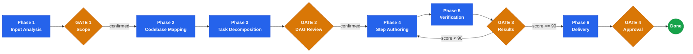

<div align="center">

# Plan Writing

**Zero-ambiguity implementation plans for Claude Code**

Atomic tasks. Complete code. DAG execution. Adversarial verification.

<p>
  
  
  
</p>

</div>

A Claude Code skill that transforms requirements into implementation plans so detailed that execution is mechanical. Every task is 2-5 minutes, every step has complete code, and the entire plan is adversarially verified before delivery.

---

## What It Does

- Extracts and numbers requirements with testable assertions from any input (design spec, brainstorm output, direct request)
- Decomposes work into a DAG of atomic tasks with explicit dependencies, parallel wave grouping, and TDD enforcement
- Authors every step with complete code and commands -- zero placeholders, zero ellipsis, zero "similar to above"
- Runs 7 adversarial verification checks and computes a Plan Quality Score (must be 90+ to pass)
- Delivers a single plan document with Mermaid DAG, traceability matrix, risk assessment, and rollback per task

---

## How to Invoke

```
/stn-skills:plan-writing
```

Or use natural language: `Write a plan for this feature` | `Create an implementation plan` | `Break this down into tasks` | `How should I implement this` | `Plan this refactoring`

---

## Workflow



---

## Key Outputs

| Output | Location |
|--------|----------|
| Plan document | `.plan/plan-{YYYYMMDD}-{slug}.md` |
| Task DAG | Mermaid flowchart embedded in plan |
| Traceability matrix | R(N) -> T(M) -> S(K) -> verification |
| Quality score | Composite 0-100 across 5 dimensions |

---

## Plan Quality Score

| Dimension | Weight | What It Measures |
|-----------|--------|-----------------|
| Requirements coverage | 30% | Every requirement traced to tasks, steps, and verification |
| Placeholder contamination | 25% | Zero matches against 40+ placeholder patterns |
| Signature consistency | 20% | Identical signatures for same function/type across all steps |
| DAG completeness | 15% | No cycles, no parallel file conflicts, no orphan tasks |
| Convention compliance | 10% | All code follows project rules from CLAUDE.md |

**Composite score must be >= 90 to pass.** Plans scoring below 90 enter a rework cycle (max 2 attempts) before escalating to the user.
