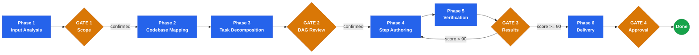

<div align="center">


# Plan Writing

**Zero-ambiguity implementation plans for AI-assisted development**

Atomic tasks. Complete code. DAG execution. Adversarial verification.

<p>
  
  
  
</p>

</div>

Part of the [stn-skills](https://github.com/sthiermann/stn-skills) pipeline. Accepts design specs from brainstorming and produces plans for plan-execution. Use `/stn-skills:build-feature` for the full pipeline.

A skill that transforms requirements into implementation plans so detailed that execution becomes mechanical. Every task takes 2–5 minutes, every step contains complete code, and the entire plan is adversarially verified before delivery. Zero-placeholder enforcement rejects 40+ lazy shortcut patterns — no `...`, no `similar to above`, no `TODO` — ensuring plans are genuinely complete before execution begins.

Research measures 20–27% quality degradation in multi-turn generation without per-step verification. Complete plans prevent that.

**Typical duration:** Small (1–3 tasks): 5–10 min | Medium (4–8 tasks): 10–20 min | Large (9+ tasks): 20–35 min

---

## What It Does

- **Requirement extraction** — numbers requirements with testable assertions from any input (design spec, brainstorm output, direct request)
- **DAG decomposition** — atomic tasks with explicit dependencies, parallel wave grouping, and TDD enforcement
- **Complete step authoring** — every step with complete code and commands — zero placeholders, zero ellipsis, zero "similar to above"
- **Adversarial verification** — 7 checks computing a Plan Quality Score (must be 90+ to pass)
- **Single deliverable** — plan document with Mermaid DAG, traceability matrix, risk assessment, and rollback per task

---

## Quick Start

```
/stn-skills:plan-writing
```

Or use natural language: `Write a plan for this feature` | `Create an implementation plan` | `Break this down into tasks` | `How should I implement this` | `Plan this refactoring`

---

## How It Works



---

## Key Outputs

| Output | Location |
|--------|----------|
| Plan document | `.plan/plan-{YYYYMMDD}-{slug}.md` |
| Task DAG | Mermaid flowchart embedded in plan |
| Traceability matrix | Requirement → Task → Step → Verification (full chain) |
| Quality score | Composite 0-100 across 5 dimensions |

---

## Plan Quality Score

| Dimension | Weight | What It Measures |
|-----------|--------|-----------------|
| Requirements coverage | 30% | Every requirement traced to tasks, steps, and verification |
| Placeholder contamination | 25% | Zero matches against 40+ placeholder patterns |
| Signature consistency | 20% | Identical signatures for same function/type across all steps |
| DAG completeness | 15% | No cycles, no parallel file conflicts, no orphan tasks |
| Convention compliance | 10% | All code follows project rules from CLAUDE.md |

**Composite score must be >= 90 to pass.** Plans scoring below 90 enter a rework cycle (max 2 attempts) before escalating to the user.
