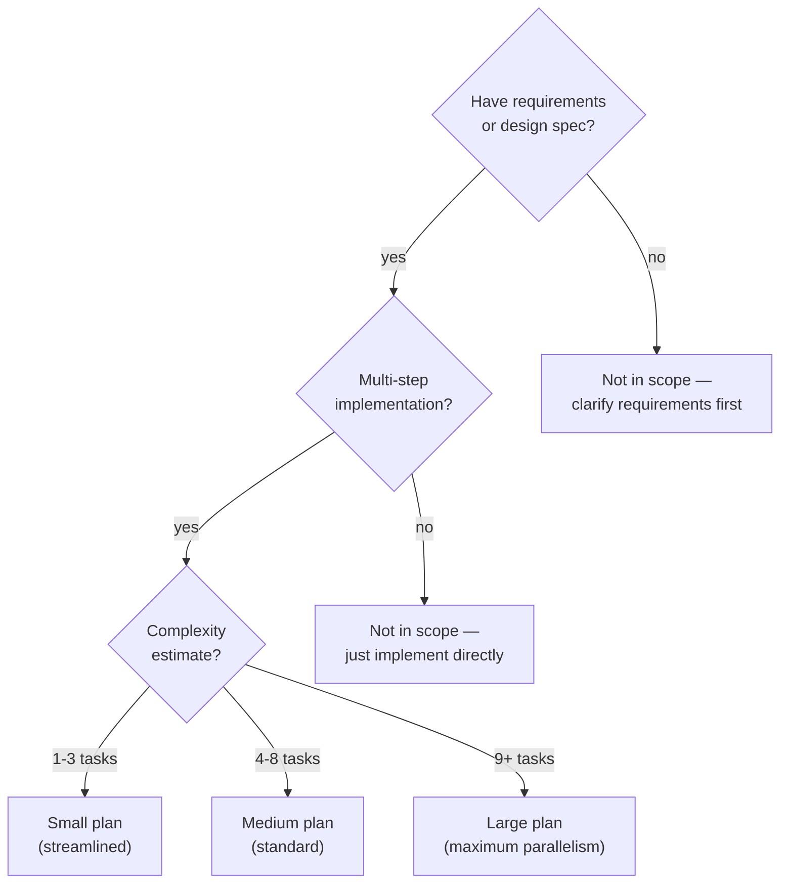
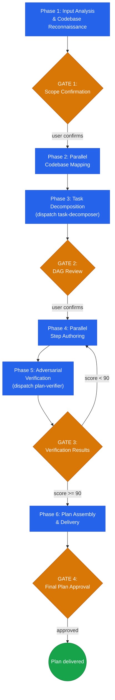

# Plan Writing

## Overview

Transform requirements, design specs, or brainstorm outputs into zero-ambiguity implementation plans. Dispatches specialized agents to decompose work into a DAG of atomic tasks, author complete steps with full code, and adversarially verify the result. Output is a single plan document so detailed that execution is mechanical.

**Core principle:** Every step contains complete code or complete commands. If a human must think during execution, the plan failed.

**Announce:** "I'm using the plan-writing skill to create a comprehensive implementation plan."

## Mandatory Skill Chain

When this skill completes (GATE 4 approval + Transition gate):
- **Next skill:** `stn-skills:plan-execution`
- **Invocation:** `Skill(skill: "stn-skills:plan-execution", args: "{plan_file_path}")`
- **Gate:** User chooses "Continue" or "Stop" via AskUserQuestion at the Transition section

Starting execution without invoking the Skill tool is a pipeline violation.
Never proceed to implement tasks by "just doing it" — the Skill tool loads checkpoint recovery, drift detection, and verification.

## The Iron Laws

```
IRON LAW 1: ZERO PLACEHOLDERS
EVERY STEP CONTAINS COMPLETE CODE OR COMPLETE COMMANDS.
"TBD", "TODO", "SIMILAR TO ABOVE" ARE PLAN FAILURES.

IRON LAW 2: DAG, NOT LIST
TASKS FORM A DIRECTED ACYCLIC GRAPH.
EVERY TASK DECLARES ITS EXACT DEPENDENCIES AND OUTPUTS.
```

Iron Law 1: Every `write_code` step contains the full file content (CREATE) or a complete diff with context lines (MODIFY). Every `run_command` step contains the exact shell command and expected output. Ellipsis, abbreviations, and "similar to above" are rejected by the placeholder detector. See `references/placeholder-detector-rules.md` for the exhaustive pattern catalog.

Iron Law 2: Tasks declare `depends_on` and `blocks` fields. Independent tasks run in parallel waves. Same-file modifications enforce sequential ordering. The DAG is verified by topological sort. See `references/task-anatomy.md` for dependency rules.

## Modernization Mandate

```
ALL CODE IN EVERY STEP MUST USE CURRENT APIs AND BEST PRACTICES.
NO DEPRECATED PATTERNS. NO LEGACY COMPATIBILITY SHIMS. NO BACKWARD-COMPAT CODE.
IF EXISTING CODE USES DEPRECATED PATTERNS, THE PLAN MUST MODERNIZE THEM.
```

This mandate is enforced at every stage:
- **Phase 2 (Codebase Mapping):** Cartographer flags deprecated patterns found in existing code. These become modernization tasks in Phase 3.
- **Phase 4 (Step Authoring):** Step-author writes only current-generation code. All agents carry the Modernization Mandate in their prompts.
- **Phase 5 (Verification):** Plan-verifier checks convention compliance (check #5) — deprecated API usage in any code block is a defect.
- **Plan Output:** If existing code touched by the plan uses deprecated patterns, the plan includes modernization steps that replace them with current equivalents. No plan may leave deprecated code in files it touches.

## When to Use



**Use this skill when:**
- Translating a design spec into executable implementation steps
- Breaking down a feature request into atomic tasks
- Planning a refactoring that touches multiple files
- Creating work breakdown for a team sprint
- Turning brainstorm output into actionable work

**Not designed for:**
- Debugging a single bug in a known file — investigate directly
- Exploring requirements that are not yet defined — use brainstorming first
- Executing a plan that already exists — use plan-execution skill

---

## The Six Phases

Complete each phase before proceeding to the next. Four gates ensure alignment and quality.



**Agent dispatch table:**

| # | Agent | Phase | Purpose |
|---|-------|-------|---------|
| 1 | `agents/codebase-cartographer.md` | Phase 2 | Maps existing files, exports, types, integration points |
| 2 | `agents/task-decomposer.md` | Phase 3 | Breaks requirements into atomic tasks with DAG and wave plan |
| 3 | `agents/step-author.md` | Phase 4 | Authors complete steps per task with full code |
| 4 | `agents/plan-verifier.md` | Phase 5 | Adversarial 7-check verification with Plan Quality Score |

---

### Phase 1: Input Analysis & Codebase Reconnaissance

Accept one of: design spec, brainstorm output, or direct requirements from the user.

**1. Validate input** — if input is a design spec file, verify it contains: Problem Statement, Success Criteria, Scope Boundaries, Selected Approach, and Acceptance Criteria. Flag missing sections. Map design spec fields: Success Criteria + Acceptance Criteria → Requirements list. Selected Approach → architecture guidance. Scope Boundaries → task constraints. Risk Register → task risk seeds.

**2. Extract requirements** — enumerate as R1, R2, ... R(N). Each requirement gets a testable assertion that proves it is met.

**3. Classify project context:**

| Dimension | Options | Detection |
|-----------|---------|-----------|
| **Mode** | Greenfield / Brownfield / Mixed | Existing source files for the target modules? |
| **Complexity** | Small (1-3 tasks) / Medium (4-8) / Large (9+) | Requirement count, file surface area, integration points |

**4. Detect tech stack** by scanning for build and config files:

| Category | Files to scan |
|----------|--------------|
| **Build systems** | `package.json`, `Cargo.toml`, `go.mod`, `pyproject.toml`, `build.gradle.kts`, `pom.xml`, `*.csproj`, `Makefile`, `CMakeLists.txt`, `pubspec.yaml`, `composer.json` |
| **Frameworks** | Inspect imports, configs, directory conventions |
| **Test frameworks** | Jest, Vitest, pytest, Go testing, JUnit, RSpec, etc. |
| **CI/CD** | `.github/workflows/`, `.gitlab-ci.yml`, `Jenkinsfile` |
| **Project rules** | `CLAUDE.md`, `AGENTS.md`, `.editorconfig`, `CONTRIBUTING.md` |

**5. Read project rules** from CLAUDE.md, AGENTS.md, or similar files. Extract naming conventions, import ordering, error handling patterns, test structure mandates. These feed into convention compliance verification in Phase 5.

**6. Estimate complexity** — count requirements, estimate file surface area, identify integration points. Assign Small / Medium / Large.

---

### GATE 1: Scope Confirmation

Present to the user:
- Numbered requirements list (R1 ... R(N)) with testable assertions
- Project mode: Greenfield / Brownfield / Mixed
- Detected tech stack
- Complexity classification
- Estimated task count and total duration range

**Present all content above to the user first.** Then use the AskUserQuestion tool:
- Question: "Confirm these requirements and scope, or adjust before I proceed."
- Options: ["Confirmed", "Adjust requirements or scope"]

**Do not proceed until the user responds.** Misunderstood requirements produce wasted plans.

---

### Phase 2: Parallel Codebase Mapping

Build the file structure that the plan will operate on.

**Brownfield mode:** Dispatch `codebase-cartographer` subagents per module to map existing files, exports, types, and integration points. Each cartographer receives:
```
- Repository path: [REPO_PATH]
- Module scope: [MODULE_PATH]
- Task: Map all exports, types, function signatures, and file dependencies
```

**Greenfield mode:** Define the complete target file structure based on requirements and detected conventions.

**Both modes produce a File Structure Lock-In table:**

| File | Action | Responsibility | Modified By |
|------|--------|---------------|-------------|
| `src/auth.ts` | CREATE | Authentication middleware | T1, T3 |
| `src/routes.ts` | MODIFY | Route registration | T2 |

This table is authoritative. Every task in the plan must reference files from this table. No phantom files.

**Complexity-adaptive behavior:**
- **Small:** Skip parallel dispatch. Single-pass mapping inline.
- **Medium:** Standard parallel dispatch per module.
- **Large:** Maximum parallelism — dispatch one cartographer per module boundary.

---

### Phase 3: Task Decomposition

Dispatch the `agents/task-decomposer.md` subagent.

**Context package:**
```
- Repository path: [REPO_PATH]
- Detected tech stack: [STACK]
- Project rules: [RULES]
- Requirements: [R1..RN with testable assertions]
- Codebase map: [CARTOGRAPHER_OUTPUT or "greenfield"]
- File structure: [FILE_STRUCTURE_TABLE]
- Complexity class: [Small/Medium/Large]
```

The task-decomposer produces:
1. **Task list** — each task with all properties per `references/task-anatomy.md`: ID, title, requirements addressed, depends_on, blocks, files_read, files_modified, estimated_minutes, risk, verification, rollback, parallel_group
2. **Mermaid DAG** — visual dependency graph
3. **Wave plan** — parallel execution groups (max 4 tasks per wave)
4. **Requirements coverage matrix** — every R(N) mapped to task(s)
5. **TDD enforcement** — every task introducing new behavior includes test-first steps

**DAG rules (enforced):**
- Same-file modification = sequential dependency
- Unrelated-file modification = parallel allowed
- Test task depends on implementation task
- Max 4 tasks per wave
- Every R(N) covered by at least one T(M)
- Topological sort must succeed (no cycles)

---

### GATE 2: DAG Review

Present to the user:
- Complete task list with dependencies
- Mermaid DAG visualization
- Wave execution plan with estimated durations
- Requirements coverage matrix (every R(N) -> T(M) mapping)
- Any gaps or risks flagged by the decomposer

**Present all content above to the user first.** Then use the AskUserQuestion tool:
- Question: "Review the task breakdown and dependencies. Confirm, or adjust tasks before I author steps."
- Options: ["Confirmed", "Adjust tasks"]

**Do not proceed until the user responds.**

---

### Phase 4: Parallel Step Authoring

Author complete steps for every task. Dispatch `step-author` subagents in parallel, clustered by dependency proximity (2-4 tasks per cluster).

**Context package per step-author:**
```
- Repository path: [REPO_PATH]
- Detected tech stack: [STACK]
- Project rules: [RULES]
- Assigned tasks: [T(A), T(B), T(C)] with full properties
- File structure: [FILE_STRUCTURE_TABLE]
- Codebase map: [relevant module maps]
- Placeholder rules: references/placeholder-detector-rules.md
- Task anatomy rules: references/task-anatomy.md
```

**Step authoring rules:**
- One action per step: `read_file`, `write_code`, `run_command`, or `verify_output`
- `write_code`: CREATE = full file content. MODIFY = complete diff with context lines.
- `run_command`: exact shell command + exact expected output pattern
- `verify_output`: exact command + expected output + specific `if_unexpected` diagnostic steps
- TDD cycle per task: read -> write failing test -> verify fail -> write implementation -> verify pass -> verify full suite
- Every task ends with at least one `verify_output` step
- Every task has a rollback block with exact git commands

**Complexity-adaptive behavior:**
- **Small:** Author all tasks inline, no parallel dispatch.
- **Medium:** Dispatch 2-3 step-author agents in parallel.
- **Large:** Dispatch one step-author per cluster of 2-4 related tasks.

<details>
<summary>Example: Complete task demonstrating zero-placeholder standard</summary>

```markdown
### Task T2: Add rate limiting middleware

- **ID:** T2
- **Depends on:** T1 (Express app setup)
- **Blocks:** T3 (API endpoint tests)
- **Files read:** `src/app.ts`, `package.json`
- **Files modified:** `src/middleware/rate-limiter.ts` (CREATE), `src/app.ts` (MODIFY)
- **Estimated:** 4 min
- **Risk:** Low — isolated middleware, no existing logic affected
- **Parallel group:** Wave 2

**Steps:**

1. `read_file` — Read `src/app.ts` to confirm Express setup from T1
2. `write_code` — CREATE `src/middleware/rate-limiter.ts`:
   ```typescript
   import rateLimit from 'express-rate-limit';
   export const apiLimiter = rateLimit({
     windowMs: 15 * 60 * 1000,
     max: 100,
     standardHeaders: true,
     legacyHeaders: false,
     message: { error: 'Too many requests, try again later' },
   });
   ```
3. `write_code` — CREATE `src/middleware/__tests__/rate-limiter.test.ts`:
   ```typescript
   import request from 'supertest';
   import express from 'express';
   import { apiLimiter } from '../rate-limiter';

   const app = express();
   app.use(apiLimiter);
   app.get('/test', (_, res) => res.json({ ok: true }));

   test('allows requests under limit', async () => {
     const res = await request(app).get('/test');
     expect(res.status).toBe(200);
   });
   ```
4. `run_command` — `npx jest src/middleware/__tests__/rate-limiter.test.ts`
5. `verify_output` — Expect: `Tests: 1 passed`. If unexpected: check import paths, verify express-rate-limit installed in T1.
6. `write_code` — MODIFY `src/app.ts` — add import and middleware registration (complete diff with 3 context lines)
7. `run_command` — `npx jest --forceExit`
8. `verify_output` — Expect: all tests pass including T1 tests. If unexpected: check middleware ordering in app.ts.

**Rollback:** `git checkout -- src/middleware/ src/app.ts`
```

Note: Every `write_code` step shows full file content (CREATE) or complete diff (MODIFY). No "similar to above", no "add appropriate tests", no `...` abbreviations.

</details>

---

### Phase 5: Adversarial Verification

Dispatch the `agents/plan-verifier.md` subagent with the complete plan.

**Context package:**
```
- Complete plan: [ALL_TASKS_WITH_STEPS]
- Requirements: [R1..RN with testable assertions]
- Project rules: [RULES]
- Placeholder rules: references/placeholder-detector-rules.md
```

**The 7 verification checks:**

| # | Check | What It Verifies |
|---|-------|-----------------|
| 1 | **Requirements coverage** | Every R(N) traces to task(s) -> step(s) -> verification step |
| 2 | **Placeholder scan** | Zero placeholder patterns per `references/placeholder-detector-rules.md` |
| 3 | **Signature consistency** | Same function/type name has identical signature everywhere |
| 4 | **DAG integrity** | No cycles, no parallel file conflicts, file lists match actual steps |
| 5 | **Convention compliance** | All code follows project rules from CLAUDE.md |
| 6 | **Rollback feasibility** | Rollback commands are actionable, target correct files, reverse-ordered |
| 7 | **Traceability** | Full chain R(N) -> T(M) -> S(K) -> verify. No orphan tasks or steps |

**Plan Quality Score** (must be >= 90 to pass):

| Dimension | Weight |
|-----------|--------|
| Requirements coverage | 30% |
| Placeholder contamination | 25% |
| Signature consistency | 20% |
| DAG completeness | 15% |
| Convention compliance | 10% |

If score < 90: return to Phase 4 with specific defect list. Step authors fix cited defects. Re-verify. Maximum 2 rework cycles before escalating to user.

**Visible output requirement:** The plan-verifier presents a structured results table to the orchestrator, which displays it to the user at GATE 3:

| # | Check | Result | Details |
|---|-------|--------|---------|
| 1 | Requirements coverage | PASS/FAIL | R1→T1→S3→S5, R2→T2→S2→S4, ... |
| 2 | Placeholder scan | PASS/FAIL | 0 found (or: 3 found in T2.S4, T3.S1, T5.S2) |
| 3 | Signature consistency | PASS/FAIL | 0 conflicts (or: `createUser` differs T1.S3 vs T3.S5) |
| 4 | DAG integrity | PASS/FAIL | No cycles, no parallel file conflicts |
| 5 | Convention compliance | PASS/FAIL | All code follows CLAUDE.md rules |
| 6 | Rollback feasibility | PASS/FAIL | All rollbacks target correct files |
| 7 | Traceability | PASS/FAIL | Full chain verified, 0 orphan tasks |

---

### GATE 3: Verification Results

Present to the user:
- Plan Quality Score (composite and per-dimension)
- Verification check results (PASS/FAIL per check)
- Defect count and details (if any remain after rework)
- Traceability matrix

If score >= 90, use AskUserQuestion:
- Question: "Verification passed with score {N}/100. Proceed to plan assembly?"
- Options: ["Proceed to plan assembly", "Review defects first"]

If score < 90 after 2 rework cycles, use AskUserQuestion:
- Question: "Score is {N}/100 after 2 rework attempts. Here are the remaining defects. Proceed anyway, or adjust scope?"
- Options: ["Proceed with known defects", "Adjust scope", "Another rework cycle"]

**Do not proceed until the user responds.**

---

### Phase 6: Plan Assembly & Delivery

Assemble the final plan document following `references/plan-document-template.md`.

**Output file:** `.plan/plan-{YYYYMMDD}-{slug}.md`

Where `{slug}` is a kebab-case summary of the plan title (max 40 characters).

**Plan document sections:**
1. Header (title, date, repo, stack, complexity, quality score)
2. Requirements table with testable assertions and task mappings
3. File Structure Lock-In table
4. Task DAG (Mermaid) + Execution Waves table
5. Complete task details with all steps, risk, rollback
6. Traceability matrix
7. Plan Quality Score breakdown
8. Verification summary (7 checks)
9. Recovery points (git commit per wave boundary)

---

### GATE 4: Final Plan Approval

Present the plan summary:
- Total tasks, waves, estimated duration
- Plan Quality Score
- Output file path

**Present all content above to the user first.** Then use the AskUserQuestion tool:
- Question: "Plan written to {path}. Review and approve, or request changes."
- Options: ["Approved", "Request changes"]

**Do not proceed until the user responds.**

---

## Transition: Plan Complete

MANDATORY: Invoke the next skill via the Skill tool. Do NOT start executing tasks without it.

**Terminal state: The next pipeline step is `/stn-skills:plan-execution`.**

Use AskUserQuestion:
- Question: "Plan saved to `{path}`. Continue to plan-execution, or stop here?"
- Options: ["Continue to plan-execution", "Stop here"]

**On "Continue to plan-execution":** Immediately invoke the Skill tool: `Skill(skill: "stn-skills:plan-execution", args: "{plan_file_path}")`
**On "Stop here":** End. Inform user: resume later with `/stn-skills:plan-execution`.

If you find yourself about to write implementation code without having invoked the Skill tool — STOP. That is the pipeline violation described in the Mandatory Skill Chain section above.

---

## Red Flags -- STOP and Restructure

If you catch yourself or an agent:
- Writing a task estimated over 5 minutes
- Writing a step with ellipsis, "similar to above", or any placeholder pattern
- Skipping Phase 5 adversarial verification
- Producing a plan without a Mermaid DAG
- Omitting risk assessment or rollback from any task
- Claiming a requirement is addressed without pointing to specific steps
- Allowing two parallel tasks to modify the same file
- Writing an `if_unexpected` that says just "investigate" or "debug"
- Producing a task that modifies more than 3 files
- Emitting a plan with Quality Score below 90 without user acknowledgment

**ALL of these mean: STOP. Fix the defect before continuing.**

---

## Common Rationalizations

| Excuse | Reality |
|--------|---------|
| "The implementation is obvious, I'll abbreviate" | Obvious to you now, not to the executor later. Write the complete code. |
| "These steps are similar, I'll say 'repeat for X'" | Each step is unique context. Duplicate with correct values, never reference. |
| "The user will know what I mean by 'configure appropriately'" | If you cannot write the exact config, you do not understand the requirement. |
| "Adding rollback to every task is overkill" | The task that does not need rollback is the task that will need it most. |
| "This small plan doesn't need verification" | Small plans with defects waste more time than large plans caught early. |
| "I'll finalize the details during execution" | Plans that defer decisions to execution are lists, not plans. |
| "The DAG is simple enough to keep in my head" | Draw it. If you cannot draw it, the dependencies are not clear. |
| "Risk assessment is speculative anyway" | Speculative risk identification prevents concrete failures. Name the failure mode. |
| "I can just start executing the plan directly" | NO. Invoke plan-execution via the Skill tool. Executing without it loses checkpoint recovery, drift detection, circuit breakers, and verification evidence. |
