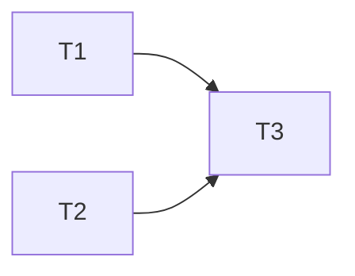

# Plan Document Template

Canonical output for plan-writing skill. Plan-execution skill consumes this structure exactly.

````markdown
# Implementation Plan: {Title}

**Generated:** {YYYY-MM-DD}
**Repository:** {repo name}
**Tech Stack:** {detected stack}
**Complexity:** {Small | Medium | Large}
**Plan Quality Score:** {0-100}

> **Execution:** Use `/stn-skills:plan-execution` to execute this plan with checkpoint recovery, drift detection, and verification.

---

## Requirements

| ID | Requirement | Testable Assertion | Addressed By |
|---|---|---|---|
| R1 | {requirement text} | {assertion that proves requirement met} | T1, T3 |

## File Structure

| File | Action | Responsibility | Modified By |
|---|---|---|---|
| `src/auth.ts` | CREATE | Authentication middleware | T1, T3 |
| `src/routes.ts` | MODIFY | Route registration | T2 |

## Task DAG

### Dependency Graph

### Execution Waves
| Wave | Tasks | Parallelism | Est. Minutes |
|---|---|---|---|
| 1 | T1, T2 | 2 | 4 |
| 2 | T3 | 1 | 3 |
## Tasks

### T{N}: {Imperative Verb Phrase Title}

**Requirements:** R1, R3
**Depends on:** T2
**Blocks:** T7
**Files read:** `src/config.ts`
**Files modified:** `src/auth.ts`, `src/auth.test.ts`
**Estimated:** {N} min
**Wave:** {N}

#### Acceptance Criteria
- AC-1: {specific, testable statement} — verify: `{exact command or check}`
- AC-2: {specific, testable statement} — verify: `{exact command or check}`

#### Risk
- **Failure mode:** {specific failure scenario}
- **Detection:** {command or check that reveals failure}
- **Recovery:** {exact steps to recover}

#### Rollback
```bash
git checkout HEAD -- src/auth.ts src/auth.test.ts
```

#### Steps

**Step 1: {description}**
- Action: read_file | write_code | run_command | verify_output
- File: `{path}` *(for read_file/write_code)*
```{lang}
{COMPLETE code - no placeholders, no ellipsis}
```

**Step 2: {description}**
- Action: verify_output
```bash
{exact command}
```
- Expected: `{output pattern}`
- If unexpected: {exact diagnostic commands, not "investigate"}

*Follow TDD cycle per task-anatomy rules: read -> test -> verify fail -> impl -> verify pass -> verify suite.*
## Traceability Matrix

| Requirement | Task(s) | Step(s) | Verification |
|---|---|---|---|
| R1 | T1, T3 | T1.S5, T3.S6 | `npm test -- --grep "auth"` passes |

## Plan Quality Score

| Dimension | Weight | Score | Details |
|---|---|---|---|
| Requirements coverage | 30% | | Every R{N} mapped to at least one task |
| Placeholder contamination | 25% | | Zero placeholder patterns detected |
| Signature consistency | 20% | | All cross-file references resolve |
| DAG completeness | 15% | | No missing edges, no orphan tasks |
| Convention compliance | 10% | | Naming, structure, style rules met |
| **Composite** | 100% | **{score}/100** | |

## Verification Summary

| Check | Result |
|---|---|
| Requirements coverage | PASS/FAIL |
| Placeholder scan | PASS/FAIL |
| Signature consistency | PASS/FAIL |
| DAG integrity | PASS/FAIL |
| Convention compliance | PASS/FAIL |
| Rollback feasibility | PASS/FAIL |
| Traceability audit | PASS/FAIL |

## Recovery Points

After each wave: `git add {files} && git commit -m "plan checkpoint: wave {N}"`

---
<!-- Generated by stn-skills:plan-writing | {YYYY-MM-DD} -->
````

## Field Definitions
| Field | Required | Format | Notes |
|---|---|---|---|
| Title | Yes | Noun phrase | Describes deliverable, not process |
| Generated | Yes | ISO 8601 date | Auto-populated |
| Repository | Yes | String | From `git remote` |
| Tech Stack | Yes | Comma-separated | Auto-detected from package files |
| Complexity | Yes | Small/Medium/Large | Small: 1-3 tasks. Medium: 4-8. Large: 9+. |
| Plan Quality Score | Yes | Integer 0-100 | Composite of 5 dimensions |

## Complexity Thresholds

| Class | Tasks | Waves | Est. Total |
|---|---|---|---|
| Small | 1-3 | 1-2 | <10 min |
| Medium | 4-8 | 2-4 | 10-30 min |
| Large | 9+ | 4+ | >30 min |

## Validation Checklist (pre-emit)

1. Every `R{N}` appears in Traceability Matrix
2. Every `T{N}` has at least one `verify_output` step
3. Every `files_modified` entry has corresponding `write_code` step
4. DAG has no cycles (topological sort succeeds)
5. No task exceeds 5 min / 3 files
6. Placeholder detector returns zero matches
7. Rollback commands reference only `files_modified` entries; recovery points cover every wave boundary